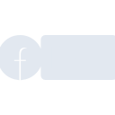

# facebooklive

[← Back to main README](../../README.md)





## 16 px

### black
```
https://georgegach.github.io/compatible-icons/simple-icons/facebooklive/16/black.png
```

### slate
```
https://georgegach.github.io/compatible-icons/simple-icons/facebooklive/16/slate.png
```

### white
```
https://georgegach.github.io/compatible-icons/simple-icons/facebooklive/16/white.png
```

## 64 px

### black
```
https://georgegach.github.io/compatible-icons/simple-icons/facebooklive/64/black.png
```

### slate
```
https://georgegach.github.io/compatible-icons/simple-icons/facebooklive/64/slate.png
```

### white
```
https://georgegach.github.io/compatible-icons/simple-icons/facebooklive/64/white.png
```

## 128 px

### black
```
https://georgegach.github.io/compatible-icons/simple-icons/facebooklive/128/black.png
```

### slate
```
https://georgegach.github.io/compatible-icons/simple-icons/facebooklive/128/slate.png
```

### white
```
https://georgegach.github.io/compatible-icons/simple-icons/facebooklive/128/white.png
```

## 512 px

### black
```
https://georgegach.github.io/compatible-icons/simple-icons/facebooklive/512/black.png
```

### slate
```
https://georgegach.github.io/compatible-icons/simple-icons/facebooklive/512/slate.png
```

### white
```
https://georgegach.github.io/compatible-icons/simple-icons/facebooklive/512/white.png
```

## 1024 px

### black
```
https://georgegach.github.io/compatible-icons/simple-icons/facebooklive/1024/black.png
```

### slate
```
https://georgegach.github.io/compatible-icons/simple-icons/facebooklive/1024/slate.png
```

### white
```
https://georgegach.github.io/compatible-icons/simple-icons/facebooklive/1024/white.png
```

## 16 px in base64

### black
```
data:image/png;base64,iVBORw0KGgoAAAANSUhEUgAAABAAAAAQCAYAAAAf8/9hAAAABmJLR0QA/wD/AP+gvaeTAAAAuUlEQVQ4je3RvVICQRAE4O+uEKUsNdBSA0IjeG4tH4DUZzA3IwDESAEL+bEwoLEuO3KYYHd2frpnejlaUfGv8I113m00a/qXBbp4wjV+8YLnxFY1AE14wwYDfGCB14BNkptgVvFHu1yJ26B94RwnGR+muedo4Sc19yjlKDFGP+xVXeAzTWucYZn4P8AYd3jIzgsMU3QR1k32naKB9wAq0Ilgp7hBz1bER3uIWB33Mmy7Eff6xpr8QdgfzEcxEZ+P3s0AAAAASUVORK5CYII=
```

### slate
```
data:image/png;base64,iVBORw0KGgoAAAANSUhEUgAAABAAAAAQCAYAAAAf8/9hAAAABmJLR0QA/wD/AP+gvaeTAAABEUlEQVQ4je2RzUpbYRRF1/pignKJogXbgSOpo4Cv4tv0kWxfwodw0kFLBymiCZhUuV4a83O3g1ihk4Bj3aMzOGefBQve47/h13S6d7y/36hLgKurydGq2+ltOu4sVnOHN/VAV+chH4QVcIF+M55HFhvft+n5e3z3g3CCXpN0xb2WfBdOA43QF2pICVZKHWxCKkO/EA4BktwLVUhXOAJQa4AW/gZ3xFmSiuRTCQWgCAUcG4aRR0D/B70rUIHLkG1S5gDhuSAyhnyM+ZywAB9Drp+p+uhsvZ9eSK3ZQkeR5bqg7ZwBl8SlUGL7FcsX8Y/aAEQf0JGWJnq71mdDmL7Q/pxMduejg9lg4Pw1GjdaeiN5AoQvh71n1hiiAAAAAElFTkSuQmCC
```

### white
```
data:image/png;base64,iVBORw0KGgoAAAANSUhEUgAAABAAAAAQCAYAAAAf8/9hAAAABmJLR0QA/wD/AP+gvaeTAAAAx0lEQVQ4je3RvTIDUBAF4O9mCMagYFCkVPHcjAfQega9TuEnKhJGEskcRTYmXdJzint3z+6eO/cs/2iLIMkBPltr08p76K6Yn7QkF7jCIWa4xXVx3ysEupLcZ47HJK9JxknuksySDKo2SPKxFD8vah0cl9o7drGJXnHDur+wg1H1nKKjjg76eMB42ZfCWw1NsY1J8b8CfZzgrP48xlM17dWrMTd0iA28lKCW5LwM28IRbsrEy3VMXF7jPkattUnla61xRf1P4Acc/3LVbFM28AAAAABJRU5ErkJggg==
```

