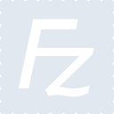
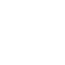

# filezilla

[← Back to main README](../../README.md)





## 16 px

### black
```
https://georgegach.github.io/compatible-icons/simple-icons/filezilla/16/black.png
```

### slate
```
https://georgegach.github.io/compatible-icons/simple-icons/filezilla/16/slate.png
```

### white
```
https://georgegach.github.io/compatible-icons/simple-icons/filezilla/16/white.png
```

## 64 px

### black
```
https://georgegach.github.io/compatible-icons/simple-icons/filezilla/64/black.png
```

### slate
```
https://georgegach.github.io/compatible-icons/simple-icons/filezilla/64/slate.png
```

### white
```
https://georgegach.github.io/compatible-icons/simple-icons/filezilla/64/white.png
```

## 128 px

### black
```
https://georgegach.github.io/compatible-icons/simple-icons/filezilla/128/black.png
```

### slate
```
https://georgegach.github.io/compatible-icons/simple-icons/filezilla/128/slate.png
```

### white
```
https://georgegach.github.io/compatible-icons/simple-icons/filezilla/128/white.png
```

## 512 px

### black
```
https://georgegach.github.io/compatible-icons/simple-icons/filezilla/512/black.png
```

### slate
```
https://georgegach.github.io/compatible-icons/simple-icons/filezilla/512/slate.png
```

### white
```
https://georgegach.github.io/compatible-icons/simple-icons/filezilla/512/white.png
```

## 1024 px

### black
```
https://georgegach.github.io/compatible-icons/simple-icons/filezilla/1024/black.png
```

### slate
```
https://georgegach.github.io/compatible-icons/simple-icons/filezilla/1024/slate.png
```

### white
```
https://georgegach.github.io/compatible-icons/simple-icons/filezilla/1024/white.png
```

## 16 px in base64

### black
```
data:image/png;base64,iVBORw0KGgoAAAANSUhEUgAAABAAAAAQCAYAAAAf8/9hAAAABmJLR0QA/wD/AP+gvaeTAAABTklEQVQ4jZ3TsUtbURQG8N+T0FpTrJXSIVBBzdKtS/8Cwb1bR0f/lEIpKLh1q1vnjg6dOgoZa0FMjCjaRLFNUkGNwz0hj5cEtB+84Z17znfP9517MrTQxXO08RJnKOOfhCfo4AVOMY+LiGui/59fM8PfuG2AFvaMooRqdDpAF+oF1k9jiuFtSMznHmah83EkdfAOt/iMqxzBIywVSK+KHjQxh637elDCTI7xUnL3GruRNA5VPEM5wxEqcbCDVSxOKDyQTNzFAo5LhYQdLOMHbnLxWWxiA9/xKuJ9hs62JafXQsJA57k0mQp+FjxoMzSxLjn9tVD8MW78ZYyJpDH2UYu2ajn2D+HHacT+4EQacz9qNeLnDN9wHAnbQbiM91jHCr7kOmhkwfrUKPZD1m2038EbvDacWgcOx2h70DK10JNe4GCdf0sPrIcpTJuwzndetJiWAvGp4wAAAABJRU5ErkJggg==
```

### slate
```
data:image/png;base64,iVBORw0KGgoAAAANSUhEUgAAABAAAAAQCAYAAAAf8/9hAAAABmJLR0QA/wD/AP+gvaeTAAAB80lEQVQ4jZ2Tz06TURDFf+f2Ay0YSglBg4pBG4xh48adT+BKH8ONGzc+gA+AxBiNbnwHXWiMwZi4MZK41WikUCnlTz8o/y33uOhHsQ26cJYzc849c+aOytV0FbGNXRRaMxpBXgb6sXYBwHlgCzQsqJk4JJE6kle5Wl8AneU/QnIlAQY7krCK9KW72SZBlLCLh7kYKSZCq4b+o0Y9HztTuNtNUF5cv2b7ldTx2JrKi+ku4kSW27K4hYmCp0J7bWK5F3OxUxZ7CWIFyDxwGnv5mNsP97HHjf9sPsYEVhKLPrWLYWO8WEjnftabymn2LzBAJewC0J/I2oHMGFGxrXJtfdow3Q0bGyn8qFQaRSdx1lAA7SQdvFFvFpY3Lsl8QDo4kh8HQA++LW1O9SRxRuJ8ps0Jch6DTR38loN4XdKQ7VwGT1F4TNh/2PuL9wQm2oPJ+YC93VLvRmNt4LOCbhhymW8p4lmu2Zyi2fOOwETXFrYD1nCLTenkpPZtLmfFOuJJNI8OcsknREmwaViSDm3XcABqGWB0vrr+AhixseWXF04P3gsiAHeCuB3hZrBe21amuqb5atownDpmV9+F50DR5iutT3YVfEVoNJthS+WldB5z7vh9/ztaxxTdp0DFZrB9zngF0Se04+iAOEn7nF0zHiI7599CDPKtvePxvQAAAABJRU5ErkJggg==
```

### white
```
data:image/png;base64,iVBORw0KGgoAAAANSUhEUgAAABAAAAAQCAYAAAAf8/9hAAAABmJLR0QA/wD/AP+gvaeTAAABZklEQVQ4jZ2TOy+EQRSGn5GNe9wiCrfEpdFp/AKJXqdU+ikSkZDodHRqpUKllCiRiGU3xGUJWVaCR/GNZHzZDfF258w775x5zzlBvQdegF6gAgwAt0AHUCNDG1AF+oEboA94BNqCWgKG+B/KBaAnl7wHTuqQC8BkrPQbvahFf2K13lPqjFrJcS+DWgNaIq8KzAOfwCbwlmg0A+M53TfUUqJYUnvUDf+GUgFoTxSfQgiP6jtwCNjAvEmgG+gIahkYjAd7wBww1uDieTTxEBgFrgo5wh4wARwAH0m+C1gH1oB9YCTmJXG2Ep1eVN+Tfz6oq+qgepzzoJKaWFSb1Z3c5RV1RD2tZyJqLQZHAOpRUtGyOqbexNyzeq1+xriGehGDW3VXvYqE7Sg4oS6oS+qsupVUcBHUZ6CzjuNnQJFsqE7JhmwamEq6Vg3qJTDcoG2/oRzM1vmVbKm+1/mObMBegSaglQbr/AUlcZ0L0USuPAAAAABJRU5ErkJggg==
```

