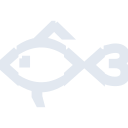

# fishshell

[← Back to main README](../../README.md)

<table><tr>
  <td></td>
  <td></td>
  <td></td>
</tr></table>

## 16 px

### black
```
https://georgegach.github.io/compatible-icons/simple-icons/compat/fishshell/16/black.png
```

### slate
```
https://georgegach.github.io/compatible-icons/simple-icons/compat/fishshell/16/slate.png
```

### white
```
https://georgegach.github.io/compatible-icons/simple-icons/compat/fishshell/16/white.png
```

## 64 px

### black
```
https://georgegach.github.io/compatible-icons/simple-icons/compat/fishshell/64/black.png
```

### slate
```
https://georgegach.github.io/compatible-icons/simple-icons/compat/fishshell/64/slate.png
```

### white
```
https://georgegach.github.io/compatible-icons/simple-icons/compat/fishshell/64/white.png
```

## 128 px

### black
```
https://georgegach.github.io/compatible-icons/simple-icons/compat/fishshell/128/black.png
```

### slate
```
https://georgegach.github.io/compatible-icons/simple-icons/compat/fishshell/128/slate.png
```

### white
```
https://georgegach.github.io/compatible-icons/simple-icons/compat/fishshell/128/white.png
```

## 512 px

### black
```
https://georgegach.github.io/compatible-icons/simple-icons/compat/fishshell/512/black.png
```

### slate
```
https://georgegach.github.io/compatible-icons/simple-icons/compat/fishshell/512/slate.png
```

### white
```
https://georgegach.github.io/compatible-icons/simple-icons/compat/fishshell/512/white.png
```

## 1024 px

### black
```
https://georgegach.github.io/compatible-icons/simple-icons/compat/fishshell/1024/black.png
```

### slate
```
https://georgegach.github.io/compatible-icons/simple-icons/compat/fishshell/1024/slate.png
```

### white
```
https://georgegach.github.io/compatible-icons/simple-icons/compat/fishshell/1024/white.png
```

## 16 px in base64

### black
```
data:image/png;base64,iVBORw0KGgoAAAANSUhEUgAAABAAAAAQCAYAAAAf8/9hAAAABmJLR0QA/wD/AP+gvaeTAAAA80lEQVQ4jc3RvyvFYRgF8I+vq1u3rDIYTDYrZTCapOz+A6OSP0DRVUr+ADYyyGggMkqGW0rJj0nSjY3CvQzvY/D1DdfCWd6et3Oe95zz8p8xiq7fiqt4xR16WxFWMIsmJnGAM/R8J8wwh4cQv8S553OMDsxgBSPQjXMcYxzlWNiPTdy/EzGAOi5xiIbIeYVV1ArcrQdxGc/YlQqu4SlDJ06xhaWCBTtowzBKEauOi3BqKLKv+VhWWSqygfm4m4p5G4vRE+jDkVTedWx/xA0mco7GsI8TLOTtDkr/vxHE9oJIXyLDLaZ/Kijl5qbUcKXVl/8Ob8zAOSskL6CqAAAAAElFTkSuQmCC
```

### slate
```
data:image/png;base64,iVBORw0KGgoAAAANSUhEUgAAABAAAAAQCAYAAAAf8/9hAAAABmJLR0QA/wD/AP+gvaeTAAABnklEQVQ4jc2Sv2sUcRTEZ96d5w8Il8bcCTFYiAqCEYvYxU6bkE5S+AcoKAh6WCuoRRqxEewlilVAUETBH6VYWkROEtw9bnfPH7e7Z6Fy3zdWQYNRY6VTv8+8GRjgv9XbtJx5kw7G/nRn68JZPk/4vRrD0krS37Vhg263uy1K88sUWpCfAfjKyEedzofxXxkQACRZJyuuiDgLYQsJd8EoPfvK6tzu5khvFXgpbWpkg/NS2Avxtq30PjXjrGhDOuZBJ74M6lvHx+o1g0/C2K8xvI66+VEAiJNiqpEViaCTAPfT8IBRkn+koZTzKahDE83RAz9GjNL8DqDjAG4APEXguVfsGobhKsh9RuOIgKWqcZHA9XU6PgZIgNMAqkLlSSXoPYllI8wMPAJheiif4zA8XAXbbW2OesVpATeDfH6iOTrptBYQLrl0EbBldxgBoPOu3OPuCxAOCuxR/hm0HaAKgq2djfqt75X6swTPCdzuCvfXxI3T4nCU5oqz8m6UlrOSKr/bwE+SZFHa78VJfmGjzJohkXTKZgC9+KvP/1TfAIe/xyolYCOfAAAAAElFTkSuQmCC
```

### white
```
data:image/png;base64,iVBORw0KGgoAAAANSUhEUgAAABAAAAAQCAYAAAAf8/9hAAAABmJLR0QA/wD/AP+gvaeTAAABDUlEQVQ4jc3RvUocQBTF8bPriiCklRQprNLZKlik3EqE9L7BlgHxAQRFQRAfQDvFQiwtlBVLCRYLgYCoqYIE0U7Bj/1ZZIRlWTSm0dMMd7hn7vzPTd6tMIGh/zUv+KtLDL/GOIhZtNHAAY7x6SVjFXO4Lub7cja7MdCPGayiHnzECY7wFQPlwRFs4Qr1Yh7FBc5wiIcUzl9YQ6vH7zbwgBXcYa8E3MJtNcmHJD+TbCdZ7kG4m6SS5EuSWpJmkoskp0mqwXhhX+8Mq6A0yvT5cvet1DtYQvup+TO+l/B+4xQ3OMdUF9Ik9vEDi928Y2X/m6Wx79n19Qisij+Y/ldPrbOoVCptTCQZfNXkN9Ujw8g6O05i2v0AAAAASUVORK5CYII=
```

