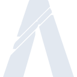

# fivem

[← Back to main README](../../README.md)

<table><tr>
  <td></td>
  <td></td>
  <td></td>
</tr></table>

## 16 px

### black
```
https://georgegach.github.io/compatible-icons/simple-icons/compat/fivem/16/black.png
```

### slate
```
https://georgegach.github.io/compatible-icons/simple-icons/compat/fivem/16/slate.png
```

### white
```
https://georgegach.github.io/compatible-icons/simple-icons/compat/fivem/16/white.png
```

## 64 px

### black
```
https://georgegach.github.io/compatible-icons/simple-icons/compat/fivem/64/black.png
```

### slate
```
https://georgegach.github.io/compatible-icons/simple-icons/compat/fivem/64/slate.png
```

### white
```
https://georgegach.github.io/compatible-icons/simple-icons/compat/fivem/64/white.png
```

## 128 px

### black
```
https://georgegach.github.io/compatible-icons/simple-icons/compat/fivem/128/black.png
```

### slate
```
https://georgegach.github.io/compatible-icons/simple-icons/compat/fivem/128/slate.png
```

### white
```
https://georgegach.github.io/compatible-icons/simple-icons/compat/fivem/128/white.png
```

## 512 px

### black
```
https://georgegach.github.io/compatible-icons/simple-icons/compat/fivem/512/black.png
```

### slate
```
https://georgegach.github.io/compatible-icons/simple-icons/compat/fivem/512/slate.png
```

### white
```
https://georgegach.github.io/compatible-icons/simple-icons/compat/fivem/512/white.png
```

## 1024 px

### black
```
https://georgegach.github.io/compatible-icons/simple-icons/compat/fivem/1024/black.png
```

### slate
```
https://georgegach.github.io/compatible-icons/simple-icons/compat/fivem/1024/slate.png
```

### white
```
https://georgegach.github.io/compatible-icons/simple-icons/compat/fivem/1024/white.png
```

## 16 px in base64

### black
```
data:image/png;base64,iVBORw0KGgoAAAANSUhEUgAAABAAAAAQCAYAAAAf8/9hAAAABmJLR0QA/wD/AP+gvaeTAAABJ0lEQVQ4jY3TzSuEURQG8J9J7I2RBSYpKWlio2wU9lJ2/gI2/hT/hK29jZKFnRQ1ExMl+YhJPhY+m7F47+Q23dGcuvW+93nOc85zzvuSjm5cooEPPKInRcy1EVjFEF7wFe4W2nCTsYdnvIbqp9jttIM85gL2iXsMYBiTnQis4TskV1CQWZnAeicCyyH5Bn2yYY4F7lLKRhz9eMcxnjAv894I5wFT/3UwjjJGZAPswra/TRSw8V8HW6ihKttCb7BxHXVx1i55WDbxKn5wGGEnLTZKKQt1me/R0PpOhO1HzwWJbcBBqNzALYoRNhvE29oo4i4ilFvwHC4ivIbp2MImBqOEoxaBOq6i97yWbVQi9TcsJiyuyL6RJu+8CZRCUhO4lf51c4lCM79UqFdsnn1FAwAAAABJRU5ErkJggg==
```

### slate
```
data:image/png;base64,iVBORw0KGgoAAAANSUhEUgAAABAAAAAQCAYAAAAf8/9hAAAABmJLR0QA/wD/AP+gvaeTAAABxklEQVQ4jY2RP0+TURSHn999m0hiwl+roi0EDcSEGKIji9G4OLnoYJwdwEG/i1/AQeOig9/AxMHBuGLiQEpoa0vSFl4aY8Hen0Pl5QWqeLd7z3Oec849YsixXdhs7nwD5kA94d20NXZ5cVF7x9kwTFCppw+QSoYd4T0Do8X0zjB2qKCQxCe2f4RBvAduuO/n/yWoVtOpiJaDBsnGDRHOWy5vfG8tnipwwY+D2Lfdi9JXUNF4R+iaCCunCiLxvu0eqBYcJw3rmKtAUNDdfwrq9fScrGWhKmIG81QiZTAONpObjfb1vwqcsGBYizAjSAG5H19Btr6iHVbzOYX8pW8/lDQLbkdc3OuOfxoZSc868Ram9KfMkXVmHdRqrTL4kYkdYC5Ya/Pz6pXLY21HOgecFCaqzc7SCUE844jVFprDyArvMkj6kI2Ji9FaOSnYT94gLwAJwc1f/f7bXKevcb4Lbh8RrNc7swphHkgGZcL2lUsTGwdQ6cLoZ3MocPRUZatzIxMUQniGfTGrAF/yHyUpAhu5h6kkspoJBPdyfDfilxw7wX4B+pnT3gII1WZnyXLpMODdbmvs43FBaXr8ve1KRonpSn375m+Xtswt3Dkh2wAAAABJRU5ErkJggg==
```

### white
```
data:image/png;base64,iVBORw0KGgoAAAANSUhEUgAAABAAAAAQCAYAAAAf8/9hAAAABmJLR0QA/wD/AP+gvaeTAAABN0lEQVQ4jY2TTysEUBTFfyOxnzGyMCQlJU1slCX2UnY+ARY+ii9ha2+jZGFnQ82EKGFMTGIs/G1+Ft7wmt5Mc1eve86595xuDxKl9qpX/ta7+qj2pbg9qSawCgwDL8Bn6C204SYd7KvPaj1sP1X3unKg5oD5gH0AVWAQKKhT3URYA76CuAzkQ5RJYL2bActBfAdkgStgPHCXOg5QB4L9W2AE2ATqES+rTndyMAGUgrgOZIAd/i+RBzYSrv8cbKs19SJcoV/Nqjf+11k7cUGtBvG3ehRhJ9GAB7WYitAAnoCxYH03wg6id57ENVAPw2bVijoaYXPqU9sY6qh6HxFKLXiPehnhNXUmjrAFDEWa43hAJpNpANdRK0d8DbUcTX9VFxMRV9S3iHfeBIpB1KxK6uuGGK2LZn8AarE/rdodSQcAAAAASUVORK5CYII=
```

