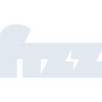
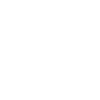

# fizz

[← Back to main README](../../README.md)





## 16 px

### black
```
https://georgegach.github.io/compatible-icons/simple-icons/fizz/16/black.png
```

### slate
```
https://georgegach.github.io/compatible-icons/simple-icons/fizz/16/slate.png
```

### white
```
https://georgegach.github.io/compatible-icons/simple-icons/fizz/16/white.png
```

## 64 px

### black
```
https://georgegach.github.io/compatible-icons/simple-icons/fizz/64/black.png
```

### slate
```
https://georgegach.github.io/compatible-icons/simple-icons/fizz/64/slate.png
```

### white
```
https://georgegach.github.io/compatible-icons/simple-icons/fizz/64/white.png
```

## 128 px

### black
```
https://georgegach.github.io/compatible-icons/simple-icons/fizz/128/black.png
```

### slate
```
https://georgegach.github.io/compatible-icons/simple-icons/fizz/128/slate.png
```

### white
```
https://georgegach.github.io/compatible-icons/simple-icons/fizz/128/white.png
```

## 512 px

### black
```
https://georgegach.github.io/compatible-icons/simple-icons/fizz/512/black.png
```

### slate
```
https://georgegach.github.io/compatible-icons/simple-icons/fizz/512/slate.png
```

### white
```
https://georgegach.github.io/compatible-icons/simple-icons/fizz/512/white.png
```

## 1024 px

### black
```
https://georgegach.github.io/compatible-icons/simple-icons/fizz/1024/black.png
```

### slate
```
https://georgegach.github.io/compatible-icons/simple-icons/fizz/1024/slate.png
```

### white
```
https://georgegach.github.io/compatible-icons/simple-icons/fizz/1024/white.png
```

## 16 px in base64

### black
```
data:image/png;base64,iVBORw0KGgoAAAANSUhEUgAAABAAAAAQCAYAAAAf8/9hAAAABmJLR0QA/wD/AP+gvaeTAAAAy0lEQVQ4jeXRMUoDYRAF4G+zgUhAwcrGzia9B/AU9oKNva0H8AhCruApRPQC6RW1UaOFCEZcsxY+4SeVW4YMDD9v5n9v3jAsfdR5BxihwayryAFu8YQHjLsK3KNNznDchVyFNMAU69jHRwSr/wi0Bf4siDW+in6Lb/SL/01vgQxrcaTAQ9zhObVh8roUmOC8wGe4zOQ3XOE0QvCIi9LOC24W8CirbOAQO9hMfwsnfbxn1wbzTKtwFJuvIdTYS/+v1quwGzD1e5FtqxU/SmwxeYECL6sAAAAASUVORK5CYII=
```

### slate
```
data:image/png;base64,iVBORw0KGgoAAAANSUhEUgAAABAAAAAQCAYAAAAf8/9hAAAABmJLR0QA/wD/AP+gvaeTAAABH0lEQVQ4jd2QO0oDYRSFv/NPNEMwopVNwEILexfgKuwFGxdhZ+MSBLfgHgQRXYAWSgpxhCRiXgTBxGTmWMwksVJS6u3u43zn3gt/PgRQr7u8vNLd5jNqbG6u9RYBhKTZO4irg8eg6DLEvntp9c8XAZQIOrFdA8BhhLKHRQBKmv0hogy0QVWT7qPwgTHKT/wZ0Op7lpkRyqUSkfEYmPZtlAqXvsknYa5lVPw0LjaaDsWgilES0FtRq4AqiNsZAPteyi7mQJ1BuM6dPQhwAz61lRSQV8zVbB0pdBSyJ2d5njrrRGgHEQmtGg6BLYn1wmIDOC6B37HGEhObzHgAUpCOjCuyugAWkWAPGGCmtaDnRn8XIMVtoqVhlE5qv33+n8UXZWx1+oM6tsUAAAAASUVORK5CYII=
```

### white
```
data:image/png;base64,iVBORw0KGgoAAAANSUhEUgAAABAAAAAQCAYAAAAf8/9hAAAABmJLR0QA/wD/AP+gvaeTAAAA0klEQVQ4jeXRMUqDURAE4O9PApGAgpWNnY1g6QE8hb1gY2/rATyC4BU8hYi5gL2iNmq0EMGI0bHZ4E8qY6kDy2P2vZmd5fE3kKSfZCPJ8m/EO0muktwnuU1yPK/BTb4xTrI/j75JMkYfIyxiG68Imp8YpMXfWsIu3our8wO91vtJZ0YMC5VIiw9wjYfqDaqGbYMLnLT4Ec5q8jPOcVhGcIfTdpxHXM7w9VplCbtYw/SrV3DQw0vtOsFnTWuwVzGfStDFVt1Pe50myWaREcZY9b/wBe84X2allouTAAAAAElFTkSuQmCC
```

