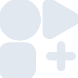

# flathub

[← Back to main README](../../README.md)





## 16 px

### black
```
https://georgegach.github.io/compatible-icons/simple-icons/flathub/16/black.png
```

### slate
```
https://georgegach.github.io/compatible-icons/simple-icons/flathub/16/slate.png
```

### white
```
https://georgegach.github.io/compatible-icons/simple-icons/flathub/16/white.png
```

## 64 px

### black
```
https://georgegach.github.io/compatible-icons/simple-icons/flathub/64/black.png
```

### slate
```
https://georgegach.github.io/compatible-icons/simple-icons/flathub/64/slate.png
```

### white
```
https://georgegach.github.io/compatible-icons/simple-icons/flathub/64/white.png
```

## 128 px

### black
```
https://georgegach.github.io/compatible-icons/simple-icons/flathub/128/black.png
```

### slate
```
https://georgegach.github.io/compatible-icons/simple-icons/flathub/128/slate.png
```

### white
```
https://georgegach.github.io/compatible-icons/simple-icons/flathub/128/white.png
```

## 512 px

### black
```
https://georgegach.github.io/compatible-icons/simple-icons/flathub/512/black.png
```

### slate
```
https://georgegach.github.io/compatible-icons/simple-icons/flathub/512/slate.png
```

### white
```
https://georgegach.github.io/compatible-icons/simple-icons/flathub/512/white.png
```

## 1024 px

### black
```
https://georgegach.github.io/compatible-icons/simple-icons/flathub/1024/black.png
```

### slate
```
https://georgegach.github.io/compatible-icons/simple-icons/flathub/1024/slate.png
```

### white
```
https://georgegach.github.io/compatible-icons/simple-icons/flathub/1024/white.png
```

## 16 px in base64

### black
```
data:image/png;base64,iVBORw0KGgoAAAANSUhEUgAAABAAAAAQCAYAAAAf8/9hAAAABmJLR0QA/wD/AP+gvaeTAAABNElEQVQ4jY3SvytFcRgG8I9LKb9KWW0WdpFilYWUTDYDSTaFv8BCNilGYpJR2UgGTEYpP0oYuH7eiGs431Onc4+bp77Ded73fZ7ve54vVGAO13hHATdYRSWaQ+0eR2iVwjSeUUyddyyiL4jG/C3W0RgLXGUMx+cGoymBIr5xiUnIlxH4wlqGQHwecul9MlAsUyvk8FSm4Q6HGXwex+jLYQMvGU0f2BL9o+/AfeIc42jHGVGMM6HxLQxeY0UUYx1OcYF5VCddKkJTN1rQEb53sR0ck6jBFJbDGuBA6Tt4Da7VKYGhsM5ETOTQhvpUY63oxfUmnAfQE2Y6MRjP/ZVxEWNBYDY4J2s/WKjyPyyL4u7CCHawh83/3iDGcHCeTJKPfwx/oD8l0IAlNCXJfdkpnChNoQS/Ya9/W9Fy0qQAAAAASUVORK5CYII=
```

### slate
```
data:image/png;base64,iVBORw0KGgoAAAANSUhEUgAAABAAAAAQCAYAAAAf8/9hAAAABmJLR0QA/wD/AP+gvaeTAAACDElEQVQ4jY2Sv28McBjGP8/3Tqvl3DmJakNbEQMDiUTQwSZit2Ew+REiBhGDdLEZJIL6C6S1CIMQjQFpDEaJEIQrd06r96PkrtX7PgYlV7lLPOOb9/M+75vnlW1NFioXkE8g1tgKyNOCBxt6Msfy+Zm+mAwTOHQ27Pc4cXSwL/WKRelDsXwuARdtUixVDXRT5lHEdyQ6AYy+CD/2HKcGBjIl5QrlHGIDrSR/ljVsc53FAQBCEeInHC4Hy+mW8O/GHsPQv3XjYNRveTi0g5f0t3eoB6Fye9JF8EQLsGLzAscDQXDL0mwLvkYMY5ZyyA0Am3ngLY7HB3ozO/vXZV/KtnLFynmZk4g1mEBgWub++p70yampqa5ao+OJpIzl2/PV9PDmzZr745IEQrCfI01H2CWRwDysfkvf0To1gO/ADoB8Pt9NirPvZmZGNmWzFQDliqVnMtuM/v6BxA/Qm3p11Z5mt09fywdjZCw6nh7szd5Y3CBsNV7yRDYrsLd0pmb3A/fy+Xz3Quja56i94CC0e7JYKiwPC+NJortRy4iWOy70AsSw8gzES8bh94Y6Eu3DtdhxJdkuwmb97GyMJOouW4kh4cOgu3YcXxY1+l8DNq5eXQZGPhbK34BDSjA+uDZ7DSBY1NpwdYVkobkw39F4IOlqYkGjfy/NFUtPbbarKQXgB+L1XDU91JxCK/0CSCzxIx6PtrkAAAAASUVORK5CYII=
```

### white
```
data:image/png;base64,iVBORw0KGgoAAAANSUhEUgAAABAAAAAQCAYAAAAf8/9hAAAABmJLR0QA/wD/AP+gvaeTAAABXElEQVQ4jY2SMUscURhFz5sNCEaFQFo7G+1FEWIbbBICksouhSKLnWD8BWkUuyWQlAatQsqAXURSJFYpRXBdCGqhq2ZXNuhJMW9gHMc1p7zvffe++e6gBnVZPVRb6pXaUD+oFXUwnh2r39Vh8qiL6rl3aamr6lQ0zfitrqtPMoN6yXBGQ31TMFC9Vg/UKmqzi8Ff9WOJQcZJwsPY5ewqAc66XDgCdkr0JvADmEqAT8BFyaU2sAnUgeuodYA9YC6EMBpC+IVpjUtxmX/Utmlt701r7FN31X31ndqTTwlqBXgGDAFjQAX4CnwOIXRuLUN7gQWgFkJoZuK2d/+Dy5jaUzCYjhXOZ1oCjAD9he9/DAwDz7Nk9SUwGWfG1VdqP106Vp2NBm9jcp4bdeVRyfbLqJHWPQHMAF+ALWDjv16Q28HrmFzNi6f3DLfVFwWDAXVNfZoXv93Tws9iC2X8A3LIEvAkTE0XAAAAAElFTkSuQmCC
```

