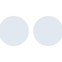
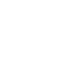

# flickr

[← Back to main README](../../README.md)

<table><tr>
  <td></td>
  <td></td>
  <td></td>
</tr></table>

## 16 px

### black
```
https://georgegach.github.io/compatible-icons/simple-icons/compat/flickr/16/black.png
```

### slate
```
https://georgegach.github.io/compatible-icons/simple-icons/compat/flickr/16/slate.png
```

### white
```
https://georgegach.github.io/compatible-icons/simple-icons/compat/flickr/16/white.png
```

## 64 px

### black
```
https://georgegach.github.io/compatible-icons/simple-icons/compat/flickr/64/black.png
```

### slate
```
https://georgegach.github.io/compatible-icons/simple-icons/compat/flickr/64/slate.png
```

### white
```
https://georgegach.github.io/compatible-icons/simple-icons/compat/flickr/64/white.png
```

## 128 px

### black
```
https://georgegach.github.io/compatible-icons/simple-icons/compat/flickr/128/black.png
```

### slate
```
https://georgegach.github.io/compatible-icons/simple-icons/compat/flickr/128/slate.png
```

### white
```
https://georgegach.github.io/compatible-icons/simple-icons/compat/flickr/128/white.png
```

## 512 px

### black
```
https://georgegach.github.io/compatible-icons/simple-icons/compat/flickr/512/black.png
```

### slate
```
https://georgegach.github.io/compatible-icons/simple-icons/compat/flickr/512/slate.png
```

### white
```
https://georgegach.github.io/compatible-icons/simple-icons/compat/flickr/512/white.png
```

## 1024 px

### black
```
https://georgegach.github.io/compatible-icons/simple-icons/compat/flickr/1024/black.png
```

### slate
```
https://georgegach.github.io/compatible-icons/simple-icons/compat/flickr/1024/slate.png
```

### white
```
https://georgegach.github.io/compatible-icons/simple-icons/compat/flickr/1024/white.png
```

## 16 px in base64

### black
```
data:image/png;base64,iVBORw0KGgoAAAANSUhEUgAAABAAAAAQCAYAAAAf8/9hAAAABmJLR0QA/wD/AP+gvaeTAAAAt0lEQVQ4je3RzWmCQRSF4SfqJgREyCIhkDRgBYJoWjBiCynDXdJEqkgJIYIVfAUIulDxh+BeF87AKN+kAT1wYWbOe7lzOVwV9YoRCozRL2EGwSvwi2403rHAPqkVPpLmz/CWMsvQa3JmxJriGS+YZZhJDY3MWo/hmxU8ZJhGJWM4m5RlatigXmLO8YObcH4qYbZV7NDCXWKs8YVv/OEeTdwmzBLDeOk4RhNj7JVMe3MaY/uf1S5KB12eNEagDS32AAAAAElFTkSuQmCC
```

### slate
```
data:image/png;base64,iVBORw0KGgoAAAANSUhEUgAAABAAAAAQCAYAAAAf8/9hAAAABmJLR0QA/wD/AP+gvaeTAAABG0lEQVQ4je2PTS5DYRiFn/Pea+im2pSmfsIyTLAGiS0wlxhIzZSBWIAZGxBrkEjsAi3qp9w2TH3fa0Ck2rsDzvQ97znngX8J4LrbW7FAUzAh6S0EDufrpdNBY+vhdc0s2XT3DFkezHYWquPnanX662Y0Hao/biePikfztXIDoP3Y3xfacLw8kPnikYbaD/0WYq5g2r2FsChJH5ZcgtcLCNqpi5KK8WoxTZcFhsepb9rhllIKTtHRwWPABW725RrxOJ4a1nM8GwmXP6UxnEsoYE/ACIKhvoXoTYnuUH3uzvHMTOVuerpyG/ETnPz3errguwK4en5fSsLHnkQZ9KboB7P1ibPBh5tOb9VMW+CZO/lYkmzXJ7OLArI/p09f6nBDEKgZYwAAAABJRU5ErkJggg==
```

### white
```
data:image/png;base64,iVBORw0KGgoAAAANSUhEUgAAABAAAAAQCAYAAAAf8/9hAAAABmJLR0QA/wD/AP+gvaeTAAAAqUlEQVQ4je2RUQpBQRiFP7rP8kaKlci1BWQFZCNiX6Ks4C5A8eBK7ODzcq8uZmyAU1PTnG+a+c+BvwBQh+pOzdS9Ogkw08LL1K2alsZCzX3VVV1VLq+Ls6ou6gL1YFhHtav21FOEOSRAMzJZG0iBOtCKMM36t2gqK8okwA1oBMwzsAFqxb4TYO6o80iIy+czugqEmKuzEhgU1ZQ1jj7+quO3GvtfRvspPQD35PjmLYIpGAAAAABJRU5ErkJggg==
```

