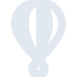
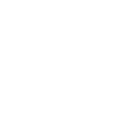

# flydotio

[← Back to main README](../../README.md)

<table><tr>
  <td></td>
  <td></td>
  <td></td>
</tr></table>

## 16 px

### black
```
https://georgegach.github.io/compatible-icons/simple-icons/compat/flydotio/16/black.png
```

### slate
```
https://georgegach.github.io/compatible-icons/simple-icons/compat/flydotio/16/slate.png
```

### white
```
https://georgegach.github.io/compatible-icons/simple-icons/compat/flydotio/16/white.png
```

## 64 px

### black
```
https://georgegach.github.io/compatible-icons/simple-icons/compat/flydotio/64/black.png
```

### slate
```
https://georgegach.github.io/compatible-icons/simple-icons/compat/flydotio/64/slate.png
```

### white
```
https://georgegach.github.io/compatible-icons/simple-icons/compat/flydotio/64/white.png
```

## 128 px

### black
```
https://georgegach.github.io/compatible-icons/simple-icons/compat/flydotio/128/black.png
```

### slate
```
https://georgegach.github.io/compatible-icons/simple-icons/compat/flydotio/128/slate.png
```

### white
```
https://georgegach.github.io/compatible-icons/simple-icons/compat/flydotio/128/white.png
```

## 512 px

### black
```
https://georgegach.github.io/compatible-icons/simple-icons/compat/flydotio/512/black.png
```

### slate
```
https://georgegach.github.io/compatible-icons/simple-icons/compat/flydotio/512/slate.png
```

### white
```
https://georgegach.github.io/compatible-icons/simple-icons/compat/flydotio/512/white.png
```

## 1024 px

### black
```
https://georgegach.github.io/compatible-icons/simple-icons/compat/flydotio/1024/black.png
```

### slate
```
https://georgegach.github.io/compatible-icons/simple-icons/compat/flydotio/1024/slate.png
```

### white
```
https://georgegach.github.io/compatible-icons/simple-icons/compat/flydotio/1024/white.png
```

## 16 px in base64

### black
```
data:image/png;base64,iVBORw0KGgoAAAANSUhEUgAAABAAAAAQCAYAAAAf8/9hAAAABmJLR0QA/wD/AP+gvaeTAAABOElEQVQ4jY3TvU4bURAF4M9OBBJRhBQgFRSuUkYpEEUKappI8CA0iBdIAy0iD4Bo8gAp0qVJjRBFnAIoIAJbBpwfIEYOxBR3LNbrNfKRVpq5M+fcmbmz9GMR31FHGzc4RxXvCvJ7sBLJnRA4DPsParjE8iByBSdBuMMmPoTfwaeoooHpIoGNTHIdr3ICVczjGutdUjkjMJux2zjIXTCGr9HiXJHA/4xdwkhOoBvPcnqcL1EqPMebnMA1FjCJzwrwEj889LymdwYfpTnUMFVUQQPb0rvDUiZ2IU2+gi2cFVUAT7EXN/7ETti/0cRu5DyKGRwFsRXfLxxHbCi8xWm0809q7/Ww5C7eh0ALq4OSSgPOn2Afz8K/kjbzNp9Yzh8ExqVFusFfjEq70YdBAk3pl36BCXyTXqUP91UjVP/VscSlAAAAAElFTkSuQmCC
```

### slate
```
data:image/png;base64,iVBORw0KGgoAAAANSUhEUgAAABAAAAAQCAYAAAAf8/9hAAAABmJLR0QA/wD/AP+gvaeTAAAB20lEQVQ4jXWQz2pTQRyFvzM3pGBJ0zbVtklKKRUUF4KF4jMIVtClbyCKCG58AjfdFjcKiuALSMGdG3XpQlBcKGKbq/afNg1VQsmd46LYJrlxVjPD9/vmnBF9q/F99yrS/RgYExp3dBTeR9pKknCvdnLkeTcfug/pZuuugx5anBWA3ZAYsigijWWd7FljY/d294z+bb5uNOcCfg2qIkVifKAQZPvmIajViOdlJkKWLdTrlbQnQRJ0B1QFwGwnMVnpfima+WDfQAxnSXIrXyF68Rj3QbVa+tzTVT5Rnxp9hdmRuJgTWIpHvWylaVrsFhji8YzznxiIL7ENEAOlrFi+QO/6vbbTumSYkJMXOUHbhRUFfTtMoLKyuNQneK/MyxLNAnqcE5yeKm054ynQBggJ17ry/8SuY+YUeTI9Xdo+qtvT0y6km823RueBJtYX5AVwC4VMeK1+qrwoqZNLACCpE7J4WXgdGEU+B7SRLHs/dLIr3cM5AUCtVmlEJddBP0BCFDAHkpdqtUqjn88JAGYnR95gHtlGVkcKy/XJsXeDWA26tJ00tvY+CQ1Hg/D+zGT5TH/8/yZI01YZu4jdFv6DGFpf3ysNYgcKZmbKvyB8tD1uu4L5MDs7ujuI/QuROcpOTrtlTgAAAABJRU5ErkJggg==
```

### white
```
data:image/png;base64,iVBORw0KGgoAAAANSUhEUgAAABAAAAAQCAYAAAAf8/9hAAAABmJLR0QA/wD/AP+gvaeTAAABVklEQVQ4jY2SzUqVURSGn6VSkEhg6SB0IA4aSoNo0BU0EeougpAguoEmXkBeQDTxAhw4c9I4pIE6SAcZpaipaerBv8fBWdJun+9ICz549/7W++zF4oWq1OfqirqpnqotdUddVifr/tr8JptNwFrqA3VDPVSnupnH1B9puFDfqzP+rbmcYksdufb1FIzXwIPU28BM9cY48BLoB141AR4X+hRYrQB3gE/ADvCkCXBZ6ABuVYDr/6Xnn8MCYOoB4FEFOAKeAfeBeepSh9XvxdKmqyXO5hI31KGOCSJiC/gItPLqRcH/BYwAY8CHiNjumCCn6FO/5It76ufUv9VddVHtazQXkFH1WxpP8ttX19XRG80F5Kn6M2N8luGZ+C9zAXmXgBP1bbe+6GLuBb7STh3AH+BhRJzXvT31RdZd2kFqAcfAbdrZ6KhGQETsAivAIHAPWIqIvabeKxYQI5TdpvPHAAAAAElFTkSuQmCC
```

