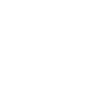

# fnac

[← Back to main README](../../README.md)

<table><tr>
  <td></td>
  <td></td>
  <td></td>
</tr></table>

## 16 px

### black
```
https://georgegach.github.io/compatible-icons/simple-icons/compat/fnac/16/black.png
```

### slate
```
https://georgegach.github.io/compatible-icons/simple-icons/compat/fnac/16/slate.png
```

### white
```
https://georgegach.github.io/compatible-icons/simple-icons/compat/fnac/16/white.png
```

## 64 px

### black
```
https://georgegach.github.io/compatible-icons/simple-icons/compat/fnac/64/black.png
```

### slate
```
https://georgegach.github.io/compatible-icons/simple-icons/compat/fnac/64/slate.png
```

### white
```
https://georgegach.github.io/compatible-icons/simple-icons/compat/fnac/64/white.png
```

## 128 px

### black
```
https://georgegach.github.io/compatible-icons/simple-icons/compat/fnac/128/black.png
```

### slate
```
https://georgegach.github.io/compatible-icons/simple-icons/compat/fnac/128/slate.png
```

### white
```
https://georgegach.github.io/compatible-icons/simple-icons/compat/fnac/128/white.png
```

## 512 px

### black
```
https://georgegach.github.io/compatible-icons/simple-icons/compat/fnac/512/black.png
```

### slate
```
https://georgegach.github.io/compatible-icons/simple-icons/compat/fnac/512/slate.png
```

### white
```
https://georgegach.github.io/compatible-icons/simple-icons/compat/fnac/512/white.png
```

## 1024 px

### black
```
https://georgegach.github.io/compatible-icons/simple-icons/compat/fnac/1024/black.png
```

### slate
```
https://georgegach.github.io/compatible-icons/simple-icons/compat/fnac/1024/slate.png
```

### white
```
https://georgegach.github.io/compatible-icons/simple-icons/compat/fnac/1024/white.png
```

## 16 px in base64

### black
```
data:image/png;base64,iVBORw0KGgoAAAANSUhEUgAAABAAAAAQCAYAAAAf8/9hAAAABmJLR0QA/wD/AP+gvaeTAAABHklEQVQ4jZ3TzS5DURQF4M9FG/9RNTaR+EnEUHiEvoE38DZm5l7DvIMaSiPEhEgFLYmqpmgwOLsJokJXsnPP2Xdn7XXWPmdIwiYO8Ix2xD2qKOMIp5H/gqH47mDv0/47HtHCE5q4QAWHvYJ9vEXB+z+imQXBCm6Qw2uQ/QWtHkERNYyExCwkn6Me3USTq9g/YyKLrguYjqJb3GEMl0H+gm6c/SQUvuI6w6Jk3mgQ5ELJMOZxHGsoRLNGkFZHsBpsM1E0i4lYz0W+HrlCKG3EMWuw63/O96KL7Qzr/U3+FfeoZmHSIOjgLMPUgARtdDLkByR4IDk5PiDBGWneJaxhA8vS2CbjX1G6Fz+hQv/Xl8eSdEe2pEkVJL/yobqE8gekz1jEJODXmAAAAABJRU5ErkJggg==
```

### slate
```
data:image/png;base64,iVBORw0KGgoAAAANSUhEUgAAABAAAAAQCAYAAAAf8/9hAAAABmJLR0QA/wD/AP+gvaeTAAABrUlEQVQ4jZ2TwWpTYRSEvzn3eqNNk9CYomYTCoJakIIbqb5Bd76FT+TDuC9Sl5KKko1FK8bWqmmMaZP7j4ukIDGgdtZz5p/zcX4BfOgPtpPL56AzwQgxSuYE6GLvOuNVMf35tt1uj1iQZgHfnibrGViLBgDDaeCh0Q/EQHCQxF5W+mUOUCZvazY6AlaWvFIzql2kGR7IPCml0wCQ4h7QRxSICSYta7LQCqFhANhuIQ4xOckDRABD0DvM0dwPqC/pI2ChM+Rq7O+7kOhg6jNPfAa+IF3DvEe0QOcSU/AB+I1QgjQh8SlWm8PbtmVzZVbNBZBjZxLrxq/BmWe7N206xsegcwXdPMvKzbLUJIKGDYI1oaoxiOtYDdtHiKpQU1C3dAwE5jBPSY8lFzbFnE/T85Vtr2tG+dbv8LBvYkpLL0J462/El0mhE1F2c0TrgvH/yMnjcrzWC0PtMg0Mo40NjQOrcpmACL4DBPIfp/tvFdQDyBOxkyvdn9oPM8VdmwZOq4rIU6IluVg2n0h7MP+Ni+r1XLla/3rHzjYFj+y0hdQU1BJUJFZM7HRu1Hd/AWatylWvP9LGAAAAAElFTkSuQmCC
```

### white
```
data:image/png;base64,iVBORw0KGgoAAAANSUhEUgAAABAAAAAQCAYAAAAf8/9hAAAABmJLR0QA/wD/AP+gvaeTAAABPElEQVQ4jZ3TzUpcQRCG4aeP4ww6+cGJgq7cBJIIkmXQ3IFXkivK3ttwL0GXMojBTUIwxJ8IMeOgGZ3K4tSQMMRFzgfN6e5TvPV1VXeBiNjADm4xzHGJPnZxgI+llKEplQS8w/vJ+h/6iQGucYXP2MO+BGxHxDgiruP/dFVlhlc4RRsjjB9wMq3BBLCIE7TSYpWWP+EckXGn+JrrW3SriGhjFU8y6AzfMYcvCf+Fuzz7UToc4VuF51m82QS008kMlnCYc+hlsouE9ltYS9rTDFpAN+fPcv8893rp9CKPedLC28za/ivLREv5XZkq3jLu8aHCa810iX6lLlIT3eC4wuOGgGEp5aZCpyHgB3Ul5xsCjqn7vYV1vMFLddse5b9Ff7ozrT0eeH0R0cEL9R3ZVHeqp65XJ11vlVJ2fwOGjIUkAVn1EAAAAABJRU5ErkJggg==
```

