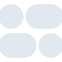

# fonoma

[← Back to main README](../../README.md)





## 16 px

### black
```
https://georgegach.github.io/compatible-icons/simple-icons/fonoma/16/black.png
```

### slate
```
https://georgegach.github.io/compatible-icons/simple-icons/fonoma/16/slate.png
```

### white
```
https://georgegach.github.io/compatible-icons/simple-icons/fonoma/16/white.png
```

## 64 px

### black
```
https://georgegach.github.io/compatible-icons/simple-icons/fonoma/64/black.png
```

### slate
```
https://georgegach.github.io/compatible-icons/simple-icons/fonoma/64/slate.png
```

### white
```
https://georgegach.github.io/compatible-icons/simple-icons/fonoma/64/white.png
```

## 128 px

### black
```
https://georgegach.github.io/compatible-icons/simple-icons/fonoma/128/black.png
```

### slate
```
https://georgegach.github.io/compatible-icons/simple-icons/fonoma/128/slate.png
```

### white
```
https://georgegach.github.io/compatible-icons/simple-icons/fonoma/128/white.png
```

## 512 px

### black
```
https://georgegach.github.io/compatible-icons/simple-icons/fonoma/512/black.png
```

### slate
```
https://georgegach.github.io/compatible-icons/simple-icons/fonoma/512/slate.png
```

### white
```
https://georgegach.github.io/compatible-icons/simple-icons/fonoma/512/white.png
```

## 1024 px

### black
```
https://georgegach.github.io/compatible-icons/simple-icons/fonoma/1024/black.png
```

### slate
```
https://georgegach.github.io/compatible-icons/simple-icons/fonoma/1024/slate.png
```

### white
```
https://georgegach.github.io/compatible-icons/simple-icons/fonoma/1024/white.png
```

## 16 px in base64

### black
```
data:image/png;base64,iVBORw0KGgoAAAANSUhEUgAAABAAAAAQCAYAAAAf8/9hAAAABmJLR0QA/wD/AP+gvaeTAAABMklEQVQ4ja3SzypFURQG8J9zUeRf3VJKkpkyk5kyxAOQB2DuBZSpB/AMIgMjDBhQSpkYGFAu0iV/Qvk3oHuvwdknJ851J7762rW+tfbaa3+Lf0A7lnGMI8whCloeazhBIcVjLKEN9lFCJfAVC6jHIcopLc0S9uA+QzzFCJ6rFCe8i9CcMVYDuqtoaTRFeMgQbrGDmxoXPObwgkG04hMXmMQZchhAC+pShRVcYz4J9mAUT9gUf2SCPoyHnAQFrKNYHwJ1odtQIFxiI7xkMcRaMYYO31abwZXfdpVDfDbk9Yvd+QhaEdNJp7+sKqILBxnaZSTetr/QieFw/kQ+wluNC97CKJ8Z2nsk3utSleIKzsXrvvqjWRmnOaygF43i1X0KvMMuJvCObbFTnUHfwlSN19fGF22na+CWUqEbAAAAAElFTkSuQmCC
```

### slate
```
data:image/png;base64,iVBORw0KGgoAAAANSUhEUgAAABAAAAAQCAYAAAAf8/9hAAAABmJLR0QA/wD/AP+gvaeTAAAB10lEQVQ4jaWQPWuTYRiFr/O8SYpKbSEQK8QUKg5ddDGT7trZwdGp6F8Qlyo4uehQEMEfIDgpqKtbB9FJcLBqm48mFmNajf148z7HodRYokHwXs99rnM48J+n5U5nYmw3PMjEGVn9KB5Nl47elhTr9c1iDNlDpFlEbt9kkcq82clnV7Xa2lhCrmLCHpKeI4uVqYkbtfbGK9BpsIaiTVTQUpA4+cu8JxyRdKne6p4znvmjeS8oYJ8K2IeH6TFPCGVZw9rvb+JQMP4yTFdbaf8lojUKINMJIrkFbtgYtItYjjG5Ui4X6xL3wGsIH0g2BjeyzDcF0Gx2KmnwhSQkXwvsviiVSt/3n1fa3RlJc7YrA0RcTlI/K5eL9RzANlIukmSiukWhutLu4hhXFcLz6WOTH4BFgPX19fEd5y9m0ZMhKACo1urOR7wg6zhisLgwaC2YO+Wpibufmt9mkyR7aqg4kpPcFMmCaq3uquHEiK0bMSlUkyx9Yjh7UKIWgOKopVEoqZ+et10akkQxGHojAXbPITRQSIck+BGQ3gHZX+3m43RpfMn2YzQIs4nA+1zBW3M7cex+COGscWFQT6mJb0Ma5iVF29drnzd7wGXLuYBeb+f710a2/5f7CQi93zsxG5FzAAAAAElFTkSuQmCC
```

### white
```
data:image/png;base64,iVBORw0KGgoAAAANSUhEUgAAABAAAAAQCAYAAAAf8/9hAAAABmJLR0QA/wD/AP+gvaeTAAABUUlEQVQ4jaXTv2qUURQE8N/5jIKKKCwIgqSw28rGdIKl+gT2kqCljZ2thQ8giOADCNZqayEEBLURLKLCsiv+wQiSCBp3xyLf4rJ8yxZOc4s5c+bMuffyn6gkx3EfZ/EHD3G7qiZJeniAPlZmdHt4hWuSbCYZ5x92ktxJspLkdZJJujFO8lySrx3kVpILSX4sEE/xpcGRjmgHcXoBN4vDDb51EJ/xDJ+WNNiWZD3JsM36qx2/D0luJvnYsYdJq7labeEqLuI7nlbVztQiyRlcxuqM8zs8rqrh9GoKB7CGtSQwwJOqeo+7bbNjuIQTaKYOG0lGC8YcJbnR1vXbeL9nIqxLMlhyVcMkp5K86OAGDXpLNn0S59tzHr0Gu0sa7GJk//nO42eDtxgvEAcfsIlHc2YTbFWSo7iHczg0U7CHN9ioqu0khVu4Yv9jvcT1JdMvx1/Xsmz8ANsKOAAAAABJRU5ErkJggg==
```

