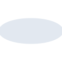

# ford

[← Back to main README](../../README.md)

<table><tr>
  <td></td>
  <td></td>
  <td></td>
</tr></table>

## 16 px

### black
```
https://georgegach.github.io/compatible-icons/simple-icons/compat/ford/16/black.png
```

### slate
```
https://georgegach.github.io/compatible-icons/simple-icons/compat/ford/16/slate.png
```

### white
```
https://georgegach.github.io/compatible-icons/simple-icons/compat/ford/16/white.png
```

## 64 px

### black
```
https://georgegach.github.io/compatible-icons/simple-icons/compat/ford/64/black.png
```

### slate
```
https://georgegach.github.io/compatible-icons/simple-icons/compat/ford/64/slate.png
```

### white
```
https://georgegach.github.io/compatible-icons/simple-icons/compat/ford/64/white.png
```

## 128 px

### black
```
https://georgegach.github.io/compatible-icons/simple-icons/compat/ford/128/black.png
```

### slate
```
https://georgegach.github.io/compatible-icons/simple-icons/compat/ford/128/slate.png
```

### white
```
https://georgegach.github.io/compatible-icons/simple-icons/compat/ford/128/white.png
```

## 512 px

### black
```
https://georgegach.github.io/compatible-icons/simple-icons/compat/ford/512/black.png
```

### slate
```
https://georgegach.github.io/compatible-icons/simple-icons/compat/ford/512/slate.png
```

### white
```
https://georgegach.github.io/compatible-icons/simple-icons/compat/ford/512/white.png
```

## 1024 px

### black
```
https://georgegach.github.io/compatible-icons/simple-icons/compat/ford/1024/black.png
```

### slate
```
https://georgegach.github.io/compatible-icons/simple-icons/compat/ford/1024/slate.png
```

### white
```
https://georgegach.github.io/compatible-icons/simple-icons/compat/ford/1024/white.png
```

## 16 px in base64

### black
```
data:image/png;base64,iVBORw0KGgoAAAANSUhEUgAAABAAAAAQCAYAAAAf8/9hAAAABmJLR0QA/wD/AP+gvaeTAAAAxklEQVQ4je3RTUoDQRAF4G8yiUGFLJKtBnIRzyaCexVyriDeQLcqKJM/J4kufANDmCOkoOju6lfvdb3mFEVH7QJXmGCc2kfyDZsuohnmeMEOv8kDVqhzrvGMR0yb5nvso7DEOuBtCBqyKusGnxG6LQLaox/ADoOQV9mX6OU1B4yCK/tHo3zjLGRF/Oi17i+PPSgDvMEXzqO4jlozSh3lQZQrDHHXEE3xFIPqVuMyuU3tBws84JrubxyGcJLk3+B3vIbkFK34AzCzQAuvcDcjAAAAAElFTkSuQmCC
```

### slate
```
data:image/png;base64,iVBORw0KGgoAAAANSUhEUgAAABAAAAAQCAYAAAAf8/9hAAAABmJLR0QA/wD/AP+gvaeTAAABKElEQVQ4je2SwUpCYRSEv/nv1UTDQHcVgcvyHeqlXLSMqGXvVA9RmzZhIEKZF1Ex++8/LW5G1KZ9zepw4MzMOXPgH/reGI1GzVTb3ifRjckdgFxMHJjERfux19PqB8HDuOhhBkEcgw9BGQC2Ja0MNSCXiIY7WddZKq92dztDDcfFJXAKFIKGUQA3QGtwbSNivBBqYV6BJXJb4kLDcZEkSpscYVtR1SCCeYJakLJkB5klgYRpIyImC5XTz5VmOEXAlSpNwZbtXBAQLbsi3yBIPpcAe2rTUFBdYmlcACvwHLyoaqTK2hSDrTNVl385KPNsYPtEcGSTG9aC+OEwl6gj3gS3WDehjFd7e93HHzHe33ursTM7UKIbTfdLjM+zp/aw39f691/yN/AOxSePuF0ZwEMAAAAASUVORK5CYII=
```

### white
```
data:image/png;base64,iVBORw0KGgoAAAANSUhEUgAAABAAAAAQCAYAAAAf8/9hAAAABmJLR0QA/wD/AP+gvaeTAAAA2UlEQVQ4je2RzUoDQRCEv07iDxE8mKsu+KZB8K6CzyXiG+jVjSK7a5JN9vNgL8bVN9CCZnqK6pqZGvhHDAl1CpwCM+Ak6TLrKSKWP1zUc/VWfVA3fqFTG7XNfaveq9dq0Q9fqlu1VGv1PcWrNOhR5bpUF3nQPNQO2AITQGAD7OXlquzHwAhogA44Tt14MnjNG7CfZgFMc7DHEfAtgxFwkf0LcJgGDfCa4gqos48dLcC8z6FQbzKgdieDOmuV3Fq9U6/UM/j9Gw+Ags9vnCVdAs/AY0SshzN/HR+4csuXaxRsGQAAAABJRU5ErkJggg==
```

