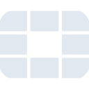
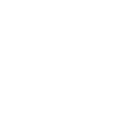

# fortinet

[← Back to main README](../../README.md)

<table><tr>
  <td></td>
  <td></td>
  <td></td>
</tr></table>

## 16 px

### black
```
https://georgegach.github.io/compatible-icons/simple-icons/compat/fortinet/16/black.png
```

### slate
```
https://georgegach.github.io/compatible-icons/simple-icons/compat/fortinet/16/slate.png
```

### white
```
https://georgegach.github.io/compatible-icons/simple-icons/compat/fortinet/16/white.png
```

## 64 px

### black
```
https://georgegach.github.io/compatible-icons/simple-icons/compat/fortinet/64/black.png
```

### slate
```
https://georgegach.github.io/compatible-icons/simple-icons/compat/fortinet/64/slate.png
```

### white
```
https://georgegach.github.io/compatible-icons/simple-icons/compat/fortinet/64/white.png
```

## 128 px

### black
```
https://georgegach.github.io/compatible-icons/simple-icons/compat/fortinet/128/black.png
```

### slate
```
https://georgegach.github.io/compatible-icons/simple-icons/compat/fortinet/128/slate.png
```

### white
```
https://georgegach.github.io/compatible-icons/simple-icons/compat/fortinet/128/white.png
```

## 512 px

### black
```
https://georgegach.github.io/compatible-icons/simple-icons/compat/fortinet/512/black.png
```

### slate
```
https://georgegach.github.io/compatible-icons/simple-icons/compat/fortinet/512/slate.png
```

### white
```
https://georgegach.github.io/compatible-icons/simple-icons/compat/fortinet/512/white.png
```

## 1024 px

### black
```
https://georgegach.github.io/compatible-icons/simple-icons/compat/fortinet/1024/black.png
```

### slate
```
https://georgegach.github.io/compatible-icons/simple-icons/compat/fortinet/1024/slate.png
```

### white
```
https://georgegach.github.io/compatible-icons/simple-icons/compat/fortinet/1024/white.png
```

## 16 px in base64

### black
```
data:image/png;base64,iVBORw0KGgoAAAANSUhEUgAAABAAAAAQCAYAAAAf8/9hAAAABmJLR0QA/wD/AP+gvaeTAAAA80lEQVQ4jaXTMUpDQRSF4S/PZxIbBYuAYGHhGuzFxg3Y2JilWehr3EDsRDsXoAnaKAoSuwRRQyQWTvFywwtqDgzM/PdwZ84Mw4Kq/dG/hizNhxjXsIMTrKTCJy6xj6/EltDBLpYTe8dhjlNsl3a5RRMbYfdmar5VYkWGVjBmqhUjt3JcBfiAa6wGfo4B7mLHLkYl9oq9ihNcYL20rsMkjJvqBLrRPy/vr5SjZzZClV6Ct57jPpiecISDwM/8RNiMXYemc/VQmL2bItXKbJChHxpO5kSItX6ONo6lJ0EDH3jEOLE8sQaeExuhvchnejN9of/TN7YlQxQAdFqbAAAAAElFTkSuQmCC
```

### slate
```
data:image/png;base64,iVBORw0KGgoAAAANSUhEUgAAABAAAAAQCAYAAAAf8/9hAAAABmJLR0QA/wD/AP+gvaeTAAABXklEQVQ4jaWTvUpcURSFv7XnOCqIE1KIQiIWEgtLwTaENAHrNGnio6WINnkB7UQ7X0BjImhURgyMP2PwB3OWxejMveKFaFa5z3f2XmvDhv+UngJvt1qN1I4AGB9vtCXdaK95OuvwV/AgANYVsAr+gPjbqVEDLQHvwH13/S5wfEqWFzCTBTMbQgOGMVy0qoFsX0mauK9ZeTGQRoo2baIyb6gUWdJIklkrr8K72Xk9FMNFODsvC50J/eihoJ1mazOk64LV369HX7x/zMHe4cmK8cteU9dTKKZKEWCjKkI2o5K6fEjVef9VKTt/fxihCg5xaNxls11PNdV+FiHj/d3m8edQfCzbz98MmyJe3ddqgmTyW9BQl5S2Ag0bz5Wnx5nFjO03vWG0A3RUcpBtKvTwTXCUiJgn5y/I9bsd9BtfYv9Cuun8dLK4lOgHH3Sm65qI+Wcf0/l548/0dG/5z9YtIrqSz6zFDbIAAAAASUVORK5CYII=
```

### white
```
data:image/png;base64,iVBORw0KGgoAAAANSUhEUgAAABAAAAAQCAYAAAAf8/9hAAAABmJLR0QA/wD/AP+gvaeTAAABBklEQVQ4jaXTvS5EURTF8d8Z1xiJkCgmkSgU4gUkWhGNRK3RmEdToPECdELnARgfDSGR0Y0IJmQr3OI6zITM6s5/r+yzVk4OQyr9xxwRU6iVx6eU0nuKiCXsYLwcvOEYa/go2QgOsILRkr1gs8Au5isXnaOBmSxAo1w+V2F7NTQzY01/5ZWbBU4yeINTTGb8EF1cfdsYEW30KuwxpbT62/URcYTpCqqLnzrrlz8i2rl5UN8/qcBFXmGA/yHz1gtcZ6a7iNjCRsb30cZsnmAZExV26esF1rMFXSxiocKeauhkxhhQIZ91CrSwjXoJx/CKW7xXkr6Ws/uS9dAa5jM9p5R6g/x/0if/lWfUsiDRhwAAAABJRU5ErkJggg==
```

