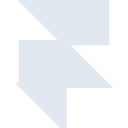

# framer

[← Back to main README](../../README.md)





## 16 px

### black
```
https://georgegach.github.io/compatible-icons/simple-icons/framer/16/black.png
```

### slate
```
https://georgegach.github.io/compatible-icons/simple-icons/framer/16/slate.png
```

### white
```
https://georgegach.github.io/compatible-icons/simple-icons/framer/16/white.png
```

## 64 px

### black
```
https://georgegach.github.io/compatible-icons/simple-icons/framer/64/black.png
```

### slate
```
https://georgegach.github.io/compatible-icons/simple-icons/framer/64/slate.png
```

### white
```
https://georgegach.github.io/compatible-icons/simple-icons/framer/64/white.png
```

## 128 px

### black
```
https://georgegach.github.io/compatible-icons/simple-icons/framer/128/black.png
```

### slate
```
https://georgegach.github.io/compatible-icons/simple-icons/framer/128/slate.png
```

### white
```
https://georgegach.github.io/compatible-icons/simple-icons/framer/128/white.png
```

## 512 px

### black
```
https://georgegach.github.io/compatible-icons/simple-icons/framer/512/black.png
```

### slate
```
https://georgegach.github.io/compatible-icons/simple-icons/framer/512/slate.png
```

### white
```
https://georgegach.github.io/compatible-icons/simple-icons/framer/512/white.png
```

## 1024 px

### black
```
https://georgegach.github.io/compatible-icons/simple-icons/framer/1024/black.png
```

### slate
```
https://georgegach.github.io/compatible-icons/simple-icons/framer/1024/slate.png
```

### white
```
https://georgegach.github.io/compatible-icons/simple-icons/framer/1024/white.png
```

## 16 px in base64

### black
```
data:image/png;base64,iVBORw0KGgoAAAANSUhEUgAAABAAAAAQCAYAAAAf8/9hAAAABmJLR0QA/wD/AP+gvaeTAAAApklEQVQ4jaXRqwpCQRAG4I+jIPgMdh9D7DYx+H4+gyCabTabNg0GwSCCwVvxcjjunosOTFnYb/7Z5VNDnHAv0XOR6mP3D1AWyQXKIIVAEfIG6qkLM7QD0AUL3FJn0xDQRCsAnHFAD9e8yPNI3PsTmaD2KxBFkjwxUw10MA4lSbCMTN5k+ohRaHgLqwAwyIuVVrboYl1hra8YlZHQI1ZCYr/wQvZFwANPC1/7KuYgaQAAAABJRU5ErkJggg==
```

### slate
```
data:image/png;base64,iVBORw0KGgoAAAANSUhEUgAAABAAAAAQCAYAAAAf8/9hAAAABmJLR0QA/wD/AP+gvaeTAAABCElEQVQ4jZ3RvUoDQRQF4HPuBpQUcUEUfwZiIfgOaSS9tWDjC/hKaawsxNZGwdLKN7DLij9RolYWO3NsssnG3bAZLwzMzJ35mHuHmMTT6OvE+zAA2EZDCLjvbqU9ALBic3dj7SIEnoJ8bQLKYeXF3k56FbzOYhD7uxGLVIBYpFVMhi+ft6IOZilBASCRB+EhMYZpJuQ3FSAAbYqurJOAwB8zjN1m54ikX6qEOQRahdQfPo+vJSXRwCRWYHZYhywLLEQMACQZxU7tNSorjRHNetnb97kkAwAW57Lsw4VWcgdgv3xfwnF3O71c9KxpCc6tZ5b7PoDHiLLme/AfpNLEWKT2F2aI3puAX/kheHIYV6kwAAAAAElFTkSuQmCC
```

### white
```
data:image/png;base64,iVBORw0KGgoAAAANSUhEUgAAABAAAAAQCAYAAAAf8/9hAAAABmJLR0QA/wD/AP+gvaeTAAAAuElEQVQ4jZ3RMQ4BQRTG8f8MCVE4wfbuoBG9ThSO5xIaap0TUG4hIVFJFPgUNmvYmd2Z/ZJpZvJ+mfceFJG0lHRTXHb4Imku6dQaSEDCQCRSD0QgJdB1CrbAyGM9gD3wcu42FQAYAJkHuANXYGaMef4/2sZeoA9MgbWkThsAoAdMfEgsEEQsgCQLDAOFuXPOwBhYFTXfSMokHTwrW9R9q1SMMTmfYR0T2vqdQRukMsRUxLsFB7k0AW+UrQYKDrY7ogAAAABJRU5ErkJggg==
```

