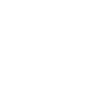

# framework7

[← Back to main README](../../README.md)

<table><tr>
  <td></td>
  <td></td>
  <td></td>
</tr></table>

## 16 px

### black
```
https://georgegach.github.io/compatible-icons/simple-icons/compat/framework7/16/black.png
```

### slate
```
https://georgegach.github.io/compatible-icons/simple-icons/compat/framework7/16/slate.png
```

### white
```
https://georgegach.github.io/compatible-icons/simple-icons/compat/framework7/16/white.png
```

## 64 px

### black
```
https://georgegach.github.io/compatible-icons/simple-icons/compat/framework7/64/black.png
```

### slate
```
https://georgegach.github.io/compatible-icons/simple-icons/compat/framework7/64/slate.png
```

### white
```
https://georgegach.github.io/compatible-icons/simple-icons/compat/framework7/64/white.png
```

## 128 px

### black
```
https://georgegach.github.io/compatible-icons/simple-icons/compat/framework7/128/black.png
```

### slate
```
https://georgegach.github.io/compatible-icons/simple-icons/compat/framework7/128/slate.png
```

### white
```
https://georgegach.github.io/compatible-icons/simple-icons/compat/framework7/128/white.png
```

## 512 px

### black
```
https://georgegach.github.io/compatible-icons/simple-icons/compat/framework7/512/black.png
```

### slate
```
https://georgegach.github.io/compatible-icons/simple-icons/compat/framework7/512/slate.png
```

### white
```
https://georgegach.github.io/compatible-icons/simple-icons/compat/framework7/512/white.png
```

## 1024 px

### black
```
https://georgegach.github.io/compatible-icons/simple-icons/compat/framework7/1024/black.png
```

### slate
```
https://georgegach.github.io/compatible-icons/simple-icons/compat/framework7/1024/slate.png
```

### white
```
https://georgegach.github.io/compatible-icons/simple-icons/compat/framework7/1024/white.png
```

## 16 px in base64

### black
```
data:image/png;base64,iVBORw0KGgoAAAANSUhEUgAAABAAAAAQCAYAAAAf8/9hAAAABmJLR0QA/wD/AP+gvaeTAAABFElEQVQ4jZXTvS8EURQF8J/JFooVskSr0mm1q5Bs68/g79ApdCpCqaITKonGV6td8VXIhhBZG1Zil+K9SdbYYeckNzNz7zv3nHn3PX5iAlu4wiM+YjzE3AbG5aCKF7ziKSdacU01JQ3F5ywWUcrrnsEndnGQ2r7GV4FoYhnlElYwNaAytLGHJSSEzSmifoGT+F5PMFJA/R7HmInfZcKYBlF+xVpskuZaRRqcRvu9ubdE2NH/cCdMajqTbyWpjT/wjB3MYzhTayY4QjeH3ME5FjCZqXVxCBXc6v/fdewLJy9bu8Fo2q2GRmZBA6vCHciSG5jL2q1FJx28Y7uPs05U/kVOUcGmcFjOhBG3het8iXWM9RK+Ad/wipEMoUktAAAAAElFTkSuQmCC
```

### slate
```
data:image/png;base64,iVBORw0KGgoAAAANSUhEUgAAABAAAAAQCAYAAAAf8/9hAAAABmJLR0QA/wD/AP+gvaeTAAABnUlEQVQ4jY2SsWtTURyFv3NfbB1Ma0IbUJqaIoKDi4O4FcXdLkI3nUR3ofgvqP+JKEIRBKGlKg7ubg7FRJ4kYDUxQwjv3eMQU5KYmpzpcrnf+X3ce8VI0rSzkoX8KYQbwsVolgAk2kBXsKcsPF5bW/oxZDRc1Fs/N23tBkgc6TMlxotImYJvr1dK748L6t/b15AfYBemgf9EyhT0slpZflNI085Kpvw5qIY0C/2r7d/OlbZarQ+FLORPQBfmIgfpOeo1wQ97cSEE0E1G7mJ2/MWBGrAK2g6C4tyslNr6iLgCYHwmRAZPNXswXeCV5C15MFSiGPDc0z8Lb4LOHW+ZEILozGRxHXxo69KYlOmGCN3/q/vICi9sboFPT1h1gqQDIJ6A5wR9coxbEpWxXojCe0F9HmF/O6HgUBEk1aaoNfoLcSdUq8tHWPcNzfEDaiLtRnwdSCboZkwK9y6Wy+0AsH7+7FtF7mLXgWjogffleEdSeVTb9tc8SbY3VovvYOIHNhrtMqf8DHTZdoJ01bYFHaSO8H626J2NUunXkPkDKcKt+mSrJWcAAAAASUVORK5CYII=
```

### white
```
data:image/png;base64,iVBORw0KGgoAAAANSUhEUgAAABAAAAAQCAYAAAAf8/9hAAAABmJLR0QA/wD/AP+gvaeTAAABMUlEQVQ4jZWTPS9EURCGn3tsQmERNhIVCp1WobGFRMnP4K8o/AFCqRAiEaGSCNmEmo74KmRDKNjER3b3UTiR6+aS3TeZ4sycZ+adYiAltaSuqVfqo/oR4yHmVtSBNJOk4ClgB+gAPslXJ1AHZpMkOfppoE4A80DhDzCrOrCVJMl+QS0BG8BIizDAK3CvHheARWC4Dfgd2AUWgJCoV8BoGw3OgBowCVwGoNgGfA9UgPH47g5AT4twDdgG5lJDi6GN6efAFDCUyoUAvLQA3wHXwFjWVYjW/tMzsAlMA12Z2ksADoHmH3ADOOV778FMrQkcoPart+brQt1T6zm1G7UXAHVGrWY+VNUl9SkHrqrlX35ik1u1ob6p6znOGnFymTzFdVbVinoST/k9nvOluqz2pZkvNqgcOjMD40IAAAAASUVORK5CYII=
```

