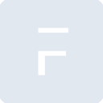

# frappe

[← Back to main README](../../README.md)

<table><tr>
  <td></td>
  <td></td>
  <td></td>
</tr></table>

## 16 px

### black
```
https://georgegach.github.io/compatible-icons/simple-icons/compat/frappe/16/black.png
```

### slate
```
https://georgegach.github.io/compatible-icons/simple-icons/compat/frappe/16/slate.png
```

### white
```
https://georgegach.github.io/compatible-icons/simple-icons/compat/frappe/16/white.png
```

## 64 px

### black
```
https://georgegach.github.io/compatible-icons/simple-icons/compat/frappe/64/black.png
```

### slate
```
https://georgegach.github.io/compatible-icons/simple-icons/compat/frappe/64/slate.png
```

### white
```
https://georgegach.github.io/compatible-icons/simple-icons/compat/frappe/64/white.png
```

## 128 px

### black
```
https://georgegach.github.io/compatible-icons/simple-icons/compat/frappe/128/black.png
```

### slate
```
https://georgegach.github.io/compatible-icons/simple-icons/compat/frappe/128/slate.png
```

### white
```
https://georgegach.github.io/compatible-icons/simple-icons/compat/frappe/128/white.png
```

## 512 px

### black
```
https://georgegach.github.io/compatible-icons/simple-icons/compat/frappe/512/black.png
```

### slate
```
https://georgegach.github.io/compatible-icons/simple-icons/compat/frappe/512/slate.png
```

### white
```
https://georgegach.github.io/compatible-icons/simple-icons/compat/frappe/512/white.png
```

## 1024 px

### black
```
https://georgegach.github.io/compatible-icons/simple-icons/compat/frappe/1024/black.png
```

### slate
```
https://georgegach.github.io/compatible-icons/simple-icons/compat/frappe/1024/slate.png
```

### white
```
https://georgegach.github.io/compatible-icons/simple-icons/compat/frappe/1024/white.png
```

## 16 px in base64

### black
```
data:image/png;base64,iVBORw0KGgoAAAANSUhEUgAAABAAAAAQCAYAAAAf8/9hAAAABmJLR0QA/wD/AP+gvaeTAAAAlElEQVQ4jcXSMQrCQBAF0JdF7FLa2nkVL+AVPIM38GjmAqkFD6BFsmCrTRAJu2RNCj8MDH9m/s6wHxr0eP0YPS7VkNTmIVaD2myEJcOwyvA3nEbcHsdxY+6EB7rEY9tSgWLkTkhtUGNTKtBhh8MXd04JkDbJFWvcM/VPTH3jc6Ke9UEYrZ/F/50YEBfMx4B2pkhE+wY2VDLxB5UuNgAAAABJRU5ErkJggg==
```

### slate
```
data:image/png;base64,iVBORw0KGgoAAAANSUhEUgAAABAAAAAQCAYAAAAf8/9hAAAABmJLR0QA/wD/AP+gvaeTAAAAxElEQVQ4jaWSMQrCQBREZz5pF8EgVpZ2nsML5AqewRsI3sAbeYFAatEmFmKSBdux0KiBJGziwDbzd97//F1ersUR0kqgwwAR8qClvOT3ami4liBvY8OvKehsbLhW1OGfJGx/DSPWAjahAEdi37QYAQqeIH6fj9QS7gPcAJSN/qATNAsFlIv5ZHnOy+RL0A5AMABZhshNeQAVd90BgP5npB699R6AubhKOmrNHue8aF9voP7+iUbIjw0L8gZaqhEQQd5o6RMUjjw2fWE6/wAAAABJRU5ErkJggg==
```

### white
```
data:image/png;base64,iVBORw0KGgoAAAANSUhEUgAAABAAAAAQCAYAAAAf8/9hAAAABmJLR0QA/wD/AP+gvaeTAAAAmklEQVQ4jcWTsQ3CMBBFny1ElzJtOjrmYAFWyAxswGpZwDUSA0ARLNH+FJEiZPkUxxR55T//7zv57CQNwBlo2EYEgpP0qTAvIU6SKs0A+H/MAAdDfwK3RLsAfXrQGuENjJnLutKAYqwRch00QFsaMAIn4Pqj3XMBKM9D0lHSy6gvrD3jd6Vu7oFP2jfZfxM986+qJXogVIZEIEyPFGgSuzNdzwAAAABJRU5ErkJggg==
```

