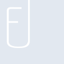
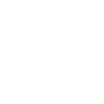

# fyle

[← Back to main README](../../README.md)

<table><tr>
  <td></td>
  <td></td>
  <td></td>
</tr></table>

## 16 px

### black
```
https://georgegach.github.io/compatible-icons/simple-icons/compat/fyle/16/black.png
```

### slate
```
https://georgegach.github.io/compatible-icons/simple-icons/compat/fyle/16/slate.png
```

### white
```
https://georgegach.github.io/compatible-icons/simple-icons/compat/fyle/16/white.png
```

## 64 px

### black
```
https://georgegach.github.io/compatible-icons/simple-icons/compat/fyle/64/black.png
```

### slate
```
https://georgegach.github.io/compatible-icons/simple-icons/compat/fyle/64/slate.png
```

### white
```
https://georgegach.github.io/compatible-icons/simple-icons/compat/fyle/64/white.png
```

## 128 px

### black
```
https://georgegach.github.io/compatible-icons/simple-icons/compat/fyle/128/black.png
```

### slate
```
https://georgegach.github.io/compatible-icons/simple-icons/compat/fyle/128/slate.png
```

### white
```
https://georgegach.github.io/compatible-icons/simple-icons/compat/fyle/128/white.png
```

## 512 px

### black
```
https://georgegach.github.io/compatible-icons/simple-icons/compat/fyle/512/black.png
```

### slate
```
https://georgegach.github.io/compatible-icons/simple-icons/compat/fyle/512/slate.png
```

### white
```
https://georgegach.github.io/compatible-icons/simple-icons/compat/fyle/512/white.png
```

## 1024 px

### black
```
https://georgegach.github.io/compatible-icons/simple-icons/compat/fyle/1024/black.png
```

### slate
```
https://georgegach.github.io/compatible-icons/simple-icons/compat/fyle/1024/slate.png
```

### white
```
https://georgegach.github.io/compatible-icons/simple-icons/compat/fyle/1024/white.png
```

## 16 px in base64

### black
```
data:image/png;base64,iVBORw0KGgoAAAANSUhEUgAAABAAAAAQCAYAAAAf8/9hAAAABmJLR0QA/wD/AP+gvaeTAAAAsUlEQVQ4ja3SvWoCQRTF8d8uSxrRIluEvIBdGt8n+HKCjU8ivkEqI1jtFmnEfGmKHWVYI/uhBy5zmTvnz+UwUOD4TxWYX5md32TI8YEtflR6wq9m5Wlo1lhGg6SFGWTh3GOCl2i2aQNIo/4BuwBrrRgwC/XWBZBF/SvGXcz1DT67muuAXrobIHOZ/jcGTYBTiM9Y4B2P+MIK0yZAovrTVCGWOIT7EYZdAL10lxDLG/zlH2XZKcLo96ooAAAAAElFTkSuQmCC
```

### slate
```
data:image/png;base64,iVBORw0KGgoAAAANSUhEUgAAABAAAAAQCAYAAAAf8/9hAAAABmJLR0QA/wD/AP+gvaeTAAAA5ElEQVQ4ja2SMU5CQRRFz51MtDBSQEF0AXY2rMaGuDlKd+AOjDug8psYCieBxoDgXAo+P35A+Z9wm7mZmXvey8tTMZl9gnvsykpBPGf8sPdWSSluwp7Z+pC8AhDqW/z8Hayq9EJJelPQS3UNOh7eKJbnXHhgdP+L/t6EE7YmZy7AXzbzptVrAEkjoZHEuA0gVk4e2ty1Cdc7gEXbcA1wqs4DsInOrk1fYpnh6hggAij4xg5PyEWwu7a/TXhF+RH/vwsqJlOXfoGUIGeMhDqG60YdlLrEvt1unw//39M5hqh0elxpDUYHUeWOB9drAAAAAElFTkSuQmCC
```

### white
```
data:image/png;base64,iVBORw0KGgoAAAANSUhEUgAAABAAAAAQCAYAAAAf8/9hAAAABmJLR0QA/wD/AP+gvaeTAAAAtElEQVQ4ja3SPWpCQRTF8Z/ySBNMoUXIBtLZuB9xc4KNKwnZQapEsPIVNuJH9Fo4hsEkvPfUA8McuHP+XA4jIhbxtxYRMfln9vOmQA9LzPHtpGfsVavXTuYTb9mgVSMMinSvMUA/m83qANqZf8AqwWorB4zT+WgCKDI/xGuT8OUGm6bhS8BVuhug8Lv9HR6rAOcSXzDFF7rY4h2jKkArIiL5DUocnH7iEzpNAFfpLiWWN+TLI/ffX4y0U48aAAAAAElFTkSuQmCC
```

