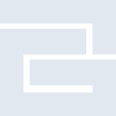
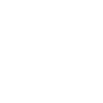

# g2g

[← Back to main README](../../README.md)

<table><tr>
  <td></td>
  <td></td>
  <td></td>
</tr></table>

## 16 px

### black
```
https://georgegach.github.io/compatible-icons/simple-icons/compat/g2g/16/black.png
```

### slate
```
https://georgegach.github.io/compatible-icons/simple-icons/compat/g2g/16/slate.png
```

### white
```
https://georgegach.github.io/compatible-icons/simple-icons/compat/g2g/16/white.png
```

## 64 px

### black
```
https://georgegach.github.io/compatible-icons/simple-icons/compat/g2g/64/black.png
```

### slate
```
https://georgegach.github.io/compatible-icons/simple-icons/compat/g2g/64/slate.png
```

### white
```
https://georgegach.github.io/compatible-icons/simple-icons/compat/g2g/64/white.png
```

## 128 px

### black
```
https://georgegach.github.io/compatible-icons/simple-icons/compat/g2g/128/black.png
```

### slate
```
https://georgegach.github.io/compatible-icons/simple-icons/compat/g2g/128/slate.png
```

### white
```
https://georgegach.github.io/compatible-icons/simple-icons/compat/g2g/128/white.png
```

## 512 px

### black
```
https://georgegach.github.io/compatible-icons/simple-icons/compat/g2g/512/black.png
```

### slate
```
https://georgegach.github.io/compatible-icons/simple-icons/compat/g2g/512/slate.png
```

### white
```
https://georgegach.github.io/compatible-icons/simple-icons/compat/g2g/512/white.png
```

## 1024 px

### black
```
https://georgegach.github.io/compatible-icons/simple-icons/compat/g2g/1024/black.png
```

### slate
```
https://georgegach.github.io/compatible-icons/simple-icons/compat/g2g/1024/slate.png
```

### white
```
https://georgegach.github.io/compatible-icons/simple-icons/compat/g2g/1024/white.png
```

## 16 px in base64

### black
```
data:image/png;base64,iVBORw0KGgoAAAANSUhEUgAAABAAAAAQCAYAAAAf8/9hAAAABmJLR0QA/wD/AP+gvaeTAAAAqUlEQVQ4jcXTMQrCUBAE0BcNKog2grWNll7DwiN4FmtPIt7Da9hZCNqK2khiEQNJCDFBwSnnM7PD7P4AsS/Q+kYMIR54NtT10+EBFg2EEWbYYJAm2L5T1EGMVZYIMWqQ4FAkmpbYLurCzOMNe1wqDM44YidTYnoHVywlBQ1rJuqEJeQY05oGvzmkIk64V2i6mKBXZjDH+sPQuaSnHvkSI8km6iB3yv/9jS8mDRiqA8fiBQAAAABJRU5ErkJggg==
```

### slate
```
data:image/png;base64,iVBORw0KGgoAAAANSUhEUgAAABAAAAAQCAYAAAAf8/9hAAAABmJLR0QA/wD/AP+gvaeTAAAA3UlEQVQ4ja2SO04DQRBEX82OAQlBYonYiQn3IkTEnIV4T2JxD1/DmQMLO7KEzCbsFMGa9QcZj7V0MtKo63V1qzR/X5seFfqIASJQC74uUolbux0ekZ5zdzBOSnoUroC7FmAmkutcAm5e0G7zCB4604LE7Lj1oiPaKtrXnS52dNjYTMGrkwBYNmg+EG/eDtdPDgQfTumJUFSQ7nMcJfsqHn9KfrA1zgEE6X+CdFhmAf48JbB1LRghbn4DVJROzetfE6VQSq5MC9gdUSTMJsv3QZQ7awS28Txbe2nqfcRvSXlT7HbwRn8AAAAASUVORK5CYII=
```

### white
```
data:image/png;base64,iVBORw0KGgoAAAANSUhEUgAAABAAAAAQCAYAAAAf8/9hAAAABmJLR0QA/wD/AP+gvaeTAAAArElEQVQ4jcXTMQ4BYRQE4G/ZsInQSNQaStdQOIKzqJ1E3MM1dAoJraARv2JtsrsRdkNiyvkz8ybz3h+FEIIv0PhGDDGuuNXUdbLhUQhhWkN4xxhLdLMEq2eKKgiY54kY/RoJtmWibonNsi7OPZ6xwfGNwQE7rOVKzO7ghJm0oF7FRK34BTnAqKLBbw6pjD0ubzRtDJG8Mphg8WHoRNpTQrHEu3QTVVA45f/+xgfn/iebz7+pZAAAAABJRU5ErkJggg==
```

