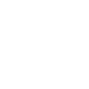

# gamejolt

[← Back to main README](../../README.md)




## 16 px

### black
```
https://georgegach.github.io/compatible-icons/simple-icons/gamejolt/16/black.png
```

### slate
```
https://georgegach.github.io/compatible-icons/simple-icons/gamejolt/16/slate.png
```

### white
```
https://georgegach.github.io/compatible-icons/simple-icons/gamejolt/16/white.png
```

## 64 px

### black
```
https://georgegach.github.io/compatible-icons/simple-icons/gamejolt/64/black.png
```

### slate
```
https://georgegach.github.io/compatible-icons/simple-icons/gamejolt/64/slate.png
```

### white
```
https://georgegach.github.io/compatible-icons/simple-icons/gamejolt/64/white.png
```

## 128 px

### black
```
https://georgegach.github.io/compatible-icons/simple-icons/gamejolt/128/black.png
```

### slate
```
https://georgegach.github.io/compatible-icons/simple-icons/gamejolt/128/slate.png
```

### white
```
https://georgegach.github.io/compatible-icons/simple-icons/gamejolt/128/white.png
```

## 512 px

### black
```
https://georgegach.github.io/compatible-icons/simple-icons/gamejolt/512/black.png
```

### slate
```
https://georgegach.github.io/compatible-icons/simple-icons/gamejolt/512/slate.png
```

### white
```
https://georgegach.github.io/compatible-icons/simple-icons/gamejolt/512/white.png
```

## 1024 px

### black
```
https://georgegach.github.io/compatible-icons/simple-icons/gamejolt/1024/black.png
```

### slate
```
https://georgegach.github.io/compatible-icons/simple-icons/gamejolt/1024/slate.png
```

### white
```
https://georgegach.github.io/compatible-icons/simple-icons/gamejolt/1024/white.png
```

## 16 px in base64

### black
```
data:image/png;base64,iVBORw0KGgoAAAANSUhEUgAAABAAAAAQCAYAAAAf8/9hAAAABmJLR0QA/wD/AP+gvaeTAAABJUlEQVQ4jZXTvS5EURQF4A9TiEg0Gp2CRKIgQnQSjcQDSLyGB1BovIA3UCg1lBKdbgiJKBANEcz4/8n4G8XZE8dkEjMr2bm5WWetvc7e9/IXfbhFtYn6wmUhExewgG88xYF6FNCNCu4wl5NduAr3dUzW1SJKeMMNxurdV1EO55U6bganeI8rjjRI5zy6b0TMGqZxFlwZB9jCWi7eDLKMayxjB0uZOK97XOQGJxnxgsfsWZKGdhln7iItaMc2euK9B6/StJ+kwX4E14FnPGAg737UIGKjesQxenNxQZruq7/oRH8kEPyFtI2Sf9CGqbhrVVrdIQb/E9YwJH0olTDYx3Cz4g7MhkEVexhtVszvz/SJIsZbEbdjXlpfEROtiEkTr2C3lc4/aq5oQJV1JL0AAAAASUVORK5CYII=
```

### slate
```
data:image/png;base64,iVBORw0KGgoAAAANSUhEUgAAABAAAAAQCAYAAAAf8/9hAAAABmJLR0QA/wD/AP+gvaeTAAAB8UlEQVQ4jY2RvU+TURTGf899XwxUpa0a0hap+JH4NzAYP2JwddFRndTNOPonOLhr4uxmjImbg4uLiTEyNA5oJHy8VDHQphSV9n0fByxQwOCZ7j3n/J7z3HPFtphZapeVrddkFdk/Msz3uHezHc/Wm/cDypBbltJdiB2DDgG/kVYc0mvq1ZIkyaVR7qvNCOKFrIfb2dRMBvke6CCwmmW+Ml4pfNh0kEZDj50RIzfIWBgrF971arNJYzIEbhmGZa+G4MvVSnEKIGy50yXEEcPbwajzoJefX1y56OAnwClBCzFv69FsffkZgADm6s1XticsEKTAU6ELmXgt+wYw3rcK3BS0q6Xi6IbAt8Znm9NAE3tAIgUiIMVat3QYvAyUgAbQrpYKxwHCXL3xxib/VzwvtAaKjVoo5AwdAJlIsCpopj/zZ3puYlAJfGzTnuidh2yDKIHJ5EGgPpBFE2Mn9WtLIPAFs9b/3xoEjwM5Nja1RhYW4qw7WRkt/tjeKnaEbc0tNs4R6SWmYNFRpmlFXB0byU/v7A87EzOLrbOE8BxvTJf5ZLrX94J3CdiOYvkkGOCA4GMIvnmifLS2F7zrCTNL7XLodmoKDDtjCnOnWim8/xfc58B2CGn3vAIDzpgC3d0P7nOQJEmuE3IrmJrM7f+BAf4AVVjaI+C1ASkAAAAASUVORK5CYII=
```

### white
```
data:image/png;base64,iVBORw0KGgoAAAANSUhEUgAAABAAAAAQCAYAAAAf8/9hAAAABmJLR0QA/wD/AP+gvaeTAAABVUlEQVQ4jZWSvUqcQRSGn3FXkFVZBBFFCyEGBAstYmEjsVnxAgQrb0G8DOu0qVLYWphOwStwRUEsjNiYxr913URQYx4LjzBuxKxvM3xz5nnPvHO+RCZ1ANgHevi//gKnxQwuAstRaAAPr0BFoAu4BWrAfMoMSsAx0AesAStNcAVYAjqBX8BsSqmaX/+beqHW1C9N0SrqkXqnXqrj/9xNPfFJ62pXtj+jHkftQt1TN9VVgBSHvgNTwTwAX4HPwAawCAw39asDv1NKg88GP4APUWgPk0Ksd0A3cAn0A1cBDwG0qVtAOZzLwE28dgMoAfdRK8Tj1YGRPPuBrelaPVR78yxF4Ci65uqI3KX4vgF+ApWU0nnzAF5ITep0jNMY3b768U0wMxhVz9TbMNhVx1qFC+pcGKjuqBMtwWEwEH/aH3Vb/fQeuE1dUBsBT7YMh0Epclff0/kRs8MqZ7gK6ZsAAAAASUVORK5CYII=
```

