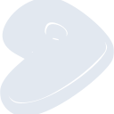

# gentoo

[← Back to main README](../../README.md)





## 16 px

### black
```
https://georgegach.github.io/compatible-icons/simple-icons/gentoo/16/black.png
```

### slate
```
https://georgegach.github.io/compatible-icons/simple-icons/gentoo/16/slate.png
```

### white
```
https://georgegach.github.io/compatible-icons/simple-icons/gentoo/16/white.png
```

## 64 px

### black
```
https://georgegach.github.io/compatible-icons/simple-icons/gentoo/64/black.png
```

### slate
```
https://georgegach.github.io/compatible-icons/simple-icons/gentoo/64/slate.png
```

### white
```
https://georgegach.github.io/compatible-icons/simple-icons/gentoo/64/white.png
```

## 128 px

### black
```
https://georgegach.github.io/compatible-icons/simple-icons/gentoo/128/black.png
```

### slate
```
https://georgegach.github.io/compatible-icons/simple-icons/gentoo/128/slate.png
```

### white
```
https://georgegach.github.io/compatible-icons/simple-icons/gentoo/128/white.png
```

## 512 px

### black
```
https://georgegach.github.io/compatible-icons/simple-icons/gentoo/512/black.png
```

### slate
```
https://georgegach.github.io/compatible-icons/simple-icons/gentoo/512/slate.png
```

### white
```
https://georgegach.github.io/compatible-icons/simple-icons/gentoo/512/white.png
```

## 1024 px

### black
```
https://georgegach.github.io/compatible-icons/simple-icons/gentoo/1024/black.png
```

### slate
```
https://georgegach.github.io/compatible-icons/simple-icons/gentoo/1024/slate.png
```

### white
```
https://georgegach.github.io/compatible-icons/simple-icons/gentoo/1024/white.png
```

## 16 px in base64

### black
```
data:image/png;base64,iVBORw0KGgoAAAANSUhEUgAAABAAAAAQCAYAAAAf8/9hAAAABmJLR0QA/wD/AP+gvaeTAAABQUlEQVQ4jYXSy0qbURQF4C9eIEozUESH6gP0CfocTjvtywjOnRfU4qgjRZw6iNAWHCiEplG81Hu8RNMG4+Dfvxx/MVmwOfscztp77XUOr/EFJ7iM9QotzOODHihjCefooJvEf5zhFHPvFViMCynxMRTk+4sovoDBlPwJ9wVyF1v4gXpS/AFtfE+LfI15U3IHfyJvJnkX/0LdMkpDGMZUdJnAQFQvxwiVIOQYjv0cqiXMYju6NmVuT0WhXqhjaCCSj/iNMdmznfUh38Qo4+lhBbsyt4uGptFENda1nDyJn/jbh3yO9VgPcgVl/PL2HxTjEJu4RgMzeffFPrJb2AuFd9iRmfyC65BTJHaiUw37QV7FSNHR23C1hacY5SAk1+O8gc9FYo7V5NIJjiNv4wjfZM/7LkaxET48yByuYQXTvYjwDDyqlMUoFqZ5AAAAAElFTkSuQmCC
```

### slate
```
data:image/png;base64,iVBORw0KGgoAAAANSUhEUgAAABAAAAAQCAYAAAAf8/9hAAAABmJLR0QA/wD/AP+gvaeTAAACBElEQVQ4jX2RPU+TcRTFf+f/FFsQQnlrgYAoMQ4mJjjIYlwUdxf9CiY4u+snMGFwNg46uJk4iIMrCcTB0RhLIWkK9aUt8lZ4/scBJRWpZ7y5v3vuuVe0qVyp3yfwWOYMooXIYrJBPD2j1qNCofCTExJAqeRc0t14BswBeSBp6zhUpG5hO30wNTb0qn1AAAjZxgJwExg6hq19RB2TsRi2nYjk5Vq18cT2sYHKG83rcroI6vlrN7NkkZPIY84CI0Z7giDi4kQxf0dSGoI9b7R1IloqMSaYcWTQZucojXNgmXB7vdZ8YVsZ5C6ZomDTMPw7VmLIIX4E0Rcje23Du2z2FH23XG0sa7VavxDQiuFQuGHcK6uIju7TUVKJ6Ew4P5ovkbSuCH8BBkA7iNp/Ydx0pIU8qD+lWq3Wtxe7lm1GgMHOzjQd+aTgS6ClBOBzdasAeg+McHSHTvoGWpG4bLMdDsJcKJWcyyp9ZzNuU+js7IrwRxNnBdsRbkxO9n/PhGxjIUZPSDp9bXuXENYxu4ZZodUDJbemR3s3AAKBe0I7p6CpYA2pQnQ3cFHmrQ6a16aLRzBARjix6JfZRcoBXyX2bQdbETwO1Kwwf260//lJlyBrEcgg1ZA2DSkm2hqWnFXQG7c0M1X8FwZQpVLpSdX92nAVqQfYBtXt+CE1D6fHB8qdnwK/AJjj6WdT/M4BAAAAAElFTkSuQmCC
```

### white
```
data:image/png;base64,iVBORw0KGgoAAAANSUhEUgAAABAAAAAQCAYAAAAf8/9hAAAABmJLR0QA/wD/AP+gvaeTAAABa0lEQVQ4jYWST0uUYRTFf8/MCCZKOFRCG3XTrk/Q5/AzCH0Wwb3LILCiVTsRtwYGFbhRxDFF88+kGTp/dOjX4r0jj42vns1zX3jPufeecyGDOqseqqfxnqktdU4dpQzqsLqoNtWet3GtnqjH6kyZwEL8kKMTE/TxK8Tn1WpOfqVeOohV9avayMTbalf9dCOivo19c/TUnajPs1r1KqZ7p6YaMARMAMfAE6ACVIFh4AwYAzrZxkPxPQOsJXUa+AL0gHNgNAQrpa4XaAC1SkqpAbwEtoFxoAWcPED+A1wB9ZSZOQasAU+B+gPkTeAF8LlPfqZ+U4/uSCNHU12Kd0+t94/ou4N38D/21RX1t/pDnep3X7A4kjK01I2Y8EJdVyduFgrFvTuIvei0pe4G+aP6KDekRpH5Y6BNkX0T6FLE+Bd4Hqm8Tim9GbA0VFvR7VD9GXVXPVA/qOOlmagj6nL40A6Ht9T36uQ9cQLwD/EuKzorp2k4AAAAAElFTkSuQmCC
```

