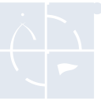
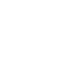

# geocaching

[← Back to main README](../../README.md)

<table><tr>
  <td></td>
  <td></td>
  <td></td>
</tr></table>

## 16 px

### black
```
https://georgegach.github.io/compatible-icons/simple-icons/compat/geocaching/16/black.png
```

### slate
```
https://georgegach.github.io/compatible-icons/simple-icons/compat/geocaching/16/slate.png
```

### white
```
https://georgegach.github.io/compatible-icons/simple-icons/compat/geocaching/16/white.png
```

## 64 px

### black
```
https://georgegach.github.io/compatible-icons/simple-icons/compat/geocaching/64/black.png
```

### slate
```
https://georgegach.github.io/compatible-icons/simple-icons/compat/geocaching/64/slate.png
```

### white
```
https://georgegach.github.io/compatible-icons/simple-icons/compat/geocaching/64/white.png
```

## 128 px

### black
```
https://georgegach.github.io/compatible-icons/simple-icons/compat/geocaching/128/black.png
```

### slate
```
https://georgegach.github.io/compatible-icons/simple-icons/compat/geocaching/128/slate.png
```

### white
```
https://georgegach.github.io/compatible-icons/simple-icons/compat/geocaching/128/white.png
```

## 512 px

### black
```
https://georgegach.github.io/compatible-icons/simple-icons/compat/geocaching/512/black.png
```

### slate
```
https://georgegach.github.io/compatible-icons/simple-icons/compat/geocaching/512/slate.png
```

### white
```
https://georgegach.github.io/compatible-icons/simple-icons/compat/geocaching/512/white.png
```

## 1024 px

### black
```
https://georgegach.github.io/compatible-icons/simple-icons/compat/geocaching/1024/black.png
```

### slate
```
https://georgegach.github.io/compatible-icons/simple-icons/compat/geocaching/1024/slate.png
```

### white
```
https://georgegach.github.io/compatible-icons/simple-icons/compat/geocaching/1024/white.png
```

## 16 px in base64

### black
```
data:image/png;base64,iVBORw0KGgoAAAANSUhEUgAAABAAAAAQCAYAAAAf8/9hAAAABmJLR0QA/wD/AP+gvaeTAAABWUlEQVQ4jYXTz0rVQRQH8I+3q7bwioJKqLlNEKknsL0+QAuDHqW38QFEXbUIlyIECqKIbpKK1Ktl+Sfzp4s5cx2uV/zCWcz3zHznO+ec6cKSzviHT5h9JP8L3+E2Fuc4wQ2akVyJfKc4wm091Cp04xgNXAS/iN94jXH0FQ6amKnFYiBcPMcVRoOfw9tw9jVuzqiwVS+Iv+jFOqaDe4YXEf/jWT0Yyoeyg0McYAQT+BJuStRxhq2SLAV60RW3Tcaz2jGKDVyWqjv4LBVqs9h8iu1wVAXXjR/Yk4rYctATtz+Fa7wrBNXxKg433RcPvsVTpvAzDjekVtbCecvBIFbDdjtO8R5vMC/Vq4XcxmF8CMEbqX0ZDWkWPuKlooUZ5Xg2sYB9aSrzKFcejvJ26SBjEDPYjRgO/kjqwIPWtgvAWMQ01oKrpM9WCtSywHIHEe6/cxXxB/1F/gDuAGLyXqu/ZSZtAAAAAElFTkSuQmCC
```

### slate
```
data:image/png;base64,iVBORw0KGgoAAAANSUhEUgAAABAAAAAQCAYAAAAf8/9hAAAABmJLR0QA/wD/AP+gvaeTAAAByUlEQVQ4jXWRTW+NURSFn3Xe99KB+oiWqqghiTQMjRjjBxiQ+B8mfg9DYdaBGIpEQiJEjNpoo7S91Edxz2Nwb9/cprdncrL3znnWOmtnea3/hAlH/FOtS02amwfM+1VXW/GW+C2kR9gBjgJ9KjsNZUq8MQkAfC3JyQKQlEroAdsBMb+I1cJjqA+Fd8D2HgeVDW0ulWHlcSp9aqaEHXAeIHpLyvWSbArLgLuA0qSePzP9tu2Q4Yd4OPgSs0gA0yTMqXMF/klWg4eEmQ40utfFlUJOYRaMrzBTe0OjVb8b3473R4CsJzksBplLykXi8X2xxfnIa5Lfu622Wt+3pXlWzWWob4bWBdkyeacsJLUO1dILrGn9qGWjczDQQ4EcsK6xb/i34m2gdg5KygVMjBuQxTG7n6IXCZdC+WzqX2U6cARSUnjfOUg8ofU5sDVBeKvGu+2guQLNHc36+LAdJTyb0twDSnQgNJ0RmEau/yuDB5FzJjP7AADq6YRNySPxKuZYhvAGuA8JE4LqAKPwTwSvRT8YP0hmR0++AD1g32rb8WJEP0tyNpTF6AsDQg3+hHQAtQC0IU8nBIf4Z0Bdamgqw7VthxztxOIKwH8c6OKbszCUfQAAAABJRU5ErkJggg==
```

### white
```
data:image/png;base64,iVBORw0KGgoAAAANSUhEUgAAABAAAAAQCAYAAAAf8/9hAAAABmJLR0QA/wD/AP+gvaeTAAABYklEQVQ4jYXTO09VQRQF4O9cDo/CCxJBDYotJIZIaQW18gMsNPF/2Ph/LA12FoaSmJBAQjSGCgJEeflAReUci9nnMjly40p2MWtm1l5775mirutll+MXXuNhn/3P2Cvquq7xBYM4w2hsnmEND/oIHOJaGYsqBA7RxY/gX4b4PdzGlUzgCAudWFyNrCOReSr4JSziGNuoM4GqKIrNMiNOMYy3mAtuADcj/mAPQ5hoLjUOPmEH13Enah9p1VziKzZzMhcYRhHZZqOsNqawjp+56nu8kRq1kR0+wbtwVAU3iH1sSU3sORiK7P/DbzzKBJWYictHLpoHu1HKXXyMy11plJ1w3nMwjpWw3cYJnmAej6V+9dCMcRJPQ/BcGl+DrvQWnmNaNsJcAG5ID+YF7mMs+AE806dHZWs9jgV8iJgM/kCawD+jbQvArYg5rAZX4XtLoNMIvLrMmovvXEV8k35qgx34C7utUPz5PLVdAAAAAElFTkSuQmCC
```

