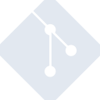

# git

[← Back to main README](../../README.md)





## 16 px

### black
```
https://georgegach.github.io/compatible-icons/simple-icons/git/16/black.png
```

### slate
```
https://georgegach.github.io/compatible-icons/simple-icons/git/16/slate.png
```

### white
```
https://georgegach.github.io/compatible-icons/simple-icons/git/16/white.png
```

## 64 px

### black
```
https://georgegach.github.io/compatible-icons/simple-icons/git/64/black.png
```

### slate
```
https://georgegach.github.io/compatible-icons/simple-icons/git/64/slate.png
```

### white
```
https://georgegach.github.io/compatible-icons/simple-icons/git/64/white.png
```

## 128 px

### black
```
https://georgegach.github.io/compatible-icons/simple-icons/git/128/black.png
```

### slate
```
https://georgegach.github.io/compatible-icons/simple-icons/git/128/slate.png
```

### white
```
https://georgegach.github.io/compatible-icons/simple-icons/git/128/white.png
```

## 512 px

### black
```
https://georgegach.github.io/compatible-icons/simple-icons/git/512/black.png
```

### slate
```
https://georgegach.github.io/compatible-icons/simple-icons/git/512/slate.png
```

### white
```
https://georgegach.github.io/compatible-icons/simple-icons/git/512/white.png
```

## 1024 px

### black
```
https://georgegach.github.io/compatible-icons/simple-icons/git/1024/black.png
```

### slate
```
https://georgegach.github.io/compatible-icons/simple-icons/git/1024/slate.png
```

### white
```
https://georgegach.github.io/compatible-icons/simple-icons/git/1024/white.png
```

## 16 px in base64

### black
```
data:image/png;base64,iVBORw0KGgoAAAANSUhEUgAAABAAAAAQCAYAAAAf8/9hAAAABmJLR0QA/wD/AP+gvaeTAAAA/ElEQVQ4jZXSPUoEQRAF4G8dFBETUQQDMxMzxcU7mHgEwRO4YCTewdQ7eAJDQyMRM8XAjYSdFQMTUXENpgbaYXpHHzQ09eq9+ukmjxOUGGEwJa8Vh3jFJE6ZMykylfeDW4nYAvr4xPW0yicY4w2XuMPwL52k4jR5FzuqPbSaFIn4GMuJ4SyW8I6t3DhFRlybz0XyEN+Yj1hqokzaa5573MROzrGHp4QfzcSlC4vYxG1dNdArItCPtpp4CX4NqzjAOnrBndWJg5ZRvnCFC3w0uLFqd7/QNCmxjQ08d4lzJo94UL1Ap7jGUcs4k5j5tEucM/mXuMZA9YVLU9r+ARI3Zjcl4SClAAAAAElFTkSuQmCC
```

### slate
```
data:image/png;base64,iVBORw0KGgoAAAANSUhEUgAAABAAAAAQCAYAAAAf8/9hAAAABmJLR0QA/wD/AP+gvaeTAAABeklEQVQ4jYWRMW8TQRSEv9kgIQGSLWEky0SJFNFQIzpqGmoaOn4BFqlCaE2qWPk3dDSIjoIeKBybsDiX5Jx0DrdD4RO2zncw5ezMvHlvoQGjk3zvOOan45hPJ/Gi36RTHfljevnyt4uhrHYpywIMNruto6o21E0uUnpB0q8l606C/UmcrTVR1azArqSb4E+GHomWxZYamqhqBu4uHpRhniW7UOA9cK9unVBnBjBuJRW7bPDI5rxpHdWZV/AVNEcek9ghcB9ze5GjLIhBUOB1gxlJlj0XPDF8kPRcMFo8umP8JghcZ16FzR2Jh4VufDFcL9dEQegdVva/EMHjUMw/AzsldebEMGx2W0dBDGpCCts/U+Ab+NpwC9RjcfgzJw63e+2Dv984ibN+MvvInZLKUvDTDcKVzUfs7srkw+1e+6BstsR6iL4LJ6MHYFXNawEA43jxyg5vV5qUh/S5pOFWtz2o3GYd1ZAm8z8xibP+OObT45ifjk7yvSbdH8+R0nq2xCRnAAAAAElFTkSuQmCC
```

### white
```
data:image/png;base64,iVBORw0KGgoAAAANSUhEUgAAABAAAAAQCAYAAAAf8/9hAAAABmJLR0QA/wD/AP+gvaeTAAAA6ElEQVQ4jY3RPS6EURjF8WNqqxCNUoQ9WIZGa9qJXqm1BjZAorEAERGFEQWVZD6ioEL8FO7Ea8ydeU91P57zv/c5T1IRehhigG6trmbewYtfDVtDysvnuPNXiyHFPMIrznCDp1aQhrlZvIWNkkMdMsMM7zjG7tx2KuaJ7nGLU/Tx9g9SFjX1ceUnkyNs47FxP+gk0WI4y0nWklwn+WicL3WSHCQZtYBsJrlMslL24ySHkxy6M1r5xAVOSqBNjdCbnsQ0ZIh1rOJ5rnkO5KFM4muhuQHZq0xmjP0WWc2EtDdPtTMooOq3vwG/XBvHijhDZwAAAABJRU5ErkJggg==
```

