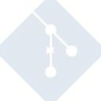

# gitforwindows

[← Back to main README](../../README.md)

<table><tr>
  <td></td>
  <td></td>
  <td></td>
</tr></table>

## 16 px

### black
```
https://georgegach.github.io/compatible-icons/simple-icons/compat/gitforwindows/16/black.png
```

### slate
```
https://georgegach.github.io/compatible-icons/simple-icons/compat/gitforwindows/16/slate.png
```

### white
```
https://georgegach.github.io/compatible-icons/simple-icons/compat/gitforwindows/16/white.png
```

## 64 px

### black
```
https://georgegach.github.io/compatible-icons/simple-icons/compat/gitforwindows/64/black.png
```

### slate
```
https://georgegach.github.io/compatible-icons/simple-icons/compat/gitforwindows/64/slate.png
```

### white
```
https://georgegach.github.io/compatible-icons/simple-icons/compat/gitforwindows/64/white.png
```

## 128 px

### black
```
https://georgegach.github.io/compatible-icons/simple-icons/compat/gitforwindows/128/black.png
```

### slate
```
https://georgegach.github.io/compatible-icons/simple-icons/compat/gitforwindows/128/slate.png
```

### white
```
https://georgegach.github.io/compatible-icons/simple-icons/compat/gitforwindows/128/white.png
```

## 512 px

### black
```
https://georgegach.github.io/compatible-icons/simple-icons/compat/gitforwindows/512/black.png
```

### slate
```
https://georgegach.github.io/compatible-icons/simple-icons/compat/gitforwindows/512/slate.png
```

### white
```
https://georgegach.github.io/compatible-icons/simple-icons/compat/gitforwindows/512/white.png
```

## 1024 px

### black
```
https://georgegach.github.io/compatible-icons/simple-icons/compat/gitforwindows/1024/black.png
```

### slate
```
https://georgegach.github.io/compatible-icons/simple-icons/compat/gitforwindows/1024/slate.png
```

### white
```
https://georgegach.github.io/compatible-icons/simple-icons/compat/gitforwindows/1024/white.png
```

## 16 px in base64

### black
```
data:image/png;base64,iVBORw0KGgoAAAANSUhEUgAAABAAAAAQCAYAAAAf8/9hAAAABmJLR0QA/wD/AP+gvaeTAAABIklEQVQ4jZXSvS5EQRwF8B8rZCU0hAdQ6FF4BZVXkFCRIFFtvIjCA/AMKh2dREUUFCLZDyE+Evb6KPY/MVl7V5xkcieTc86c859LOWpooI6tPryeWME9vmI1ykwqJTcvYwiTcTaKBbzjtN/NG2jhCUc4x02WpInVMnEtxAVegryIeZ05PKAdnO3uCjXsYALPqGIwKrxhDlNRYTzqtHFS6RLDSGYyjVlcYBhj8c1nopF1zNcj9nEQM9nDEq4zTn0oNr1QRNxqVJ3FWURPGKDzvt0pWnjFnc5LFFHrFh9+XqSWnHKTJG7jGIchLqLKL3FuksRFkBYwE0ke47zVS5ywFoRU5QqX+MzSrZeJEzZ7zCSJd/8Sl5k0/yNO2NL5hRv6dP4GNJ9xI0zySyAAAAAASUVORK5CYII=
```

### slate
```
data:image/png;base64,iVBORw0KGgoAAAANSUhEUgAAABAAAAAQCAYAAAAf8/9hAAAABmJLR0QA/wD/AP+gvaeTAAAB30lEQVQ4jX2SsU/TcRDFP+9brEINtMhQiRRjTFxcGd1N9D9wcXAzERNMDFEcFEJMFGXBydHJycl/wMHBwcnBRBNaUn+2tP21iVFBvs+BBttSvPHuvbt37w6OiM1qulj+ntbLSVqrJK35o3Aaltyqda5HxzVMoQvbFnF5plhYH8SGYZNjjNccqf3LesqE+8OU9Ckof2vfRDyUnLV5j11EGjeUtA9uAHdnivmXhxpsVtNFBe4IJmx+S/wUuroXvRsyems7K5FzpBOkR2eKE88PVuiSF4BJix8Sxy2PWV5QhjlHtyVymB3EZIR7W0n7NoB6yKd6FuvI5AxNoAp8FVy0mMbkeo1VOUnrwNSgOYZOgNcOOkn0FUdehRG9IfqFYba7fz0IPEgGkPkTxbgjOeOMAhf2NPLRsNszRAG8AtoeGN9EjMpcEj4bUFYwF+LOB+BcF9VwZC3MFAvrIi4fNOmSEccQn+34yfgXcEJovGt8w5Gns9P51YMzVpLWvK0HiFEgC6RELpOhBXoHHts3Vm1HP5mdzq8eeqRKkt4AHhsm94v6ghxtnQcLaGItlU5PbBx6pB4lt+ywhNx3GdtNSWulYn6lz+xhFxjSpAE8GyT/NypJa76SpLVyktY3q+niUbi/0ATsF856g+wAAAAASUVORK5CYII=
```

### white
```
data:image/png;base64,iVBORw0KGgoAAAANSUhEUgAAABAAAAAQCAYAAAAf8/9hAAAABmJLR0QA/wD/AP+gvaeTAAABFUlEQVQ4jY3SPS5EYRTG8SM0GptQWACFLdiFhEJIzLRiIwoLIBIbUNnBJBpBQSGSmblCfDRz+SmciRf3Dqd6i+f/nHOe80a0FHYwQB+dNl0bvIp7XzX4t0l2PsG57/W3CbZQ4SlNznBTmAyxNqlzhRovKV7GYubwgFFquk3wMLs8pskrjrCBy4RfinW6TbAfJn30cIwLPP/KJB9N9Yh9HGQme1jBdaHpz0SElkzriJiLiNmImI6IhYjoRcSo0EwFOg1TVJnBnc9L1Dn+Ld6Ki+yMcyhNxvAIpzhMuM5VvsPFJToFXKdoCfM5yTjY6hdcmKynYFxXmf57Md3mhL8Yge2Wy1TYnQhPMBn+G/6RST+NmneOiA/4lVWFXhkcJwAAAABJRU5ErkJggg==
```

