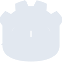
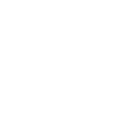

# godotengine

[← Back to main README](../../README.md)





## 16 px

### black
```
https://georgegach.github.io/compatible-icons/simple-icons/godotengine/16/black.png
```

### slate
```
https://georgegach.github.io/compatible-icons/simple-icons/godotengine/16/slate.png
```

### white
```
https://georgegach.github.io/compatible-icons/simple-icons/godotengine/16/white.png
```

## 64 px

### black
```
https://georgegach.github.io/compatible-icons/simple-icons/godotengine/64/black.png
```

### slate
```
https://georgegach.github.io/compatible-icons/simple-icons/godotengine/64/slate.png
```

### white
```
https://georgegach.github.io/compatible-icons/simple-icons/godotengine/64/white.png
```

## 128 px

### black
```
https://georgegach.github.io/compatible-icons/simple-icons/godotengine/128/black.png
```

### slate
```
https://georgegach.github.io/compatible-icons/simple-icons/godotengine/128/slate.png
```

### white
```
https://georgegach.github.io/compatible-icons/simple-icons/godotengine/128/white.png
```

## 512 px

### black
```
https://georgegach.github.io/compatible-icons/simple-icons/godotengine/512/black.png
```

### slate
```
https://georgegach.github.io/compatible-icons/simple-icons/godotengine/512/slate.png
```

### white
```
https://georgegach.github.io/compatible-icons/simple-icons/godotengine/512/white.png
```

## 1024 px

### black
```
https://georgegach.github.io/compatible-icons/simple-icons/godotengine/1024/black.png
```

### slate
```
https://georgegach.github.io/compatible-icons/simple-icons/godotengine/1024/slate.png
```

### white
```
https://georgegach.github.io/compatible-icons/simple-icons/godotengine/1024/white.png
```

## 16 px in base64

### black
```
data:image/png;base64,iVBORw0KGgoAAAANSUhEUgAAABAAAAAQCAYAAAAf8/9hAAAABmJLR0QA/wD/AP+gvaeTAAABOklEQVQ4jYXSzUpcQRAF4M9xjJIRXSQKwVXWrgUhb+Bb+DK+gtv4IBJw4V4XQnAjuhCdkBH/f4jXxT1NekYdCw51u+6pqtPVxbBNYA2/sFfFt4O1cN61efTRYICNYJBYP5xX1ov/jJOQ38JJOHWOFZxhC7/xOKbAYzhbyVmBw/x8HpM4isI97FRSxg5nxAq3N4lF/EjgAn9yz85I0hNO03kmsc0ODnK4xlSq/0usH4jsCXTDhYO6yy3usBQynAelwFI4tyWpLrAYBUWNXKU82038VLhEToO/KTab+EL896rB1/iedlbPaIqCJtK6VcLlO9/dcJtyOMYnfInMBvdVR5jTvs6MdpDfUvQIJrFveFFucFWdr6riBXvJJUPZ0a7nR1t4Fu4Cr7dvGetY1U5/OvEH7dPt4qf/u+MFlsB2fWvKdQsAAAAASUVORK5CYII=
```

### slate
```
data:image/png;base64,iVBORw0KGgoAAAANSUhEUgAAABAAAAAQCAYAAAAf8/9hAAAABmJLR0QA/wD/AP+gvaeTAAAB6ElEQVQ4jY2SwU4TURiFv3NnKtIiNAgYgpEQ2RljYmLCA7DQxJdw6QO44CFcuzXhFUx044rEuDNxwUaMUkkoBbElpR2svcfFzMgQMfFf3blzvnP+/88VlbKt3cOTR2EcnxE0e+tG8x7AbvvH20DCOPj58vz0a0kuGVUNPh8fz9TOwg5iDqmL/QLA4qlME3M0moirt2dneyUTANrtdgNgMstGBLKinSawAWzINAt1Nplloyqj1n7vgeRX0X4jtIZYAWpcXiPMF9B7yQ9tPVbroPcJexVhfHGkf1ahlbQTcGzkLf8nXNHasREkbVacu4g9oV9/p2qE2DP0zq+0GWIM28V3H1MDZBgXSYdChwBEIiBBCu4DxBi2w3lXDARDzBLEmEe4Y2InP8eIWRIMjQYl98dAsGDl25dCP59RdVv1QnFaBNUECyWXJsGOkWMCAXsKhO353IiVyhbmil4bSF0iMQl2KOJtewhKK8DJ5WeltocIA6SOsSVxBXTd+FRgIAPNVQymwUfAVYOEFsEnceyvsp18O+h+AN0913sAisBUMUrfdoByHyDx8ebCzP0gafyTdB1pS6hT/K6XcL5MpkpYqGN7K43JuqTxhde3u//9jkieIK9JqtueyNN0Zntg6R0xebm8eK18O/wGzrjgnOXkFv0AAAAASUVORK5CYII=
```

### white
```
data:image/png;base64,iVBORw0KGgoAAAANSUhEUgAAABAAAAAQCAYAAAAf8/9hAAAABmJLR0QA/wD/AP+gvaeTAAABSklEQVQ4jY2Sz0obYRTFf5PEKonURU1AXAnuuhb6DL5FX8bnUHwOEVy4jwtB7KKoG02p/6NNW38u5gx8BGN74XLnO/ecO2e+uVCEWqmb6r46LPC95KZaMSvUJXVkHdfqVvI62EhdekvYS+2q586Oc7VbalA31Et1Rz1RJ+8MmISzE81GpZ4C64DA7O+bMh3utxbQC/i/4pLbawG7ReMGuAD+vCH6nd5tge22gOMcHoC5TP8bbJQEeEmvEy7AcauYNgaegNWQAa6SzYDVcMaNqBwwiIPGDUA3CfCYOhcuxI7AzwxbDN5PXStesJzao76rF8DGgbHWKQR3M5474doczoAPwKfYFHgu3gjwEfgBLFBf5EqGfkdtq0dTG/eo3hfn+2BlDNV27V8H6kHW819xGW4fprZP/Qx8Bb7k9ufT+kX96w6B7aqqmt3hFW7QVQcEDztkAAAAAElFTkSuQmCC
```

