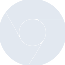

# googlechrome

[← Back to main README](../../README.md)





## 16 px

### black
```
https://georgegach.github.io/compatible-icons/simple-icons/googlechrome/16/black.png
```

### slate
```
https://georgegach.github.io/compatible-icons/simple-icons/googlechrome/16/slate.png
```

### white
```
https://georgegach.github.io/compatible-icons/simple-icons/googlechrome/16/white.png
```

## 64 px

### black
```
https://georgegach.github.io/compatible-icons/simple-icons/googlechrome/64/black.png
```

### slate
```
https://georgegach.github.io/compatible-icons/simple-icons/googlechrome/64/slate.png
```

### white
```
https://georgegach.github.io/compatible-icons/simple-icons/googlechrome/64/white.png
```

## 128 px

### black
```
https://georgegach.github.io/compatible-icons/simple-icons/googlechrome/128/black.png
```

### slate
```
https://georgegach.github.io/compatible-icons/simple-icons/googlechrome/128/slate.png
```

### white
```
https://georgegach.github.io/compatible-icons/simple-icons/googlechrome/128/white.png
```

## 512 px

### black
```
https://georgegach.github.io/compatible-icons/simple-icons/googlechrome/512/black.png
```

### slate
```
https://georgegach.github.io/compatible-icons/simple-icons/googlechrome/512/slate.png
```

### white
```
https://georgegach.github.io/compatible-icons/simple-icons/googlechrome/512/white.png
```

## 1024 px

### black
```
https://georgegach.github.io/compatible-icons/simple-icons/googlechrome/1024/black.png
```

### slate
```
https://georgegach.github.io/compatible-icons/simple-icons/googlechrome/1024/slate.png
```

### white
```
https://georgegach.github.io/compatible-icons/simple-icons/googlechrome/1024/white.png
```

## 16 px in base64

### black
```
data:image/png;base64,iVBORw0KGgoAAAANSUhEUgAAABAAAAAQCAYAAAAf8/9hAAAABmJLR0QA/wD/AP+gvaeTAAABIklEQVQ4jZXTuUpEQRQE0ONzEPddcYnMTM3MBEHUjzNXxF/RnzB0TcYddATXWQzeFdueGcGChtdF3brV/W7zG+M4wAlu8IIP3OEMO5jSBRs4RwOtLqsRmtW8eB3VPwrzdYWtNPYpnv5h0MIlJnqxixV8YjBJVUUND3hDEZrPRNvqictZCmEDs/Fdz445i3c0E+62gpHYVGI9Roe5zOAqoi8k3FCB0diM4RX96NGOIgxSjObkJI47FHdDq8BzQvRhXnkXOeodkj1XwmA6IReVk3eTcM3QLWcGtQJH2s82EynqGMCw9hFu4lB0v/D31N114C+UQwi2/fymfPZrET/lr7GWJbIZrs1EWPX7jTRC01b8jSnsK6fzPrq/4Vb5xPfS2PAFrRiAIhfuUg4AAAAASUVORK5CYII=
```

### slate
```
data:image/png;base64,iVBORw0KGgoAAAANSUhEUgAAABAAAAAQCAYAAAAf8/9hAAAABmJLR0QA/wD/AP+gvaeTAAABw0lEQVQ4jY2RsW4TQRiEv1mfglHiSxw7UWIiwB1l3gAJxDMgKqCko+MNEA0SNTU9JTSA6CigoyaxFYIDWD5sJBTbt0OROD4bR2Kq3dl/RjP7iwL2er210khPFXUdqIArUU6C9ct4gMLLMNLjnZ20O9Focmh9zW5R8nOhy0BgMaJxu0S4s7O1+uHMYL+T3Qj4BWj7HOE8OnnU/WZj9bX2er21cMwnoTqQ/qcB2G0PtZuEIc+CtI41NC5M6FDYhiGoDHHWXNRCWQ/V7mRfDE1B15ALNjFdxLgwDGYTOAbHgsv3RFA5HUqwEwgZwSPM1jQuIH3jJGKjwC+HiNLTy6oIf4CyPd1OoXNA9gwFaZCnpM06+PO/6sUQOIAHZ4S8ZNhGyhfMj7HmvQeJpYGgXnC9hP0DODpbihRtDyRfm0kg9YPwu5M6M9gA5QqMEReFVwS1uf4R/FaHh/16HvKPRlfOadoBJxRSAthuxTK7odFIf+b2A6CzQBxNXAaX5x6OYpLcbVarWQC4ur3+iqh7xq1iHROPBL9BK5PYxq28VLrd3Ki8P/2zKQ4O+jUn8YnRTdkpgSVbS9h9pL7wm/EFP2pWq9lE8xe2Xsa2Rf96HgAAAABJRU5ErkJggg==
```

### white
```
data:image/png;base64,iVBORw0KGgoAAAANSUhEUgAAABAAAAAQCAYAAAAf8/9hAAAABmJLR0QA/wD/AP+gvaeTAAABNklEQVQ4jZWTS0oDQRRFjyGI4j+J4mfkzCU4EwRRd+NGBKcibkU34dBPnERNFDQBPzHdx0EXUqm0igcaum6/d/tWdT+IUOfVU/VSfVBf1b7aUa/VQ7VOGeqOeqNm/kwWajbT5m219Utjyp26F8e+Ul/+YaB6qy5UgSOgBvSTXbUAgz4BzCbP68DBmHoNrANPQAYshftB0rAEfAB5pLWrwExYVMP1DHwCy4nBXUi0GmlTlSjaHPAW4o4xSiUYxMymYg24KGn+CStALxLGgRWKs0gZlCTrVYNBIxLXgA7wEGl5qNtIDLoV4JzRvS2GFANgEpim+GwxOXCG2lCbf/x1nRK9qc4XJ6H7oTAlU7tqL9Hv1a3h49Td4JpHhS2HZyQLNVuUodbVE4vRfQxvf1fbFiN+/B078AVXLbWEwwJBZwAAAABJRU5ErkJggg==
```

