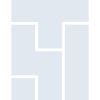
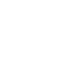

# googlecloudcomposer

[← Back to main README](../../README.md)





## 16 px

### black
```
https://georgegach.github.io/compatible-icons/simple-icons/googlecloudcomposer/16/black.png
```

### slate
```
https://georgegach.github.io/compatible-icons/simple-icons/googlecloudcomposer/16/slate.png
```

### white
```
https://georgegach.github.io/compatible-icons/simple-icons/googlecloudcomposer/16/white.png
```

## 64 px

### black
```
https://georgegach.github.io/compatible-icons/simple-icons/googlecloudcomposer/64/black.png
```

### slate
```
https://georgegach.github.io/compatible-icons/simple-icons/googlecloudcomposer/64/slate.png
```

### white
```
https://georgegach.github.io/compatible-icons/simple-icons/googlecloudcomposer/64/white.png
```

## 128 px

### black
```
https://georgegach.github.io/compatible-icons/simple-icons/googlecloudcomposer/128/black.png
```

### slate
```
https://georgegach.github.io/compatible-icons/simple-icons/googlecloudcomposer/128/slate.png
```

### white
```
https://georgegach.github.io/compatible-icons/simple-icons/googlecloudcomposer/128/white.png
```

## 512 px

### black
```
https://georgegach.github.io/compatible-icons/simple-icons/googlecloudcomposer/512/black.png
```

### slate
```
https://georgegach.github.io/compatible-icons/simple-icons/googlecloudcomposer/512/slate.png
```

### white
```
https://georgegach.github.io/compatible-icons/simple-icons/googlecloudcomposer/512/white.png
```

## 1024 px

### black
```
https://georgegach.github.io/compatible-icons/simple-icons/googlecloudcomposer/1024/black.png
```

### slate
```
https://georgegach.github.io/compatible-icons/simple-icons/googlecloudcomposer/1024/slate.png
```

### white
```
https://georgegach.github.io/compatible-icons/simple-icons/googlecloudcomposer/1024/white.png
```

## 16 px in base64

### black
```
data:image/png;base64,iVBORw0KGgoAAAANSUhEUgAAABAAAAAQCAYAAAAf8/9hAAAABmJLR0QA/wD/AP+gvaeTAAAA10lEQVQ4ja3SQUpDMRSF4a/tQwsOFBwUqogbaHUfjjpzL67ENYjgJtyAU50oKK3QSUFRq9bBS2h8vNoX8EDg3OTcn3ATSh1jhkXDNcMQ2pb60Fzv0aSATgagqJoJLhLIF07QD/UTrpL8N55TQA8jvKGFG7xWrnyIo1Bv4hzjIgm1sB/8bc21u9gLfho32zXBLBV/nN0rnwtecgED5eCiOpjnAHbDirrDQ13wX2ewwGNSb2GnKWCCS8uPdI2zHEAPp9gO9cG6xqh0Bp9Nm1YBNipn3RX+V/YH9LwqON0eoc0AAAAASUVORK5CYII=
```

### slate
```
data:image/png;base64,iVBORw0KGgoAAAANSUhEUgAAABAAAAAQCAYAAAAf8/9hAAAABmJLR0QA/wD/AP+gvaeTAAABGUlEQVQ4ja2QTUoDURCEv3qZxICIYhYB//ACogfwBq7ceRdP4hmC4BkEL5CtbhQNJiCCopjM5JWLZDIYDD7RXnV3dX9UtwDuB88Hjro0rJAQxq9BPtxur3dD1WSUsgwQCMMqr6KWCojErMwzgEKNvsg7mkJMHEs6wtoAQOoRfSFN5rFiEeqDGSDzqG3CMfaHZUmhC7xXR3sotIvivg0KYalOfgY8zqwYC7EFAvsaac64mrY2Jzw/lXLgj5EtEgS3Fi8Ajn6b9/MDQHu2e2UVFGqY/DcOWqBWWVi+kXX33eD//UCS7fhQSVoG1pIAhRp9OT8H1QBkXylwaicCMo/aY3MitDq1s+PEE2Y/ECoSdxYBaMxpzQX5l9lPZtBmBDHSkjYAAAAASUVORK5CYII=
```

### white
```
data:image/png;base64,iVBORw0KGgoAAAANSUhEUgAAABAAAAAQCAYAAAAf8/9hAAAABmJLR0QA/wD/AP+gvaeTAAAA2klEQVQ4ja3STUoDQRDF8V+SQQMuFFwEVMQL+HEPV+68iyfxDCJ4CS+QrW4UFCO4GVA0UcuFPaQdJjoDPmh41f3qT1E0iIiDiCijvcqI2IO+uaba660yOWDQAVDUzQRnGeQDh9hI9T0usvwnHnPACEd4RQ9jvNRG3sF+qpdxiociC/WwlfxVw9hDbCb/VF32G4KdVPzydoMy+eeugF3fi6s0wKwLYD2dSte4bQr+6w4Cd1m9grW2gAnOzT/SJU66AEY4xmqqt/9qrJTv4L1t0yLAUu1tuMD/yH4BuQdUDotjrqYAAAAASUVORK5CYII=
```

