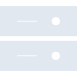
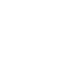

# googlecloudstorage

[← Back to main README](../../README.md)

<table><tr>
  <td></td>
  <td></td>
  <td></td>
</tr></table>

## 16 px

### black
```
https://georgegach.github.io/compatible-icons/simple-icons/compat/googlecloudstorage/16/black.png
```

### slate
```
https://georgegach.github.io/compatible-icons/simple-icons/compat/googlecloudstorage/16/slate.png
```

### white
```
https://georgegach.github.io/compatible-icons/simple-icons/compat/googlecloudstorage/16/white.png
```

## 64 px

### black
```
https://georgegach.github.io/compatible-icons/simple-icons/compat/googlecloudstorage/64/black.png
```

### slate
```
https://georgegach.github.io/compatible-icons/simple-icons/compat/googlecloudstorage/64/slate.png
```

### white
```
https://georgegach.github.io/compatible-icons/simple-icons/compat/googlecloudstorage/64/white.png
```

## 128 px

### black
```
https://georgegach.github.io/compatible-icons/simple-icons/compat/googlecloudstorage/128/black.png
```

### slate
```
https://georgegach.github.io/compatible-icons/simple-icons/compat/googlecloudstorage/128/slate.png
```

### white
```
https://georgegach.github.io/compatible-icons/simple-icons/compat/googlecloudstorage/128/white.png
```

## 512 px

### black
```
https://georgegach.github.io/compatible-icons/simple-icons/compat/googlecloudstorage/512/black.png
```

### slate
```
https://georgegach.github.io/compatible-icons/simple-icons/compat/googlecloudstorage/512/slate.png
```

### white
```
https://georgegach.github.io/compatible-icons/simple-icons/compat/googlecloudstorage/512/white.png
```

## 1024 px

### black
```
https://georgegach.github.io/compatible-icons/simple-icons/compat/googlecloudstorage/1024/black.png
```

### slate
```
https://georgegach.github.io/compatible-icons/simple-icons/compat/googlecloudstorage/1024/slate.png
```

### white
```
https://georgegach.github.io/compatible-icons/simple-icons/compat/googlecloudstorage/1024/white.png
```

## 16 px in base64

### black
```
data:image/png;base64,iVBORw0KGgoAAAANSUhEUgAAABAAAAAQCAYAAAAf8/9hAAAABmJLR0QA/wD/AP+gvaeTAAAApUlEQVQ4ja3TMQrCQBQE0KekMZVNOq8g3sQ7egY9hoWiN0gkiCBWsRFiYZA1JJAlDgwL+5nZvzt/GYkJDnhihtdAXRJo1MibNYY56mlEt1dsUYSbbYMKl4D3oHbDGsf2XUKkDbuwwAlZl0HbqAvzhj/aBJum9b6T+1AhjXnEXtQoxcdYCmIcMkAPnH3i/GpiYiywxD4UxMSYYYdVuzBqlP/ymUbhDU1QUAykIZ7jAAAAAElFTkSuQmCC
```

### slate
```
data:image/png;base64,iVBORw0KGgoAAAANSUhEUgAAABAAAAAQCAYAAAAf8/9hAAAABmJLR0QA/wD/AP+gvaeTAAAA4UlEQVQ4jaWTQUoDQRBF329646zMIphA0BNIDhLwjp5Bj+HCoBdwGLGDGGeVbCTfTTJ0Eow95ENtPvWqiqpuOFOqU/uMWGMuED9FlIk7JgJTQWOY4B6dt0woBWwW2A+IJvfDQdYK/N6Fvew6is/r8eDO1jxH4v5cqoAqnzPTpE7tC3h4VMBW5P8FXG6DnInY9yFotdm4OgEfaccUL/EvqU6tQQk86okm8CgASC55QK3tV8MiZ4rPaLu5GQ9uQU85Un5Gafj28f0oe5r7+wVOSHCFNDv0IzA3rIGvPp+pY87VLxuBbKQ1Ew+9AAAAAElFTkSuQmCC
```

### white
```
data:image/png;base64,iVBORw0KGgoAAAANSUhEUgAAABAAAAAQCAYAAAAf8/9hAAAABmJLR0QA/wD/AP+gvaeTAAAAuElEQVQ4jaWTQQrCMBBF30g3duWm2EWvIB5E8I6eQY/hQtEjVKgI4qpuhHFhUmJIS4c+mE3C+xkyCUxEVPUEvIE58BnpZd4RVVWgBirj4TVQzQzCHdg7sSMOaIFbUM9g7yEiW+AcClkUkLtKUanqBShSAXFQioWrPzcDdq71vpP7aIHccolJ/BgboDS6DVD6DsY8oBdw5TfOzrGMsRaRFXAMBcsYC1U9AOuhgCGWwCZenPyZDA2k+QJ47Tk2PKOXKAAAAABJRU5ErkJggg==
```

