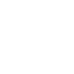

# googledocs

[← Back to main README](../../README.md)

<table><tr>
  <td></td>
  <td></td>
  <td></td>
</tr></table>

## 16 px

### black
```
https://georgegach.github.io/compatible-icons/simple-icons/compat/googledocs/16/black.png
```

### slate
```
https://georgegach.github.io/compatible-icons/simple-icons/compat/googledocs/16/slate.png
```

### white
```
https://georgegach.github.io/compatible-icons/simple-icons/compat/googledocs/16/white.png
```

## 64 px

### black
```
https://georgegach.github.io/compatible-icons/simple-icons/compat/googledocs/64/black.png
```

### slate
```
https://georgegach.github.io/compatible-icons/simple-icons/compat/googledocs/64/slate.png
```

### white
```
https://georgegach.github.io/compatible-icons/simple-icons/compat/googledocs/64/white.png
```

## 128 px

### black
```
https://georgegach.github.io/compatible-icons/simple-icons/compat/googledocs/128/black.png
```

### slate
```
https://georgegach.github.io/compatible-icons/simple-icons/compat/googledocs/128/slate.png
```

### white
```
https://georgegach.github.io/compatible-icons/simple-icons/compat/googledocs/128/white.png
```

## 512 px

### black
```
https://georgegach.github.io/compatible-icons/simple-icons/compat/googledocs/512/black.png
```

### slate
```
https://georgegach.github.io/compatible-icons/simple-icons/compat/googledocs/512/slate.png
```

### white
```
https://georgegach.github.io/compatible-icons/simple-icons/compat/googledocs/512/white.png
```

## 1024 px

### black
```
https://georgegach.github.io/compatible-icons/simple-icons/compat/googledocs/1024/black.png
```

### slate
```
https://georgegach.github.io/compatible-icons/simple-icons/compat/googledocs/1024/slate.png
```

### white
```
https://georgegach.github.io/compatible-icons/simple-icons/compat/googledocs/1024/white.png
```

## 16 px in base64

### black
```
data:image/png;base64,iVBORw0KGgoAAAANSUhEUgAAABAAAAAQCAYAAAAf8/9hAAAABmJLR0QA/wD/AP+gvaeTAAAAvElEQVQ4ja3SsWoCQRCA4Q8NFtEiGhIQUtsHwfcHK618gzQhUSsJIRZGz+L24Fx35Uz8YYoddv6ZXYaSLt5wQJGJBe5lGGF5objAL+axpJUzJmhjjCl6fxFU918xqyZpKtgon7jECi+YwF1DwUN0XuEjJ1iHjvso3w6i53oyJRiofVJEJ06kBF/4VO5EnRaGocFFQcf5m6+aYIdv5fJUPOIpZbx2D85ITdAP0Yh/T3AzwTu2Tj8uR4GfUOMI3Bkp0jK6oPYAAAAASUVORK5CYII=
```

### slate
```
data:image/png;base64,iVBORw0KGgoAAAANSUhEUgAAABAAAAAQCAYAAAAf8/9hAAAABmJLR0QA/wD/AP+gvaeTAAABD0lEQVQ4ja2TTUsCYRSFn3NHLCcXahRkQX+gTQQt+vVCq5ZBP0EmcyUhGqnvadHXMDOKQWd5uPfhvPfeVwCTyeToncMn4BIQDRI8ZmlxNxwOF2U/ANZZfg7qbGv+JOhqrXxUFEVeAwAYb+0FsJ0ZblbK76fTabcG2EcSAVwv08HDd5LWfp3MQG9fEHC62KhzC4z2A5gepScavUQrisYEhqnNLKRN2U92JtETnJb9GiBgYLlLZaghEGpXR10DJPMqxTOkVEFHss8kBjsBCto49ao+JBRqV7fdNMSVHfPQb6nxMXDSdCp/uoMm1ROYvuT+7rv8xwQ/AO34R1WVawMgVvOxnZZUl98sgxexmo8BPgBwml2Ds2iCvQAAAABJRU5ErkJggg==
```

### white
```
data:image/png;base64,iVBORw0KGgoAAAANSUhEUgAAABAAAAAQCAYAAAAf8/9hAAAABmJLR0QA/wD/AP+gvaeTAAAAwklEQVQ4ja3SzUpDMRTE8Z+3UlC78AMF0UdwI4LPL7hy5xu4EW1diYguxI6bFGqaK7fqwCFkOPmfSQhIspPkLsk8/bpNsq1SV9YTbGGjbljSGa5qSNfT3NIIF7hOMvkNYNF/jptFkqGAZ0xLzXCKS9gcCNit9jM89AGeysTPyh8V0NGy2QLsY9LwYVwbLcALHjGv/A7HZcCPgLHVO6+V4AOvyJJ3gMMWcd1/sKJWgr1Sg/TnBP8GuMe77w/Xp+CtnPEFx/1K7r3/8vgAAAAASUVORK5CYII=
```

