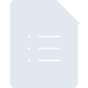
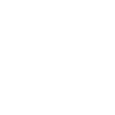

# googleforms

[← Back to main README](../../README.md)





## 16 px

### black
```
https://georgegach.github.io/compatible-icons/simple-icons/googleforms/16/black.png
```

### slate
```
https://georgegach.github.io/compatible-icons/simple-icons/googleforms/16/slate.png
```

### white
```
https://georgegach.github.io/compatible-icons/simple-icons/googleforms/16/white.png
```

## 64 px

### black
```
https://georgegach.github.io/compatible-icons/simple-icons/googleforms/64/black.png
```

### slate
```
https://georgegach.github.io/compatible-icons/simple-icons/googleforms/64/slate.png
```

### white
```
https://georgegach.github.io/compatible-icons/simple-icons/googleforms/64/white.png
```

## 128 px

### black
```
https://georgegach.github.io/compatible-icons/simple-icons/googleforms/128/black.png
```

### slate
```
https://georgegach.github.io/compatible-icons/simple-icons/googleforms/128/slate.png
```

### white
```
https://georgegach.github.io/compatible-icons/simple-icons/googleforms/128/white.png
```

## 512 px

### black
```
https://georgegach.github.io/compatible-icons/simple-icons/googleforms/512/black.png
```

### slate
```
https://georgegach.github.io/compatible-icons/simple-icons/googleforms/512/slate.png
```

### white
```
https://georgegach.github.io/compatible-icons/simple-icons/googleforms/512/white.png
```

## 1024 px

### black
```
https://georgegach.github.io/compatible-icons/simple-icons/googleforms/1024/black.png
```

### slate
```
https://georgegach.github.io/compatible-icons/simple-icons/googleforms/1024/slate.png
```

### white
```
https://georgegach.github.io/compatible-icons/simple-icons/googleforms/1024/white.png
```

## 16 px in base64

### black
```
data:image/png;base64,iVBORw0KGgoAAAANSUhEUgAAABAAAAAQCAYAAAAf8/9hAAAABmJLR0QA/wD/AP+gvaeTAAAAyklEQVQ4jbXSS0tCURSG4aeUqIwQBUFo3FwC/z80qlH/oEmKgkqDvEDqcbC3EOfsraegDxbsy1ov60ZQC+/Yo8jYG25l9IjJieACW7yWIZc5YkINPOEZd38BHP0HeDlmUhfwKZQ4wRQPGEKzJqBduk8xzgFm2MW/eTwTetBG76dzCtDFEte4Kf1dlZ1TgAU2wthGwm4Q+tVH5xygFYObqrXXyuA72hZfwhLBhcQmpsZYJN6ySmVwH41qCRX9dhP/D/CBtXr1F1jFGAeSoDGjt9lBygAAAABJRU5ErkJggg==
```

### slate
```
data:image/png;base64,iVBORw0KGgoAAAANSUhEUgAAABAAAAAQCAYAAAAf8/9hAAAABmJLR0QA/wD/AP+gvaeTAAABK0lEQVQ4jZWTwUoDQRBEX3VCNBsJQUEwCv6AFxE8+PUBTx4FP0FDDCoeYgzuZsrDGg27mxDr2NP9pmu6RwCTyaT3xf4DcA6IBgnuW2l+MxwO5+vxACha2Smou6m4JOiiUDYaj8dZDQBgvLEWwHbLcJUru51Opwc1wC6SCODyM+3drTpp71bJO2jxAwGns6W618BoN4AZsGbR6DnaMW7sQNKL7SXQTuY1pCVAslsSA8Hxen4NYPtI4gOzH3J3dXMIhDrVp26y8JbsBVCIeIKUynBEsk8kDrcDTE+KAqU2ToO/g4RCneq06xbkXHYOFHbMQmVJMpKcVfNreyBp+0ZV1GShj9QvYR6saOX864B/bWKTfgHa8o+qWs8NgMhnj3b6pLHJmgyeRz57BPgGL2pyVSD3ZFYAAAAASUVORK5CYII=
```

### white
```
data:image/png;base64,iVBORw0KGgoAAAANSUhEUgAAABAAAAAQCAYAAAAf8/9hAAAABmJLR0QA/wD/AP+gvaeTAAAA0klEQVQ4jbXSzUpDMRCG4afHImpFioIgegluRPD6BVfuvAM3KhZUXPgH1o6LTuGQc4JHwQ+GJJMvLzNJQERMIuI6IhZR11VEbCnU5HiITYxKQ0vHOC8hTcXcpzWc4iIitv8CWPlPcLmqZCjgGfcZMxzhDMYDAdNiPcNdDfCAr9x7zDnLO5hiv23uA+zhFRuWL9PWemnuAzzhA3PcYpH5BgfY/QkwycNj3d4HVfCZMccLIvMjVH9iW9GTq6qvgp0Mui109Nuf+H+AG7wb1n/gLc/4Bn6EUr99akDPAAAAAElFTkSuQmCC
```

