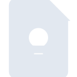
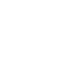

# googlekeep

[← Back to main README](../../README.md)





## 16 px

### black
```
https://georgegach.github.io/compatible-icons/simple-icons/googlekeep/16/black.png
```

### slate
```
https://georgegach.github.io/compatible-icons/simple-icons/googlekeep/16/slate.png
```

### white
```
https://georgegach.github.io/compatible-icons/simple-icons/googlekeep/16/white.png
```

## 64 px

### black
```
https://georgegach.github.io/compatible-icons/simple-icons/googlekeep/64/black.png
```

### slate
```
https://georgegach.github.io/compatible-icons/simple-icons/googlekeep/64/slate.png
```

### white
```
https://georgegach.github.io/compatible-icons/simple-icons/googlekeep/64/white.png
```

## 128 px

### black
```
https://georgegach.github.io/compatible-icons/simple-icons/googlekeep/128/black.png
```

### slate
```
https://georgegach.github.io/compatible-icons/simple-icons/googlekeep/128/slate.png
```

### white
```
https://georgegach.github.io/compatible-icons/simple-icons/googlekeep/128/white.png
```

## 512 px

### black
```
https://georgegach.github.io/compatible-icons/simple-icons/googlekeep/512/black.png
```

### slate
```
https://georgegach.github.io/compatible-icons/simple-icons/googlekeep/512/slate.png
```

### white
```
https://georgegach.github.io/compatible-icons/simple-icons/googlekeep/512/white.png
```

## 1024 px

### black
```
https://georgegach.github.io/compatible-icons/simple-icons/googlekeep/1024/black.png
```

### slate
```
https://georgegach.github.io/compatible-icons/simple-icons/googlekeep/1024/slate.png
```

### white
```
https://georgegach.github.io/compatible-icons/simple-icons/googlekeep/1024/white.png
```

## 16 px in base64

### black
```
data:image/png;base64,iVBORw0KGgoAAAANSUhEUgAAABAAAAAQCAYAAAAf8/9hAAAABmJLR0QA/wD/AP+gvaeTAAAA00lEQVQ4jbXTwUpCQRQG4C+VBDWIAjPdh9sIgh6iN21Vj+CmWvkGLbqJQisXhhXdFncuXOTOoII/HJgz5/9/DufMUKCLN/whr4kVpuiI4ArziDjHEr943TRpxBxr0MQNJujtY1Dyr/FSdrKtwTeyEB+4wC20EqKvQD7CJc4rtQVmqQ7WeMBYMeBHxRCj2NzCO04q9dNwV9bnQRPtoIVBJR/hOEaswwBPeA75Hfq7GMAQ9+HcjpFSa/zBZ4h1jJTq4CxEEru+xMMZZIqXl2+hKb93Bv8HQjRDcmzNJQAAAABJRU5ErkJggg==
```

### slate
```
data:image/png;base64,iVBORw0KGgoAAAANSUhEUgAAABAAAAAQCAYAAAAf8/9hAAAABmJLR0QA/wD/AP+gvaeTAAABMUlEQVQ4jZWTvUoDQRhFz50NiUYhoOBPFO3EwkYEQd/BBxFfzUpfQLDR3spSNusaAzYhq/nZayExweyGeNu535kzM4wA0jRd6bP0BOwD4m9MJvEc5b3zZrPZm14KAMOovgNaLhwGHDxEOhqqfpckSX0G8LOJi2YnEDsynAxUv2+326szgEUiEYDjLK89jk0WAsihjxwjxwpuBbw50vIpQGWOc6agVm4U8Lat9fFSDm9RJUrmGOhLIVzvbjQO9zYbB4Yb4WFRsxggvy+F/pWkkaR8VPOlpXRxgFX5dHXrt/SZ78hUi6old+Ct3Ny+vH48AAidGTb+AQBME3TxcyRqZbXSZxQMgA7QMfoq65UbwBpibazzb4NF8wtQ8T8qzHQ3AIRBN7bzjHmukxjcC4NuDPANWaBt9CBJ7XgAAAAASUVORK5CYII=
```

### white
```
data:image/png;base64,iVBORw0KGgoAAAANSUhEUgAAABAAAAAQCAYAAAAf8/9hAAAABmJLR0QA/wD/AP+gvaeTAAAA4UlEQVQ4jbXSTUpDQRAE4C8xKP6BKGg0++DCjQiCh/CmrvQCghvdeQMXRongOhIVy0Um8Agvj0SwoJnp6eqimG6QZDPJU5Kf1GOU5DHJhhm0y9nDOlqzhIJvnOB2VqRdz6/FCs5wl2TrLwJT/ikepk4WFfjEoMQLDnAOnYamj0Ju4RB7ldobXpscjHGFY/RxbfKR9UjSTzKsjO05yXalvlPephgm6Tc56KBbyXtYnUesQxc3Se5LfoH9ZQTgCJflvjaP1DTGL7yXGM8jNTnYLdGIZTfx/wQGJpuXBXqCUenxCyxQfUEzHYa1AAAAAElFTkSuQmCC
```

