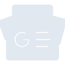
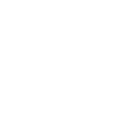

# googlenews

[← Back to main README](../../README.md)

<table><tr>
  <td></td>
  <td></td>
  <td></td>
</tr></table>

## 16 px

### black
```
https://georgegach.github.io/compatible-icons/simple-icons/compat/googlenews/16/black.png
```

### slate
```
https://georgegach.github.io/compatible-icons/simple-icons/compat/googlenews/16/slate.png
```

### white
```
https://georgegach.github.io/compatible-icons/simple-icons/compat/googlenews/16/white.png
```

## 64 px

### black
```
https://georgegach.github.io/compatible-icons/simple-icons/compat/googlenews/64/black.png
```

### slate
```
https://georgegach.github.io/compatible-icons/simple-icons/compat/googlenews/64/slate.png
```

### white
```
https://georgegach.github.io/compatible-icons/simple-icons/compat/googlenews/64/white.png
```

## 128 px

### black
```
https://georgegach.github.io/compatible-icons/simple-icons/compat/googlenews/128/black.png
```

### slate
```
https://georgegach.github.io/compatible-icons/simple-icons/compat/googlenews/128/slate.png
```

### white
```
https://georgegach.github.io/compatible-icons/simple-icons/compat/googlenews/128/white.png
```

## 512 px

### black
```
https://georgegach.github.io/compatible-icons/simple-icons/compat/googlenews/512/black.png
```

### slate
```
https://georgegach.github.io/compatible-icons/simple-icons/compat/googlenews/512/slate.png
```

### white
```
https://georgegach.github.io/compatible-icons/simple-icons/compat/googlenews/512/white.png
```

## 1024 px

### black
```
https://georgegach.github.io/compatible-icons/simple-icons/compat/googlenews/1024/black.png
```

### slate
```
https://georgegach.github.io/compatible-icons/simple-icons/compat/googlenews/1024/slate.png
```

### white
```
https://georgegach.github.io/compatible-icons/simple-icons/compat/googlenews/1024/white.png
```

## 16 px in base64

### black
```
data:image/png;base64,iVBORw0KGgoAAAANSUhEUgAAABAAAAAQCAYAAAAf8/9hAAAABmJLR0QA/wD/AP+gvaeTAAABJElEQVQ4jaXTyy5EURAF0HVbEzQaQUJiIOIXDBhJxNf4GjM/4CMMiImxxIR4JR4DpOPV3hqDWy0nV5OInZyksk/Vrl117uWfyJK4DZvoS7gqynjBXXA3mEWjKFbFCT4iuYYHnOM++I/I+WpSSgQ6MRDd6uhHF0ZC8BWP6EVPOsI8FrGADly0sFdJuMFwcoDVDNcxf3fB0W94xy06ShG8/6FY5GaolXGI6eTyQj5zFUO4lC9UOB2V7yBDrYQl+bLgFLvhqJEUdSaniR5sZGjHGYaxHV0r0bkaycdJ4WTCzzTJZflm97CPZ2zhCE+FcxW5dZTLheWMhZudcDEu/5D24r6CiYhX8FYU6MZUC9Ex39Hgb0/XEk0Ha5jT4gf5AW1Y/29z8AnIZ0YxOGaAigAAAABJRU5ErkJggg==
```

### slate
```
data:image/png;base64,iVBORw0KGgoAAAANSUhEUgAAABAAAAAQCAYAAAAf8/9hAAAABmJLR0QA/wD/AP+gvaeTAAABmElEQVQ4jaWST2tTQRTFf2dejC9NYlqRlqZ2IejKbXHjShA/jZ/GDyG4cuHOheLGjV9AUQuWCqZp/jR5KiR9c1y8yWsLQik9cGE4d+6Ze+4duCa0OtjODn6dfAzSrZoj9oQaiAXWvOJ8srvVeyypBGisLu9PJp0bIfRt30UURC8sWoa5YAO8k1QPv43HbWAGEOpWls0c2DAsQIWldaGWYBNrbrFE/CXQvRljp677MZg+FXpu+5mgiXwElBd9qo0rznC7csJ3SW91MJhOMRmwdr6jSxANM0EzED0zxCsUAwQhYY8awL7g0SpjOBLMQT3wHWAoNEq5DOI2qAOWpVGI5gXQSmYPJX9BiuAyKWbGuXEOzqV6850Q9CEcb6+/AYaJnAD37biFKDDH4IgYpxj6bMBB1quwJy1NfA0g08L6I5QDBaIAulgPz4VTZ793Nruf6o+UPPbBP4HPENrYu4gBjl+rvNoS9wCs+FLS6QUBYA30oFJz+ujqI/rViM4ghxKutrr/ogEQCe8yeCJUXlYAYJydwvvrPg7APyHqqGIAPncoAAAAAElFTkSuQmCC
```

### white
```
data:image/png;base64,iVBORw0KGgoAAAANSUhEUgAAABAAAAAQCAYAAAAf8/9hAAAABmJLR0QA/wD/AP+gvaeTAAABPElEQVQ4jaXSvWrUURAF8N/dXUOSTVwVFQxYiFjZW2gliE/j0+QhbO0tFBsbSxtFtDBaJLKg5guMm2Oxs/GfTRRCDgwM83XOzL2cE23mJOnjNS528iMM8AvbFfuBB621ybFJSUZJNjLFdpJxkr0km0l28xcbSY5Iep0Zi7hcbDu4hCVcL/YD7GMVK0crJHmEJ3iMBWzhuDyGndgVBB/xvCX5jj6W5xT9D4f4iYVeOYdnaFa1DeMBPuFeJ7lluvMIV/EN48r1ccP0Bg3jHtZNjwVf8L4UTTpNix2bYQWvWpIL+IpreFusw2IeVfHnTuPtTvx+r7V2gGcVWMJeMe2UreJux1K1u3gzmDvOWql5VypuYhMfKj/ErfKfttZ+zw9Yxp1Thq45iQlne7pTMVPwAg+d/IH/Qh8vz0sO/gAoV3E153EMlAAAAABJRU5ErkJggg==
```

