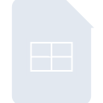
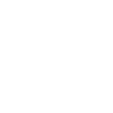

# googlesheets

[← Back to main README](../../README.md)

<table><tr>
  <td></td>
  <td></td>
  <td></td>
</tr></table>

## 16 px

### black
```
https://georgegach.github.io/compatible-icons/simple-icons/compat/googlesheets/16/black.png
```

### slate
```
https://georgegach.github.io/compatible-icons/simple-icons/compat/googlesheets/16/slate.png
```

### white
```
https://georgegach.github.io/compatible-icons/simple-icons/compat/googlesheets/16/white.png
```

## 64 px

### black
```
https://georgegach.github.io/compatible-icons/simple-icons/compat/googlesheets/64/black.png
```

### slate
```
https://georgegach.github.io/compatible-icons/simple-icons/compat/googlesheets/64/slate.png
```

### white
```
https://georgegach.github.io/compatible-icons/simple-icons/compat/googlesheets/64/white.png
```

## 128 px

### black
```
https://georgegach.github.io/compatible-icons/simple-icons/compat/googlesheets/128/black.png
```

### slate
```
https://georgegach.github.io/compatible-icons/simple-icons/compat/googlesheets/128/slate.png
```

### white
```
https://georgegach.github.io/compatible-icons/simple-icons/compat/googlesheets/128/white.png
```

## 512 px

### black
```
https://georgegach.github.io/compatible-icons/simple-icons/compat/googlesheets/512/black.png
```

### slate
```
https://georgegach.github.io/compatible-icons/simple-icons/compat/googlesheets/512/slate.png
```

### white
```
https://georgegach.github.io/compatible-icons/simple-icons/compat/googlesheets/512/white.png
```

## 1024 px

### black
```
https://georgegach.github.io/compatible-icons/simple-icons/compat/googlesheets/1024/black.png
```

### slate
```
https://georgegach.github.io/compatible-icons/simple-icons/compat/googlesheets/1024/slate.png
```

### white
```
https://georgegach.github.io/compatible-icons/simple-icons/compat/googlesheets/1024/white.png
```

## 16 px in base64

### black
```
data:image/png;base64,iVBORw0KGgoAAAANSUhEUgAAABAAAAAQCAYAAAAf8/9hAAAABmJLR0QA/wD/AP+gvaeTAAAA1ElEQVQ4jbXTQUvDQBCG4QejUk09aT0E9Oi9FPz/4M2bv0CRWBU9CWpbWuOhEwhxQ6LgB0Oyk5l3PnY3bJXjFl+oEvGBGxzq0AWeOporvGGN6zZkp4uYUIYZrjD+C6CunzadDAWsUEY84BSXsDsQcNxaP2PeBXjFS2My7MdzjLNmcQrwiAIHDdAEnzG1F7DBXUy9j9x5uMnaxSlAFlMWOIrcHkbhoBdQX5wl3iOXh4OqXZw6xiKa68Y83pfxrdfBScQg/fYm/h+gtD3nH5uUUP17l/AN/r81gA4oISUAAAAASUVORK5CYII=
```

### slate
```
data:image/png;base64,iVBORw0KGgoAAAANSUhEUgAAABAAAAAQCAYAAAAf8/9hAAAABmJLR0QA/wD/AP+gvaeTAAABPUlEQVQ4jZWTQTMDQRCFvzdLJLtxEg6rwg9wUqpU+feq3JzdXJSKFeGkSGTFPocJIruId5mp7p6ve7pnBDAcDrOS9gWwD4hlmYnEZVKNT/I8Hy+6AsAsSXdBncbDgINnSAczpadFUaQ1QEziprNfEDsxHM2Uno1Go24NsIokgsXhpNo4/6hkJYAcSuQB8kDyTcA7b+ocA6ytlttbWJjYpArukrWk+AnwALqP26qMa2jFSqouUn8xuAHgW0yO3PEcJKptrAmiAH4HSHqzfQW0Ar4GMOyBS0mJl4ZVA9hOJPWNX4w259Z1SW3bxfJTqQEqcIBHEaa2n2NVITMu575vqo0xWLnQdH6dTFIW+6BpsPLl+HoTRc+4V7NHX03/eolN+gSo+R/9UMhXbAAIr08Du5rAHz8qyuBxeH0aALwDzN1+TwVyoy4AAAAASUVORK5CYII=
```

### white
```
data:image/png;base64,iVBORw0KGgoAAAANSUhEUgAAABAAAAAQCAYAAAAf8/9hAAAABmJLR0QA/wD/AP+gvaeTAAAA30lEQVQ4jbXSTS8EQRDG8Z8dBLtOXg4rfAEnkfj8Ejc3n4DIIsJJYllBOWxNsmktMySepNPdNU/9q9I1ICKGEXEZEZ9R1zQiLiJiQ6FB7ntYx1JpSL3jEKclZFD3V9XgGGcRMfoLoPUf4bztpC/gDZNcN9jFCSz3BGwV93vc/gR4xMNCZVjNfYT9RXMNcIex+VRa0A5esmon4ANXWfU6YwfZTVOaa4Amq7xiM2MrWMsOOgGBJ8zwnLFhdhCluTbGcSa3icM8z/JbZwfbuXrpt3/i/wEm5nP+9kgVBaaZ4wuvG1ekr5S//QAAAABJRU5ErkJggg==
```

