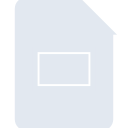
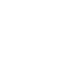

# googleslides

[← Back to main README](../../README.md)

<table><tr>
  <td></td>
  <td></td>
  <td></td>
</tr></table>

## 16 px

### black
```
https://georgegach.github.io/compatible-icons/simple-icons/compat/googleslides/16/black.png
```

### slate
```
https://georgegach.github.io/compatible-icons/simple-icons/compat/googleslides/16/slate.png
```

### white
```
https://georgegach.github.io/compatible-icons/simple-icons/compat/googleslides/16/white.png
```

## 64 px

### black
```
https://georgegach.github.io/compatible-icons/simple-icons/compat/googleslides/64/black.png
```

### slate
```
https://georgegach.github.io/compatible-icons/simple-icons/compat/googleslides/64/slate.png
```

### white
```
https://georgegach.github.io/compatible-icons/simple-icons/compat/googleslides/64/white.png
```

## 128 px

### black
```
https://georgegach.github.io/compatible-icons/simple-icons/compat/googleslides/128/black.png
```

### slate
```
https://georgegach.github.io/compatible-icons/simple-icons/compat/googleslides/128/slate.png
```

### white
```
https://georgegach.github.io/compatible-icons/simple-icons/compat/googleslides/128/white.png
```

## 512 px

### black
```
https://georgegach.github.io/compatible-icons/simple-icons/compat/googleslides/512/black.png
```

### slate
```
https://georgegach.github.io/compatible-icons/simple-icons/compat/googleslides/512/slate.png
```

### white
```
https://georgegach.github.io/compatible-icons/simple-icons/compat/googleslides/512/white.png
```

## 1024 px

### black
```
https://georgegach.github.io/compatible-icons/simple-icons/compat/googleslides/1024/black.png
```

### slate
```
https://georgegach.github.io/compatible-icons/simple-icons/compat/googleslides/1024/slate.png
```

### white
```
https://georgegach.github.io/compatible-icons/simple-icons/compat/googleslides/1024/white.png
```

## 16 px in base64

### black
```
data:image/png;base64,iVBORw0KGgoAAAANSUhEUgAAABAAAAAQCAYAAAAf8/9hAAAABmJLR0QA/wD/AP+gvaeTAAAAvUlEQVQ4ja3SPU8CQRDG8Z9iYpASaUxs+QDExI8PtaHxE1hgBMNbRbAAzuLukss6C0fik2wxT2b+M7uzlOrhAycUmfOOBxkNsThTXOCAtxRymyMG6mCESRNyDaCGvGBaQ+5aFq7x04if8IpxW0A/ib/xlZtghWUGNMBj04gA82rEbuLvq64XAXVyOvYmSsxtIQKHzSKzq3yHbeIf/b1WCHiukiN12gDuM8Whrv2J/wa4SQGfytUVLYoL7DCDX0hRKl9oh2FpAAAAAElFTkSuQmCC
```

### slate
```
data:image/png;base64,iVBORw0KGgoAAAANSUhEUgAAABAAAAAQCAYAAAAf8/9hAAAABmJLR0QA/wD/AP+gvaeTAAAA/0lEQVQ4jZWTQUoDQRREX/UIOpNldDMiHsCdCOLp9QCuxBsoY8Som5gRk3S5UHGc6Y7JXzUF9Sj+rxbAZDIZfbB3CxwDIjGCmyLOL+q6nnf1ALAsqkNQmTN/EXSyVHXVNE01AAAYZ70AtgvEaR8S1pkSU1icLcLo+geys4lL8Gz5/fsNdh1VngOXGwEMY9xdjx4V1eQSTEFPGdQBsN9VEgA/YGrk8q+sFrkB/QcAAi3WuKe9pA6VvoIT4JSWSmBUBjG19drVJa+iVfabNgAIHdlxRS+vDSIUfT21xN18o4dL2LaJeYDW/KNBDv+2KgCExezeji2pjAm/xJs0uwP4BEhyXgWh02DMAAAAAElFTkSuQmCC
```

### white
```
data:image/png;base64,iVBORw0KGgoAAAANSUhEUgAAABAAAAAQCAYAAAAf8/9hAAAABmJLR0QA/wD/AP+gvaeTAAAAv0lEQVQ4ja2TPQoCMRCFP3cFWS3VRvEEdiJ4fD2AjSewUBTxrxJt9FlsIkucYBZ8Tcjw5ptJJgFAUkfSWtJLca0ktQmUuXUIFEAjNFQ0BhYhJIuYLeXAJITUAXjIFFh6SDMx8Qw8KvsBMAPmqYBusD8Au1gHJ+AYAfWBXjVgAfauxSKI313VnwBvDtu+WMbYFCywWcwKFpT3cA3iT76PZQJGzmwpTwG0Ismm6r7EvwE+n84DtpSjU0KygBuwAXgDMJJLehStCbwAAAAASUVORK5CYII=
```

