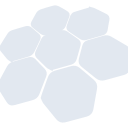
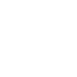

# h3

[← Back to main README](../../README.md)





## 16 px

### black
```
https://georgegach.github.io/compatible-icons/simple-icons/h3/16/black.png
```

### slate
```
https://georgegach.github.io/compatible-icons/simple-icons/h3/16/slate.png
```

### white
```
https://georgegach.github.io/compatible-icons/simple-icons/h3/16/white.png
```

## 64 px

### black
```
https://georgegach.github.io/compatible-icons/simple-icons/h3/64/black.png
```

### slate
```
https://georgegach.github.io/compatible-icons/simple-icons/h3/64/slate.png
```

### white
```
https://georgegach.github.io/compatible-icons/simple-icons/h3/64/white.png
```

## 128 px

### black
```
https://georgegach.github.io/compatible-icons/simple-icons/h3/128/black.png
```

### slate
```
https://georgegach.github.io/compatible-icons/simple-icons/h3/128/slate.png
```

### white
```
https://georgegach.github.io/compatible-icons/simple-icons/h3/128/white.png
```

## 512 px

### black
```
https://georgegach.github.io/compatible-icons/simple-icons/h3/512/black.png
```

### slate
```
https://georgegach.github.io/compatible-icons/simple-icons/h3/512/slate.png
```

### white
```
https://georgegach.github.io/compatible-icons/simple-icons/h3/512/white.png
```

## 1024 px

### black
```
https://georgegach.github.io/compatible-icons/simple-icons/h3/1024/black.png
```

### slate
```
https://georgegach.github.io/compatible-icons/simple-icons/h3/1024/slate.png
```

### white
```
https://georgegach.github.io/compatible-icons/simple-icons/h3/1024/white.png
```

## 16 px in base64

### black
```
data:image/png;base64,iVBORw0KGgoAAAANSUhEUgAAABAAAAAQCAYAAAAf8/9hAAAABmJLR0QA/wD/AP+gvaeTAAABQklEQVQ4jZXSv0qcQRQF8J/urgRBCcSQYgn+64RosPAF0lqnSpkur5AufR5BbELewRSC2qVQk0AgEFxY3UVWsxhYNYtxLb6LjOO3hQeGgTNzzr3nzlSUo4oVVHCW8E9wMURzizdooIsWPmAdv9DEBuaGias4wCDWNU7QT7gBvqQCWMQ7zKMWgi7+oY3lrND31OAVPuNpcK24MI0x1HEUZ2MYxwSeRyQ/s/aOomrKtfEp9v/BHeIj7AZxFeL9TDyIIr9L+N4oVmNwvXDvJC3DKb5F6/dQxWxkmkzWdgyxpvgLz6KDR3ic6C9HsIelzPhHDGwmdjGwr4oP1o+u1+BPlquPrYiUZ25iKq006u5XhePIW5o5CtwxeB+iRmR/G7nLcI6/ZQf1TLSgeIk8ws4Q41K8js46ihfYDOMH4QVeKqKW4gbxrGnxtEZljwAAAABJRU5ErkJggg==
```

### slate
```
data:image/png;base64,iVBORw0KGgoAAAANSUhEUgAAABAAAAAQCAYAAAAf8/9hAAAABmJLR0QA/wD/AP+gvaeTAAAB8ElEQVQ4jXWRTUvUYRTFf+eZv1MJjsZQvkw6RgQR9A4h0apo17pVy6DAr9Cyb9C6tkFfoWgjrdpERi4iTefFGRvnxbBMnee0GMVxRu/qcrjn3HPuhSPKdlKstGYWy418N14sbmR7Z9ULLJfrj0MIL6IYlv0XeIXCJPYdiVM2CxbP8qMji30CtpOVavO70PQ+hF0nhAz2wMFavZ8aHX4AkAAUqvWr0cwWq60LQRqwtY1oyP5naRV8s8fo/H6TLFea94l+I+mMO/JlHOdB+QjpIHK2Sx2zShsPIg+VSuuTuVy2oEKluWC41HWWMhDAY11YBfzBcE9wFgiIEtbbEGFrL24bXIZYO0wGQdMwIxjriAMmB34aQrL7ELRk2MS0RfiFKHWR1yP+ghg86oVJjOnzwR5CyiAyEWew5wQNWwMEUiF6NMIP0Elg5OBrbGml0vwMXDus7a9YaaRpcHpvW8H2J+C2pe0gLaUCrxNJU7a7fe1AaAjf8h65E5lJkBKHGxPjmdo+HqJjqydXNeBB05+ZAJsndrYPQUF+jlS1+Yk057ae2KT6yACRPxez2Y3eQ1Ko1XLnstmKpDbA8urvy2j3ndBEz20+To2dvtsncFQV15qP2pGXQQq2N4AVOzWbHx/6dhynrwqV+pXiWuO67XDczH8f1ONKYNjpRQAAAABJRU5ErkJggg==
```

### white
```
data:image/png;base64,iVBORw0KGgoAAAANSUhEUgAAABAAAAAQCAYAAAAf8/9hAAAABmJLR0QA/wD/AP+gvaeTAAABaklEQVQ4jYWSPUucQRSFn9kPEcEQMEZhkc1HIwtJwEJSa2ttZZnOv2CX/yF2gfyEBBJQOwsTExAEWWHZVdFEDKyYJfFJ4dW8++4rHhiGOXPPuXNmBgqgVtTXaj3HjxXV58VL6oF6pnbUt+qauqe21A/qs7vEFbXpf1ypp2rPfny80VRC+BJYBp4DVaAHnAG/gUNgJtfr262BOg+8A8aD60RBHRgCakA79oaAEWBUnUoptZK6C0xn3DtACZjMcEfAJ2AOeBz7beA96nbk+qO21a8OYlfdL+C7JWABaAJd4C9wkjkywA9gJ44+gArwFBgFHmTGRlxiFSgDE8A+MAw8zOgvk/oFeJUz/h4X9iRmgBawBcxy/UpNYBX1Zy5XT11XuwWZW+qjbKcScJ7rfhx5CzNH9z6DlRAdRPY3kbsIFymlXwOsWlPLmXUjnjSPzTuMB6EuqsfqSfyBz2ojX5fuMXkRcXZSSldFNf8AoTZBDikvaiwAAAAASUVORK5CYII=
```

