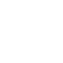

# hackerrank

[← Back to main README](../../README.md)

<table><tr>
  <td></td>
  <td></td>
  <td></td>
</tr></table>

## 16 px

### black
```
https://georgegach.github.io/compatible-icons/simple-icons/compat/hackerrank/16/black.png
```

### slate
```
https://georgegach.github.io/compatible-icons/simple-icons/compat/hackerrank/16/slate.png
```

### white
```
https://georgegach.github.io/compatible-icons/simple-icons/compat/hackerrank/16/white.png
```

## 64 px

### black
```
https://georgegach.github.io/compatible-icons/simple-icons/compat/hackerrank/64/black.png
```

### slate
```
https://georgegach.github.io/compatible-icons/simple-icons/compat/hackerrank/64/slate.png
```

### white
```
https://georgegach.github.io/compatible-icons/simple-icons/compat/hackerrank/64/white.png
```

## 128 px

### black
```
https://georgegach.github.io/compatible-icons/simple-icons/compat/hackerrank/128/black.png
```

### slate
```
https://georgegach.github.io/compatible-icons/simple-icons/compat/hackerrank/128/slate.png
```

### white
```
https://georgegach.github.io/compatible-icons/simple-icons/compat/hackerrank/128/white.png
```

## 512 px

### black
```
https://georgegach.github.io/compatible-icons/simple-icons/compat/hackerrank/512/black.png
```

### slate
```
https://georgegach.github.io/compatible-icons/simple-icons/compat/hackerrank/512/slate.png
```

### white
```
https://georgegach.github.io/compatible-icons/simple-icons/compat/hackerrank/512/white.png
```

## 1024 px

### black
```
https://georgegach.github.io/compatible-icons/simple-icons/compat/hackerrank/1024/black.png
```

### slate
```
https://georgegach.github.io/compatible-icons/simple-icons/compat/hackerrank/1024/slate.png
```

### white
```
https://georgegach.github.io/compatible-icons/simple-icons/compat/hackerrank/1024/white.png
```

## 16 px in base64

### black
```
data:image/png;base64,iVBORw0KGgoAAAANSUhEUgAAABAAAAAQCAYAAAAf8/9hAAAABmJLR0QA/wD/AP+gvaeTAAAAgElEQVQ4jd3SMQrCUBAE0BeR9KYQ7IRg7VW8Tk6ZykLs1C6dggERkibF94MhEkLAhS0WdmZ2h0nQGFGLMeA/IVhG8xNXrPDGCxmOwc4WmxDUBH3HATecUOARiZQhJr5Ap3pGNeSFSUxMscN+CEHiM4k1LvpNzLH+RvBzzR+k+QlaNHMba1i/684AAAAASUVORK5CYII=
```

### slate
```
data:image/png;base64,iVBORw0KGgoAAAANSUhEUgAAABAAAAAQCAYAAAAf8/9hAAAABmJLR0QA/wD/AP+gvaeTAAAAmElEQVQ4jeWSsQrCYAyEvwviKjooDoIgzu4+mc/iezm51UVxcRCFWv9zEIVihUI7aSBDIPm4O6JsfzINKpoc/wigU5rMRcEOq29RYOeGQUib94qZgseVCiTuxiuTbuBzEGtBTEa95aslH74rAJQiR94CxzoW2g/RkbrGc8OiDkClT7SvCmXPEFOB9RFiSswkD6sBbVj4Q8ADo5w+xsItpYkAAAAASUVORK5CYII=
```

### white
```
data:image/png;base64,iVBORw0KGgoAAAANSUhEUgAAABAAAAAQCAYAAAAf8/9hAAAABmJLR0QA/wD/AP+gvaeTAAAAhUlEQVQ4jd2SMQrCUBBEX0TSxyJgJwTrXMXreEori2CndukiRBDh2Uj4+RCJBAk43cDOzO4yiSoTsJgi/hODZcRb4AJkwBN4ACvgGMxsgHXH7KNRd+pVrdS9egsT1EMoiDfgnXoC6jEn/OSJKbAFyjEGSdTEO3Dm8xMLIB8y+BrzF2l+gxfHIks7zYS12AAAAABJRU5ErkJggg==
```

