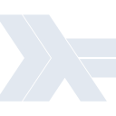

# haskell

[← Back to main README](../../README.md)

<table><tr>
  <td></td>
  <td></td>
  <td></td>
</tr></table>

## 16 px

### black
```
https://georgegach.github.io/compatible-icons/simple-icons/compat/haskell/16/black.png
```

### slate
```
https://georgegach.github.io/compatible-icons/simple-icons/compat/haskell/16/slate.png
```

### white
```
https://georgegach.github.io/compatible-icons/simple-icons/compat/haskell/16/white.png
```

## 64 px

### black
```
https://georgegach.github.io/compatible-icons/simple-icons/compat/haskell/64/black.png
```

### slate
```
https://georgegach.github.io/compatible-icons/simple-icons/compat/haskell/64/slate.png
```

### white
```
https://georgegach.github.io/compatible-icons/simple-icons/compat/haskell/64/white.png
```

## 128 px

### black
```
https://georgegach.github.io/compatible-icons/simple-icons/compat/haskell/128/black.png
```

### slate
```
https://georgegach.github.io/compatible-icons/simple-icons/compat/haskell/128/slate.png
```

### white
```
https://georgegach.github.io/compatible-icons/simple-icons/compat/haskell/128/white.png
```

## 512 px

### black
```
https://georgegach.github.io/compatible-icons/simple-icons/compat/haskell/512/black.png
```

### slate
```
https://georgegach.github.io/compatible-icons/simple-icons/compat/haskell/512/slate.png
```

### white
```
https://georgegach.github.io/compatible-icons/simple-icons/compat/haskell/512/white.png
```

## 1024 px

### black
```
https://georgegach.github.io/compatible-icons/simple-icons/compat/haskell/1024/black.png
```

### slate
```
https://georgegach.github.io/compatible-icons/simple-icons/compat/haskell/1024/slate.png
```

### white
```
https://georgegach.github.io/compatible-icons/simple-icons/compat/haskell/1024/white.png
```

## 16 px in base64

### black
```
data:image/png;base64,iVBORw0KGgoAAAANSUhEUgAAABAAAAAQCAYAAAAf8/9hAAAABmJLR0QA/wD/AP+gvaeTAAAA7klEQVQ4jcXSvUoDURAF4C8SXQvBxEJSilj7AAEfI49hr28i+BjmKSysU/kXIxGLRVwEwWQtdiRXZXc7PTDF3HvnzD1zhv9GBwVyrOMN/ThbwxGu20gusECJaUQZcRVEjdjGTRQscYenyF9x2iYBRjjDTsgpMAhZM4xx2PaTcYOUh4jyZ3QSgr5K815SlGE3fvSMj2jyhc3WAQW2sBHysrpHTW6Uyfk3Kd0oHmGosiyPy0HcPaIbUnq4xX3auee3jXMrG09wjner2RykBE3Tv1RZnWGiZsGKKJqr1jaPfIb9pNEw3kzxguOaWf4xPgHL8l9u0p0HmgAAAABJRU5ErkJggg==
```

### slate
```
data:image/png;base64,iVBORw0KGgoAAAANSUhEUgAAABAAAAAQCAYAAAAf8/9hAAAABmJLR0QA/wD/AP+gvaeTAAABi0lEQVQ4jcWSvW4TURCFvzP+2RSR7FB4oziYoMgtD4CElJYHiESBKGihzxNQ8AbUiApRpucNoKRBBJtdJwZFS2CFlATfQ2FihSIWDeJUI90735k598L/lsZHVY2oIFrYPxBr4BoijO/cyLsflgFCxGusDexcogWusTaxNyL5le1YCjhrz+6DxwC2+rKS4TOApeF4erK3dAWA0eHxrtR4BlxDqkiuHazLtCTK5LQfaty6EgAwOjrZF74LhEQxn4jN+S2XIDD9qwGjr2tkfiO0BVi4SCgT9IAa+AL8FJpd9BivLA3oklYl2pjKOLt80FxUmZ6HGNggURpJprdwM30CA7J98w/A6PB4V/i2TSBVTraDdQFIE9tNQQ/TBX+UYrzI4KCquo1T3oK2QBbpk6UMkwvqBE+AbcEDoA0uFbFzvdd5DxDN83gBGszNXFoKTD4PSe8Geefp2ffOY4uD3559ZunlxQcLp7SDPEGa2pwDq8gF0sTyPUkeDnXaJB4CU+TC0nYx/fboLx/gH+sXWWSw28DRw/QAAAAASUVORK5CYII=
```

### white
```
data:image/png;base64,iVBORw0KGgoAAAANSUhEUgAAABAAAAAQCAYAAAAf8/9hAAAABmJLR0QA/wD/AP+gvaeTAAABDElEQVQ4jcWSvUpDQRCFvw1qLAQTixAQRMXaBwj4GD6Gvb6JYOcrJE9hkdoq/iRXIhZBvAiC8bPIqCuGGxvxwMAuO3NmzpmF/0ZSS2ACLAPPQBMogRpwkFIaVDKoXXXqDMOID/TV2iKCdfUqCt7UG/U+7k/qSaWEIDkEToGNkFMC7ZBVAD1gf9EkvQopo4gfSBlBE+gD24DACKgDrZjoAXgFplnf1WqDvrAGrIS8ev6wlJ3Pga04F8z8aWXvmzFZAna+EYSJHWa7n0RiO3LuIq8FNIBr4PaTVm3MWeM4W+Oxeqa+ZIbu5QRV7l+oSa2rl3M/mFpG0VgdqJO4F+pu1qgTOUP1UT365QL+GO+3Pj5dLWqnGQAAAABJRU5ErkJggg==
```

