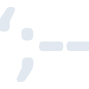
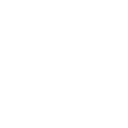

# haveibeenpwned

[← Back to main README](../../README.md)

<table><tr>
  <td></td>
  <td></td>
  <td></td>
</tr></table>

## 16 px

### black
```
https://georgegach.github.io/compatible-icons/simple-icons/compat/haveibeenpwned/16/black.png
```

### slate
```
https://georgegach.github.io/compatible-icons/simple-icons/compat/haveibeenpwned/16/slate.png
```

### white
```
https://georgegach.github.io/compatible-icons/simple-icons/compat/haveibeenpwned/16/white.png
```

## 64 px

### black
```
https://georgegach.github.io/compatible-icons/simple-icons/compat/haveibeenpwned/64/black.png
```

### slate
```
https://georgegach.github.io/compatible-icons/simple-icons/compat/haveibeenpwned/64/slate.png
```

### white
```
https://georgegach.github.io/compatible-icons/simple-icons/compat/haveibeenpwned/64/white.png
```

## 128 px

### black
```
https://georgegach.github.io/compatible-icons/simple-icons/compat/haveibeenpwned/128/black.png
```

### slate
```
https://georgegach.github.io/compatible-icons/simple-icons/compat/haveibeenpwned/128/slate.png
```

### white
```
https://georgegach.github.io/compatible-icons/simple-icons/compat/haveibeenpwned/128/white.png
```

## 512 px

### black
```
https://georgegach.github.io/compatible-icons/simple-icons/compat/haveibeenpwned/512/black.png
```

### slate
```
https://georgegach.github.io/compatible-icons/simple-icons/compat/haveibeenpwned/512/slate.png
```

### white
```
https://georgegach.github.io/compatible-icons/simple-icons/compat/haveibeenpwned/512/white.png
```

## 1024 px

### black
```
https://georgegach.github.io/compatible-icons/simple-icons/compat/haveibeenpwned/1024/black.png
```

### slate
```
https://georgegach.github.io/compatible-icons/simple-icons/compat/haveibeenpwned/1024/slate.png
```

### white
```
https://georgegach.github.io/compatible-icons/simple-icons/compat/haveibeenpwned/1024/white.png
```

## 16 px in base64

### black
```
data:image/png;base64,iVBORw0KGgoAAAANSUhEUgAAABAAAAAQCAYAAAAf8/9hAAAABmJLR0QA/wD/AP+gvaeTAAAAvUlEQVQ4ja3SsWpCQRSE4U8bsQiIIFjYp0kZ38KHsLC3FmwsfYhAIGXeImms7C0UuRaKqIWdkJgUu4WEG64u/t0OO+cMs8sdKOMd41TzEB1sUxOsMEclNUETB5xSB3ziJZ5rWGCaMgxaQhfZtYZSjtbGETMM8Bj1H4zQi4vgu2jBWujnEId2sb/U8hJcUhd6gTOWaOAhal95pje8FkX7j6rwLzLhhQr5e+lZiLcRIt/MBDs8pZhL+EA/xZzML64KJJRPl0SFAAAAAElFTkSuQmCC
```

### slate
```
data:image/png;base64,iVBORw0KGgoAAAANSUhEUgAAABAAAAAQCAYAAAAf8/9hAAAABmJLR0QA/wD/AP+gvaeTAAABK0lEQVQ4jaWQP0tCYRjFz3nvNQn8lxAZZtAgQWPUHs19imhuD1qiKaLvELTVx2hvamkqvcNVB70mDZr3OQ0ZaEbd9GzPC7/feZ4XmDeSXK3ZuQvC6GIW3tVb0SnFgxhqzSJg0IwCiYN+L7dVrbL/7w0ElAC1Z4EBwKdwL+IWAJ47nYLX5wPJqLKS304kqJQK+19D6s0y5nkZQX7SDfj9oR52dz3ja7mce6o12icUNwHAOad3szOSR05aG9HxlGA8tUY3JJUeNfkydwzaFfhZLMn/VRAE3aItqAAAZrKN1aWXMOwtD1ycBYBUbMOfWm/qze51gvMBABOfFQTBoqg9CpLkSNpfAjc+KJ3fkZQV0EgCTwlgdklwCNhhEnhCIIkSBzKdr5eKj0kFc+cDZWCGsXmapnQAAAAASUVORK5CYII=
```

### white
```
data:image/png;base64,iVBORw0KGgoAAAANSUhEUgAAABAAAAAQCAYAAAAf8/9hAAAABmJLR0QA/wD/AP+gvaeTAAAA1klEQVQ4jaWSMUpDURBFz/1NsBCCIFikt7HUXbgICzch2IiVixAES5dhY2Vlk0KRWCghpkhniDk2T5EY4vc5MMW7M/fOKR78t9RGvVLPavwNcAzsA8Nagif1Xu3UEmwB4yRvtQHXwHmh6aoP6m1NGGpPHaqDtp4sCdkDJkn66hGw/TkCToBDoFe099+IntVx6Yl6oL5+134QLARsAN3ynCd5VDeB9aLNlpku1YuVaCsurpV/MVCbNp7Fpd2C95JkXkNwo47UnbaeLwI1wBQ4TXL35+u19QE3iI5cXvVmnAAAAABJRU5ErkJggg==
```

