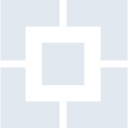
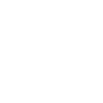

# hdfcbank

[← Back to main README](../../README.md)





## 16 px

### black
```
https://georgegach.github.io/compatible-icons/simple-icons/hdfcbank/16/black.png
```

### slate
```
https://georgegach.github.io/compatible-icons/simple-icons/hdfcbank/16/slate.png
```

### white
```
https://georgegach.github.io/compatible-icons/simple-icons/hdfcbank/16/white.png
```

## 64 px

### black
```
https://georgegach.github.io/compatible-icons/simple-icons/hdfcbank/64/black.png
```

### slate
```
https://georgegach.github.io/compatible-icons/simple-icons/hdfcbank/64/slate.png
```

### white
```
https://georgegach.github.io/compatible-icons/simple-icons/hdfcbank/64/white.png
```

## 128 px

### black
```
https://georgegach.github.io/compatible-icons/simple-icons/hdfcbank/128/black.png
```

### slate
```
https://georgegach.github.io/compatible-icons/simple-icons/hdfcbank/128/slate.png
```

### white
```
https://georgegach.github.io/compatible-icons/simple-icons/hdfcbank/128/white.png
```

## 512 px

### black
```
https://georgegach.github.io/compatible-icons/simple-icons/hdfcbank/512/black.png
```

### slate
```
https://georgegach.github.io/compatible-icons/simple-icons/hdfcbank/512/slate.png
```

### white
```
https://georgegach.github.io/compatible-icons/simple-icons/hdfcbank/512/white.png
```

## 1024 px

### black
```
https://georgegach.github.io/compatible-icons/simple-icons/hdfcbank/1024/black.png
```

### slate
```
https://georgegach.github.io/compatible-icons/simple-icons/hdfcbank/1024/slate.png
```

### white
```
https://georgegach.github.io/compatible-icons/simple-icons/hdfcbank/1024/white.png
```

## 16 px in base64

### black
```
data:image/png;base64,iVBORw0KGgoAAAANSUhEUgAAABAAAAAQCAYAAAAf8/9hAAAABmJLR0QA/wD/AP+gvaeTAAAA9klEQVQ4jZ3SrU5DQRAF4K+baypJcEgEAgNPgOANsLwEFgcGzROQgOMFwBFQxfGjSUpdQwIkmCpuEb03bIe7lHCSzc6cmZw9u7MwxrSwDjH4pT5OmPg/JlUgpoU88r02yAVecYTnjHvEJVYybge7XQJwhfvAPYV8LU+iQItjbAbuFCexsUJq4pTxW9gIvaMOgVThAkv4xEvBUY4Bzpv4vXWQUMtedwHmXI/MxvSW2b7z89OcNbX9jBtVzcmyHW7wEU697nBSl6awt/gWM0SBbaxm+QOWzX+k9Sgy9H2nOqwD3Hbwbf8wOohT6DWNxekk9EvFP6D/Bd3WSJ2xTFeYAAAAAElFTkSuQmCC
```

### slate
```
data:image/png;base64,iVBORw0KGgoAAAANSUhEUgAAABAAAAAQCAYAAAAf8/9hAAAABmJLR0QA/wD/AP+gvaeTAAABX0lEQVQ4jY2TsU5UYRCFvzP3UtBINhogQWksKGykIVBRmBhqEipewmegsNCGJyCx9AWwM1rZgjUFy0LYJTErNBR651joLncvV91J/uSfM/85M5OZX93L677kBVrMrvYiype219vjGoTk27bgNCb5tmyKTngRbsVBo0td4Bvya8HpXYb4SvJB8tIIS8e28G6bACE+Pp7vHDWyndSd8/7NStYKarYAQK9/vW/l6mTRxbvl+QcHzbelUBgjEXePvYn1fIKPu8DBJKYoJQ5tdWxXjp9XbRXV7UdRfSmqeA8gMSxth0TYpCT9T+A30QFgEyVoy/YyYqgs3gAX/yLPVMVGkjt/WjgrjRMAk+PpWp9R3tSJVnxqihln6xSeLM69mqYVaIwxzYve4PvTMSAdK3nk2iJV9jP9ReAh1luPuSKde0JbmLWxZnPbGxVpdGyLTElyHaf2DwDC1ux03d43W7O/AI/shlW7XwlNAAAAAElFTkSuQmCC
```

### white
```
data:image/png;base64,iVBORw0KGgoAAAANSUhEUgAAABAAAAAQCAYAAAAf8/9hAAAABmJLR0QA/wD/AP+gvaeTAAABCUlEQVQ4jZ3TsUoDQRAG4G+Pa1IKdoKNhYWNllYWNtaClS/hI2hjYeUTCJa+gHaiVSzVWogKQhAkYJPKjIW5sFkuRvxhuZn/Zv7972ZXRPRjNo4iovvL+36Fof9jWBdEzMhLPjVBLvCBYzxn3COusJRxu9hvE4DrlNJ9wT1NWYpYzfNSoCk6xUZBn6eUzsraGtU4rjJ+C+tF7QtKgarGJRbwhfc2RwW6uBjHg8ZBhZHs787BxHWNHSxjgBO8zWnexN44fq3HO8uecIvPovGmRWzUOoWU0sEcFxOUAtsRsZLlD1g0fZDWpjoiopddjlGxDiPiroVv0CsdlFNIfu7BzOlU6PzhU2eh8w3RjqmysR0WFwAAAABJRU5ErkJggg==
```

