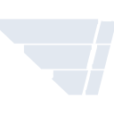
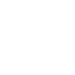

# hermes

[← Back to main README](../../README.md)

<table><tr>
  <td></td>
  <td></td>
  <td></td>
</tr></table>

## 16 px

### black
```
https://georgegach.github.io/compatible-icons/simple-icons/compat/hermes/16/black.png
```

### slate
```
https://georgegach.github.io/compatible-icons/simple-icons/compat/hermes/16/slate.png
```

### white
```
https://georgegach.github.io/compatible-icons/simple-icons/compat/hermes/16/white.png
```

## 64 px

### black
```
https://georgegach.github.io/compatible-icons/simple-icons/compat/hermes/64/black.png
```

### slate
```
https://georgegach.github.io/compatible-icons/simple-icons/compat/hermes/64/slate.png
```

### white
```
https://georgegach.github.io/compatible-icons/simple-icons/compat/hermes/64/white.png
```

## 128 px

### black
```
https://georgegach.github.io/compatible-icons/simple-icons/compat/hermes/128/black.png
```

### slate
```
https://georgegach.github.io/compatible-icons/simple-icons/compat/hermes/128/slate.png
```

### white
```
https://georgegach.github.io/compatible-icons/simple-icons/compat/hermes/128/white.png
```

## 512 px

### black
```
https://georgegach.github.io/compatible-icons/simple-icons/compat/hermes/512/black.png
```

### slate
```
https://georgegach.github.io/compatible-icons/simple-icons/compat/hermes/512/slate.png
```

### white
```
https://georgegach.github.io/compatible-icons/simple-icons/compat/hermes/512/white.png
```

## 1024 px

### black
```
https://georgegach.github.io/compatible-icons/simple-icons/compat/hermes/1024/black.png
```

### slate
```
https://georgegach.github.io/compatible-icons/simple-icons/compat/hermes/1024/slate.png
```

### white
```
https://georgegach.github.io/compatible-icons/simple-icons/compat/hermes/1024/white.png
```

## 16 px in base64

### black
```
data:image/png;base64,iVBORw0KGgoAAAANSUhEUgAAABAAAAAQCAYAAAAf8/9hAAAABmJLR0QA/wD/AP+gvaeTAAAA6ElEQVQ4jcXSvUpDQRCG4cdksVDBRBs7SSFoYS3YphIbIdh7GbkEG2vvIthZKaI23oA/RbQQfzAqaGNjPBa7sTqHnAjiB7PF7MzLN7vDf2sMm7/oe8bxAPCJ6oiAA8xjtoJDfIwIOEENbwFr6GAFWUlAHQH3AX1soIE2mkOan9DFK3ZDSma4xiNmkr0inWIp1VzmFWwnelYQW7jADaohB9BGDy1MYTJnhHHxG/uVAps7WMV5AkykqIlvVE93igAD7eELcyneMS3uzv6Q3h+t406c/wwPuBWXMB4ltIxFXGEBLzgq6+Bv9Q3EyjItjt84zQAAAABJRU5ErkJggg==
```

### slate
```
data:image/png;base64,iVBORw0KGgoAAAANSUhEUgAAABAAAAAQCAYAAAAf8/9hAAAABmJLR0QA/wD/AP+gvaeTAAABR0lEQVQ4jcWOP0tbcRiFn/N66aDCvdHBRLkpDkIdOgvdipO4FIrfxclv4Cz2Q4hbp7ZiO7m4STtYbAImxtaYLC7J77g4WKl/MhTPejjPeeC5o1+ty7VRR2P491y12AdQs305MIyNAkj2pwi9JDEdhs/gq1EAgq8kF4heVs7kK82z/o7lJSE/UaHiUBbSaSZpaPtdo9Obt70uWH7kveOIY+ELYCsDkGTgZ6PVbROawhT3AWx9E14ECid/j9tlvVbZGKa0jek+4P9F4q2hX9byw+xuPV+bWm+0uudSvMeeNEz8NSc6gV8ovC9pGHcBNyab5Uz+xnBkmEAaRxoHiggtI1WcfATwT8Ctv93ACbuKXTX0ccplDyL4CKCHAXDS6q2G0gfQLHAA1DGDsprXJflRAECzffE6OV5FpB8QCyT/KWuVvads/3+uAcsMhfNtgeGHAAAAAElFTkSuQmCC
```

### white
```
data:image/png;base64,iVBORw0KGgoAAAANSUhEUgAAABAAAAAQCAYAAAAf8/9hAAAABmJLR0QA/wD/AP+gvaeTAAABAUlEQVQ4jcXQu06UYRSF4WczfyjExEEbO0NhIoU1ia2VoSEh9l4Gl0Bj7V0YOiqNGW28AQ8FUhgOAZwEGpoZFsX8JASHMENCeJNd7W+9Wfvjvqkkb2+RO0LvQjBAZ0rBJzzDkxl8xumUgq/o4rjBG3zEEjKhYB4NdpuqGiZZwQLW8PqG8AG20MeHBqoq+JNkH4/betfxDYvtm1//bZOsJ+nnet4l+ZlkO0mnuSqoqrUkh1jFQ8yNOWEWvaoazozrWFXvq+oVfrSCB+10jf5ovt0ZK7jEBs7wtJ0TPMIAmzdkRyRZTrLT3v89yV6Sv0kKakLJS7zAbzzHv6r6MlGDO+ccKct898RtyHYAAAAASUVORK5CYII=
```

