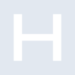
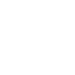

# hetzner

[← Back to main README](../../README.md)

<table><tr>
  <td></td>
  <td></td>
  <td></td>
</tr></table>

## 16 px

### black
```
https://georgegach.github.io/compatible-icons/simple-icons/compat/hetzner/16/black.png
```

### slate
```
https://georgegach.github.io/compatible-icons/simple-icons/compat/hetzner/16/slate.png
```

### white
```
https://georgegach.github.io/compatible-icons/simple-icons/compat/hetzner/16/white.png
```

## 64 px

### black
```
https://georgegach.github.io/compatible-icons/simple-icons/compat/hetzner/64/black.png
```

### slate
```
https://georgegach.github.io/compatible-icons/simple-icons/compat/hetzner/64/slate.png
```

### white
```
https://georgegach.github.io/compatible-icons/simple-icons/compat/hetzner/64/white.png
```

## 128 px

### black
```
https://georgegach.github.io/compatible-icons/simple-icons/compat/hetzner/128/black.png
```

### slate
```
https://georgegach.github.io/compatible-icons/simple-icons/compat/hetzner/128/slate.png
```

### white
```
https://georgegach.github.io/compatible-icons/simple-icons/compat/hetzner/128/white.png
```

## 512 px

### black
```
https://georgegach.github.io/compatible-icons/simple-icons/compat/hetzner/512/black.png
```

### slate
```
https://georgegach.github.io/compatible-icons/simple-icons/compat/hetzner/512/slate.png
```

### white
```
https://georgegach.github.io/compatible-icons/simple-icons/compat/hetzner/512/white.png
```

## 1024 px

### black
```
https://georgegach.github.io/compatible-icons/simple-icons/compat/hetzner/1024/black.png
```

### slate
```
https://georgegach.github.io/compatible-icons/simple-icons/compat/hetzner/1024/slate.png
```

### white
```
https://georgegach.github.io/compatible-icons/simple-icons/compat/hetzner/1024/white.png
```

## 16 px in base64

### black
```
data:image/png;base64,iVBORw0KGgoAAAANSUhEUgAAABAAAAAQCAYAAAAf8/9hAAAABmJLR0QA/wD/AP+gvaeTAAAAm0lEQVQ4ja2SQQrCMBREX6R12dK1PZEo3rurHiDLegEXhYZqXfiDKc3H0PhhIBkmQzITAyxkzCHnMEARrB8CgFbRD3xuXAOVJxeBlf0ZmALewwEX0VjPa0+I5RLN6q8ZhPMExr0GHXBT9H2KQQk0isExRsZacGxbmIGraH628Erk8lvQDEwih+H7QfxXNsBJMb6LvhKsDHZNdgZvV9EricQaf5YAAAAASUVORK5CYII=
```

### slate
```
data:image/png;base64,iVBORw0KGgoAAAANSUhEUgAAABAAAAAQCAYAAAAf8/9hAAAABmJLR0QA/wD/AP+gvaeTAAAA5klEQVQ4jaWTQU7DMBRE3zgNy0BXIJX2DpwEcQrEwbgMK86AACF1g7pAok08LKKgxHZVQWb1NbbH88ffevn4NDMQ5hwGWAyF5Z1gJ4TNdWmzxCvGFueYZuJAZru5XK6JurfZp4ctDtHhYX11scFsCy1oXGW5yDmXCPwPiyIrOvDXlFLRQiZQWU+H4NtxS9D3VHc8nxTY11WtNi5Lxtr6++y0g7a9cdAjdj1dceeuugPex2w5xOiYUpYy7rjAH1AUsJIEgeCcA9DwmYZRBgmzKt/nt/411Qyj/BuirAZ68ji0SodhdgY/6lFQJ1QRmT4AAAAASUVORK5CYII=
```

### white
```
data:image/png;base64,iVBORw0KGgoAAAANSUhEUgAAABAAAAAQCAYAAAAf8/9hAAAABmJLR0QA/wD/AP+gvaeTAAAAoUlEQVQ4ja2TQQrCMBBFX0RdVlzrJbyGCOIhvYyrHqBL9QAuBIX6XXSKI3YgNH4YSD6TB/mZJEmiQJOSwwBTt75ZAayD/jMgYAFUAOijxvZbSQ/96ilpZz1Nb0ZXGMplMKu/ZuDVAvexgBOwD/rrHMAMWAaAeQ5gAxwN5NUCB+DqzSjEV6ZX/goRIGV6JPeZ+lFOwCoAX+gGqrL6AoxScQZv8sNVLJJfcisAAAAASUVORK5CYII=
```

