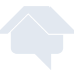
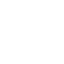

# homeadvisor

[← Back to main README](../../README.md)

<table><tr>
  <td></td>
  <td></td>
  <td></td>
</tr></table>

## 16 px

### black
```
https://georgegach.github.io/compatible-icons/simple-icons/compat/homeadvisor/16/black.png
```

### slate
```
https://georgegach.github.io/compatible-icons/simple-icons/compat/homeadvisor/16/slate.png
```

### white
```
https://georgegach.github.io/compatible-icons/simple-icons/compat/homeadvisor/16/white.png
```

## 64 px

### black
```
https://georgegach.github.io/compatible-icons/simple-icons/compat/homeadvisor/64/black.png
```

### slate
```
https://georgegach.github.io/compatible-icons/simple-icons/compat/homeadvisor/64/slate.png
```

### white
```
https://georgegach.github.io/compatible-icons/simple-icons/compat/homeadvisor/64/white.png
```

## 128 px

### black
```
https://georgegach.github.io/compatible-icons/simple-icons/compat/homeadvisor/128/black.png
```

### slate
```
https://georgegach.github.io/compatible-icons/simple-icons/compat/homeadvisor/128/slate.png
```

### white
```
https://georgegach.github.io/compatible-icons/simple-icons/compat/homeadvisor/128/white.png
```

## 512 px

### black
```
https://georgegach.github.io/compatible-icons/simple-icons/compat/homeadvisor/512/black.png
```

### slate
```
https://georgegach.github.io/compatible-icons/simple-icons/compat/homeadvisor/512/slate.png
```

### white
```
https://georgegach.github.io/compatible-icons/simple-icons/compat/homeadvisor/512/white.png
```

## 1024 px

### black
```
https://georgegach.github.io/compatible-icons/simple-icons/compat/homeadvisor/1024/black.png
```

### slate
```
https://georgegach.github.io/compatible-icons/simple-icons/compat/homeadvisor/1024/slate.png
```

### white
```
https://georgegach.github.io/compatible-icons/simple-icons/compat/homeadvisor/1024/white.png
```

## 16 px in base64

### black
```
data:image/png;base64,iVBORw0KGgoAAAANSUhEUgAAABAAAAAQCAYAAAAf8/9hAAAABmJLR0QA/wD/AP+gvaeTAAAA30lEQVQ4jaXTP0oDQRTH8U9kEbRMLS4IniLn8AAeIAew9DJiJYi9hYuQxs4yEVTE/wkRsdXCNzDG3Zg1A8O8efN+3/djhmHJ0anJlTjEKj6z/Bt2cT0PWGKEKR4DkM9R1PwprnCK+0UhJYZhs8IdJhHXQa5yyGaIpzgLcSqcYDAHsgUveM86zxYmJw81Z68d7GCMffQa7meMGxSxv8TRbNF5TYemWSXRSkPHhUcOeG6he0pBkSX7vp+xm+U2sI31aHAR614bhyf4wC3WWrj8ATkOd/8CJMjBMoAE+fV7vwA7jlj3pzU3EgAAAABJRU5ErkJggg==
```

### slate
```
data:image/png;base64,iVBORw0KGgoAAAANSUhEUgAAABAAAAAQCAYAAAAf8/9hAAAABmJLR0QA/wD/AP+gvaeTAAABaklEQVQ4jaWQMU9TYRSGn/fjxhgHBANWG8pNSnBwczVhEXfiT3B04Acw8m+cSEjYiHXRkRgJDiakBkJuCoW2qQNEy/c62NvQ9kIH3unkfOc83/seuKc02qhn7TQJ+mjzQAHnfZvudfT7ann26FZAPWuniVRzYA5zJXg6RDf1nv3mJiQULSt6P+AfQGPEbzWRavWsnQ4B+rY/WZ5X1D6iaumVow9dBAn6nEOUZa3FXgg1pHki3xVYsl3uj3eAn0AKPBtO419Ib3Xc6JyDH+LwDcUqqMywOo4+IGhZUBp5ayU2H5BaCmzisWWAGUkvhY8NzX6OA5ut/4n6Omq0vwq9LgCMyfaX9PnsyuCI99EAIOX2JktBZ3md5MVUL67HJOlingys4gXBsuGRUNNiT9Bk6u/GAHbXT7bDyWl32/YqgQv9+f2iUqlcFkYotCrFhdL0GtKuzOOimYlHlBQrpel3SDuTZu+U7WB7LPI/5xWVsiXbM5YAAAAASUVORK5CYII=
```

### white
```
data:image/png;base64,iVBORw0KGgoAAAANSUhEUgAAABAAAAAQCAYAAAAf8/9hAAAABmJLR0QA/wD/AP+gvaeTAAAA90lEQVQ4jaWTvUpDQRBGz4YgamkjiBgI+BQ+hw/gA/gAlr6MWAlib2EQ0ohNSiOoiPjDjUlheywyV9abXL3Rr9nZGb4zu8Mu/FOpmlA7wDGwBJiVJsBeSumulqZ21KE6Vp+d1TAa/GruqefqUyNImG/USZgf1VHE8yC3XxB1K8xj9SLMpUZq/wdIN6lvwDJwDXSBjcrt3oEBsA2sV2pFUneBAjgEdmrmWwD3QDv2A+CkOofLOcesU6/0tWo6NlYOeF3A91IG7Sy5z/S1rWW5TabDW40GV7EeNGqjttQz9UN9UFcWOOU3yGk8ssUBGeToz4AMMvN7PwEDe0D9viDxNAAAAABJRU5ErkJggg==
```

