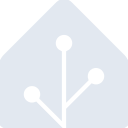

# homeassistant

[← Back to main README](../../README.md)

<table><tr>
  <td></td>
  <td></td>
  <td></td>
</tr></table>

## 16 px

### black
```
https://georgegach.github.io/compatible-icons/simple-icons/compat/homeassistant/16/black.png
```

### slate
```
https://georgegach.github.io/compatible-icons/simple-icons/compat/homeassistant/16/slate.png
```

### white
```
https://georgegach.github.io/compatible-icons/simple-icons/compat/homeassistant/16/white.png
```

## 64 px

### black
```
https://georgegach.github.io/compatible-icons/simple-icons/compat/homeassistant/64/black.png
```

### slate
```
https://georgegach.github.io/compatible-icons/simple-icons/compat/homeassistant/64/slate.png
```

### white
```
https://georgegach.github.io/compatible-icons/simple-icons/compat/homeassistant/64/white.png
```

## 128 px

### black
```
https://georgegach.github.io/compatible-icons/simple-icons/compat/homeassistant/128/black.png
```

### slate
```
https://georgegach.github.io/compatible-icons/simple-icons/compat/homeassistant/128/slate.png
```

### white
```
https://georgegach.github.io/compatible-icons/simple-icons/compat/homeassistant/128/white.png
```

## 512 px

### black
```
https://georgegach.github.io/compatible-icons/simple-icons/compat/homeassistant/512/black.png
```

### slate
```
https://georgegach.github.io/compatible-icons/simple-icons/compat/homeassistant/512/slate.png
```

### white
```
https://georgegach.github.io/compatible-icons/simple-icons/compat/homeassistant/512/white.png
```

## 1024 px

### black
```
https://georgegach.github.io/compatible-icons/simple-icons/compat/homeassistant/1024/black.png
```

### slate
```
https://georgegach.github.io/compatible-icons/simple-icons/compat/homeassistant/1024/slate.png
```

### white
```
https://georgegach.github.io/compatible-icons/simple-icons/compat/homeassistant/1024/white.png
```

## 16 px in base64

### black
```
data:image/png;base64,iVBORw0KGgoAAAANSUhEUgAAABAAAAAQCAYAAAAf8/9hAAAABmJLR0QA/wD/AP+gvaeTAAABB0lEQVQ4jZ3SMUpDQRAG4O/JE41pxCaFCnoCEbTTWMRLeABbO72EHkLEC3gM0UIrC4koEkUEwSJICo3Fm4VHeC9Ef/jZYWb/f2dnl3q08RRsj9lXK+5hGHzB7n/FfzKpEye+YmdS8SfOcB5xyvdUzKTq5GfMoRnxsM5ku6btAS6Cg4p6L7S6Y+58Fayrd3O06oYygi/c4gfraKCVxx0nwQc6+MY9ltHMSxuGeECG1VgT+rjEIbawkApZCCmGsha5GyziGnkYTys+UqPc1lQpnsUelhTvnnAc4s6ouNx6Yh9vOMJddHIa+cqXyBRTzUZM33GCFWxio+rkZPCImYriPPZxoJh4FQa/e01tGWXok/oAAAAASUVORK5CYII=
```

### slate
```
data:image/png;base64,iVBORw0KGgoAAAANSUhEUgAAABAAAAAQCAYAAAAf8/9hAAAABmJLR0QA/wD/AP+gvaeTAAABk0lEQVQ4jY2TPWtUURRF1z7vxWQMI0HQARNB01gLERtNYRobSyFpBAt/glhbq79DWzsFG+0Ei9jZOJCHjI9RzJjRaOLM3RYzZr4xt7nF2Xudfe7hwoxTb7bXi3J3pyh3d+rN9vosnWaZs5SeCp/rqfw5Q3eWa0uv/guYMB8pp0N0LHP/GMrIss3zZ6qvJwCTZu9J8Tw5hdAt4FQPokY3Ymv1bPXNEWBqZ/Ep7+5figgdauEDZmWQZABR0dy77uRn47ENh+AXfdpNwYnRuhoKbaooWx+B1WkzA+/699r0sus5ooZn2Edb/gLeS07JuixRQaoFZvEYdgi+5d7f+N1euiHxtQ9dzAcKGVy3kYKLeGTFP0l++yer3J+vtq4Jnf4XegiQGtHJrkagjtM2sNxrQi77JYo52Q+AyvDEMZRgwVlnK+XdFdD3gUCPUMxJ3gAq45OpKFtDQO0b/wjFk+R0NxQHie52oNs2J6c9jYqylRj/E+aLIh47pQuIK8xcI85lCofmR7Fgp4cK3cOsWZRT3Skd/AUIBL/iaWWtSAAAAABJRU5ErkJggg==
```

### white
```
data:image/png;base64,iVBORw0KGgoAAAANSUhEUgAAABAAAAAQCAYAAAAf8/9hAAAABmJLR0QA/wD/AP+gvaeTAAABHUlEQVQ4jZ3Rz0qbURAF8F9KpG2yETdZtELtC4hgdxoX8RW66NKF2+76FOpLSF/AxxBc6FoMlhJdCIVA/5BFc7rI/TSk+ULwwDDDnTnnzj2XGiTpJvlWols3t4g8yBPukuw/l7y8yAJyhfske8uSh0lOk3wtdYXBf57U3Pw9SStJu9SZK5Jkt2btUZKzEqM5/UGS3UaSG7yvseWi5O2afr+JzkJnn/AHVxhjC6/RaaK9pMAP9PAX11hHuzk1EPTRwEbJFX7hHF+wg7Wq0UiSUg+wWYiXeGPiQbMIr2C/rP6IF1P1K3zCWwynzo8KuTdLnt0AfuMnTnCAUdnmI1qz5EpgPPNeeMAx3uGD+m9MI8ktXs5pruIQn00cn4fRP8C9OFojVSypAAAAAElFTkSuQmCC
```

