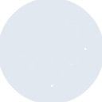

# homebridge

[← Back to main README](../../README.md)

<table><tr>
  <td></td>
  <td></td>
  <td></td>
</tr></table>

## 16 px

### black
```
https://georgegach.github.io/compatible-icons/simple-icons/compat/homebridge/16/black.png
```

### slate
```
https://georgegach.github.io/compatible-icons/simple-icons/compat/homebridge/16/slate.png
```

### white
```
https://georgegach.github.io/compatible-icons/simple-icons/compat/homebridge/16/white.png
```

## 64 px

### black
```
https://georgegach.github.io/compatible-icons/simple-icons/compat/homebridge/64/black.png
```

### slate
```
https://georgegach.github.io/compatible-icons/simple-icons/compat/homebridge/64/slate.png
```

### white
```
https://georgegach.github.io/compatible-icons/simple-icons/compat/homebridge/64/white.png
```

## 128 px

### black
```
https://georgegach.github.io/compatible-icons/simple-icons/compat/homebridge/128/black.png
```

### slate
```
https://georgegach.github.io/compatible-icons/simple-icons/compat/homebridge/128/slate.png
```

### white
```
https://georgegach.github.io/compatible-icons/simple-icons/compat/homebridge/128/white.png
```

## 512 px

### black
```
https://georgegach.github.io/compatible-icons/simple-icons/compat/homebridge/512/black.png
```

### slate
```
https://georgegach.github.io/compatible-icons/simple-icons/compat/homebridge/512/slate.png
```

### white
```
https://georgegach.github.io/compatible-icons/simple-icons/compat/homebridge/512/white.png
```

## 1024 px

### black
```
https://georgegach.github.io/compatible-icons/simple-icons/compat/homebridge/1024/black.png
```

### slate
```
https://georgegach.github.io/compatible-icons/simple-icons/compat/homebridge/1024/slate.png
```

### white
```
https://georgegach.github.io/compatible-icons/simple-icons/compat/homebridge/1024/white.png
```

## 16 px in base64

### black
```
data:image/png;base64,iVBORw0KGgoAAAANSUhEUgAAABAAAAAQCAYAAAAf8/9hAAAABmJLR0QA/wD/AP+gvaeTAAABPElEQVQ4jY3TS05bQRAF0PMe/1/CJ4xgkJUEGWWLGSAiloJYCEhmhEEBAhbBBBsYvPtQA7ZESSV1dde9t6q7mre2jgOc4AKD+EX2fmPNBPuJU4zwPMFH6GJ3HLj3LnmIK1wGOMJDznrolGWfjgH3cR6/w03WZ8npYnUKv/ADVQhHuI/XRelfQjrE18SbNXaS+B5cYQFzRVWl1ehMY2UCeAkzWIzybQhn8ZizlSqAefwp2BejWhWtPeJ/4lrznIO6AD2HfSHxrGYG7qI2nXaecvbaRz/rb5pnqgNo2xngX0DDxEvB9EuCCpuad/+b5PmoDkNyg+2i6tsaRymrta1Uco+NkC4n53txJ084lMvomjy+57ges9/Faqu66+Mot+CzqJX7Pc38vLGOz3+mD+DW1rCP46iX3/kYe2XZ8AIs/IqCYasSPgAAAABJRU5ErkJggg==
```

### slate
```
data:image/png;base64,iVBORw0KGgoAAAANSUhEUgAAABAAAAAQCAYAAAAf8/9hAAAABmJLR0QA/wD/AP+gvaeTAAAB6ElEQVQ4jW2TYU4TURSFv/NsZ8BS6KCNGqulO2AHhIRN+IuEPRj3oGzBxB9uQ9AVsAWbhpiSmA4lMC0M7/ij01Iq59d9991z37nn5oklDAaX267HY9AepglsAiDGoCuIp57qY7fbGs05mgfnw/zg3v4qQsc48DSi8cCljnY6rZNFg/NhflCa74JXS8X3mDHCNq0gEU0pOQGG0f6w8yY7VSX7DPT+ERkXgptoIbxhqQzSJNpR8Nq4H1N2g+vxWITOKhmrAIUgAyoEDZtS5m4mXe9qU30JoL2lmauXVUgIWLeUChlTrvgRjPYD0FwlG2S7AaSYTSsmChpjryNvI1UqaNYwTQSYkSQMEjxHIYJvK6PrdkSEW5sJ8i2Q2d58WJewcQKsG7Cc2J4IXUuqg2pRMUWKMsliDsRVFb/EmoIDom5TIArkieEGkUgqcZwYGhXnKsCigRBtWX9lcs1MW7OVVvEN1iV62JikcQD/BOI8afHWZkqgAL0At402ZjXeAQvAs/OJ+v08Y40zmS5PwOZCIgFaj/PuxzV2Q7fbGvmOI8PwPzK+kIigrZWrYazVDntZli8+0+8/o/0A35A6wJOfqZI9iM9qh71289fMuCX0+3kWUj6D9oFmtLeqojHSWPhHmfpTL8vyOecfNVr8V7Wc2o4AAAAASUVORK5CYII=
```

### white
```
data:image/png;base64,iVBORw0KGgoAAAANSUhEUgAAABAAAAAQCAYAAAAf8/9hAAAABmJLR0QA/wD/AP+gvaeTAAABWUlEQVQ4jY2Tb0pbQRTFf+9hUjUKRi0U2kqX4A4k0t3VDZQWlyLdQTdgQT81lcZWg75ok/z6waOdyAv0wMDcO/ec+2dmoIC6rR6r39QLdZJ1Ed9ntU8b1PfquTpzOWbqmXrYRh4+C56ql+ooxJl6l7OhOgCo1G3gK7BXaM6ABriNvQFMgQkwB14B58B+DRwBb1rIDVDH1wC9iPyJ7y3woQYOisCSXAFrwAvAkEvUwGAF2FxC7gEdYB0YA9cR7KaKDrBZqQ2wCvws1NeTtcoipPvYNdAHJnVBMuprsbsZ2k2yraSdec6e+hhnvwvcxdcp2pnwcBtd/t1EL5xxKVABL4ER8DvBq8k6jcgVizd2XQNfUtYjXqeSBtiJ6EZi3hUzmQMnqP08z2X4of5q8Z+pWw/T08OWp/xI/q7On/mH6gEl1IH//5kWyYVIX/2kniZ7+Z1P1Y9PZQd/AQBHkYcLwzR+AAAAAElFTkSuQmCC
```

