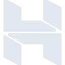

# hostinger

[← Back to main README](../../README.md)

<table><tr>
  <td></td>
  <td></td>
  <td></td>
</tr></table>

## 16 px

### black
```
https://georgegach.github.io/compatible-icons/simple-icons/compat/hostinger/16/black.png
```

### slate
```
https://georgegach.github.io/compatible-icons/simple-icons/compat/hostinger/16/slate.png
```

### white
```
https://georgegach.github.io/compatible-icons/simple-icons/compat/hostinger/16/white.png
```

## 64 px

### black
```
https://georgegach.github.io/compatible-icons/simple-icons/compat/hostinger/64/black.png
```

### slate
```
https://georgegach.github.io/compatible-icons/simple-icons/compat/hostinger/64/slate.png
```

### white
```
https://georgegach.github.io/compatible-icons/simple-icons/compat/hostinger/64/white.png
```

## 128 px

### black
```
https://georgegach.github.io/compatible-icons/simple-icons/compat/hostinger/128/black.png
```

### slate
```
https://georgegach.github.io/compatible-icons/simple-icons/compat/hostinger/128/slate.png
```

### white
```
https://georgegach.github.io/compatible-icons/simple-icons/compat/hostinger/128/white.png
```

## 512 px

### black
```
https://georgegach.github.io/compatible-icons/simple-icons/compat/hostinger/512/black.png
```

### slate
```
https://georgegach.github.io/compatible-icons/simple-icons/compat/hostinger/512/slate.png
```

### white
```
https://georgegach.github.io/compatible-icons/simple-icons/compat/hostinger/512/white.png
```

## 1024 px

### black
```
https://georgegach.github.io/compatible-icons/simple-icons/compat/hostinger/1024/black.png
```

### slate
```
https://georgegach.github.io/compatible-icons/simple-icons/compat/hostinger/1024/slate.png
```

### white
```
https://georgegach.github.io/compatible-icons/simple-icons/compat/hostinger/1024/white.png
```

## 16 px in base64

### black
```
data:image/png;base64,iVBORw0KGgoAAAANSUhEUgAAABAAAAAQCAYAAAAf8/9hAAAABmJLR0QA/wD/AP+gvaeTAAABDUlEQVQ4jY3UsS5EQRQG4G/tbqES0ZCNhKtZiV6pIBLeRekRPIBCpVZQUOgUJJ5Ap5NIli0kWKEQYRUzl3Uz97p/MpnkzJl/zpn/n4EMA1xiUTm28IxDdEYXMvQxjPMJpkoIhnH0cIDxsULSNDaxXFGJWMEaZooE4gl18AUpgqoNH8VgK5HYwl5+QkQD9zgV2uuMJhfRxFwiPi9c8jXu0M0J3vGIh/96iMhwhW0MGpjEEnYEFT5rkLyjjfWc8QXn2MWNX72rRh9ZfgdvWMECzmIVq/6q1MZsWU+5E4d4xUYib9SJPxWkfNASZKuFnKBZd0OKoId93KpW4AjHgqGSmBAc+CQ8qDJ0cSF8Adk3NWdCsDp6ib4AAAAASUVORK5CYII=
```

### slate
```
data:image/png;base64,iVBORw0KGgoAAAANSUhEUgAAABAAAAAQCAYAAAAf8/9hAAAABmJLR0QA/wD/AP+gvaeTAAABnUlEQVQ4jY2SvWtTURjGf8+5N/UDJS0ONoYUGxelQsdO4lBxEJxEwf/ApaOTs/+A4CDODjroICI4FHETOri5enNjelODvfGT1tz3dYgtMc1Hn/E5z/nxvOc9JO28nrS3u43N7rtPre8XGKN0q7uWZNt5I8ufpp1Odc8PAEK/kF8KKtYbWf6i2fx2ahREqAzcsl70vpHlT9I0PRaGEvPuXPPIV8Y1+QeqOlyxmZOVcPAQn3R5Pydsf4TDKIAh/Rn24xH9YscfNrLc9ix31DNakr8EXwFVxwMgAs4O1QV8EdemOx8lPrtzHkEcot6O96KvwJfpgzigOvBB5neDRV0lST6nkl1E0X3EvKCYjrEdoKS4uBpzlDl5eGXuG6DXYNdBi5MRApFZER+JAVz8FFwWnAO98X6LVQa35JQQtWHU4CMGxxcEt+W6WauU7wwG063umps/GAYc+AfuxP2Oh1Mf4IqmBc1spB9+dMpNzB8LEiZsoFDpmZznoNZ/gKUl7S6cmb23O2PLOI8I/B4FqJ8+0a5VZm8UplXgrbsfB/gLmteiaI4SHxcAAAAASUVORK5CYII=
```

### white
```
data:image/png;base64,iVBORw0KGgoAAAANSUhEUgAAABAAAAAQCAYAAAAf8/9hAAAABmJLR0QA/wD/AP+gvaeTAAABIklEQVQ4jY2UsUrDUBSGv9oUcZLiogRB41LB3dFBESz4KI4+go/QydlBBx1EBBfB2cHNWahWENSCDkXs55AEYpo0+cZz//Nz7j0/FzVSh+qduk4J6oH6qZ6qYfYgUgfGDNQLdaHEIKWvnqhzMzndItAFNssmSQiBHWApbwBgRXPKGKDIYFrDT74YFAgDoKeOM7UG8AJcEl8vzIrzNIGVgvoqMAAegWegkxqMgHfgrfISMRHwABwCw4baBjaAI+It/NYwGQEtYDcA2sAVcA9cA/vJuFW8ArPpG3wDW8AacJNMsc3/LbWA5QmbXBJVv9S9Al02iWlqo6IcBMRrq0Vq0KzbUGTQB46BJ6Zv4Aw4Jw7UJOq82lM/1G6Zi9pRb5MvIPoDHbi2my9sTWIAAAAASUVORK5CYII=
```

