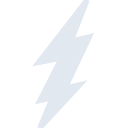

# hotwire

[← Back to main README](../../README.md)





## 16 px

### black
```
https://georgegach.github.io/compatible-icons/simple-icons/hotwire/16/black.png
```

### slate
```
https://georgegach.github.io/compatible-icons/simple-icons/hotwire/16/slate.png
```

### white
```
https://georgegach.github.io/compatible-icons/simple-icons/hotwire/16/white.png
```

## 64 px

### black
```
https://georgegach.github.io/compatible-icons/simple-icons/hotwire/64/black.png
```

### slate
```
https://georgegach.github.io/compatible-icons/simple-icons/hotwire/64/slate.png
```

### white
```
https://georgegach.github.io/compatible-icons/simple-icons/hotwire/64/white.png
```

## 128 px

### black
```
https://georgegach.github.io/compatible-icons/simple-icons/hotwire/128/black.png
```

### slate
```
https://georgegach.github.io/compatible-icons/simple-icons/hotwire/128/slate.png
```

### white
```
https://georgegach.github.io/compatible-icons/simple-icons/hotwire/128/white.png
```

## 512 px

### black
```
https://georgegach.github.io/compatible-icons/simple-icons/hotwire/512/black.png
```

### slate
```
https://georgegach.github.io/compatible-icons/simple-icons/hotwire/512/slate.png
```

### white
```
https://georgegach.github.io/compatible-icons/simple-icons/hotwire/512/white.png
```

## 1024 px

### black
```
https://georgegach.github.io/compatible-icons/simple-icons/hotwire/1024/black.png
```

### slate
```
https://georgegach.github.io/compatible-icons/simple-icons/hotwire/1024/slate.png
```

### white
```
https://georgegach.github.io/compatible-icons/simple-icons/hotwire/1024/white.png
```

## 16 px in base64

### black
```
data:image/png;base64,iVBORw0KGgoAAAANSUhEUgAAABAAAAAQCAYAAAAf8/9hAAAABmJLR0QA/wD/AP+gvaeTAAAA2ElEQVQ4jZ3SPUqDQRSF4edLIIYUQRdgE8vgDtLZuIEUgpAtuA4XYhNrEduIrQQiEn8K7T5IEQV/CKIWM0EiBG5yYJqZ+557ZuYS0yYe0Px/UAnABc7wjNdgwwUd4wN768D7KHGXk6ykbTzhGwP0cRSFaxjiB1+YYYKdqMEJPrPBfF1E4R7eMMJ7hkvsRg3aqKOLaTa4jMJzFbjN8ASdZYXVJfuHOMCGNAOtnOo60r2Ksb/Hm+E0Fjypi0e8SD9xLjbyC+pJ0a+kmVhZ97hBYx24LV1hK1L8C1JwMMhaScZgAAAAAElFTkSuQmCC
```

### slate
```
data:image/png;base64,iVBORw0KGgoAAAANSUhEUgAAABAAAAAQCAYAAAAf8/9hAAAABmJLR0QA/wD/AP+gvaeTAAABd0lEQVQ4jY2RMU9TURiGn+8cAhOlsYk01cJENHFyMCwsbAwmEAYXBwZ/gpuJgyMbf4CE/4BxdgAn40LqYCGEW4HbJjftbSINmHteF2OgPdJ+4/me9z3veQ9MMKfdbjlp58fNLCsN79w4sSRz1+6TFJKlSqU/vJ8aZ5B08m3Ec2/2cpK0d+b0Il9rpb12knZ/SLIYEz0EOD/P6sH7gwB1pEOcpRR2uFib27nNRTtoNDRdePdRsGBYwGzZZKvmtT/MRjuYreR74J6AAHkDD/q2MF8+GWZHEvzs9LeAdeDY0ABA0DHC29hlIwZF8ftrMZirSPoQsBsAQ8169cFRzCBaoiRL2vl3g6dAJuc2Fh+WDiZK8PcZr4FH/6AivGulvTcTGUjyCnpvMAsgKAW4qlfLuzGDkV9I0nwTYwrUN9yME58fV0uvYuL/ztlldytJe4NWu/el0dD0fWy0xCTNmwY3Pvx6UavVru4zGOng7DJ7JsmFa62MEwP8ATUfnVStohyQAAAAAElFTkSuQmCC
```

### white
```
data:image/png;base64,iVBORw0KGgoAAAANSUhEUgAAABAAAAAQCAYAAAAf8/9hAAAABmJLR0QA/wD/AP+gvaeTAAAA1ElEQVQ4jZ3SMUpDQRCH8V2FIBaiB7CyDN7AzsYLpAuk8AKew4PYxDoEW8VeUESjRdIFUmhAI0H8pXCL52ucl387+32zuzMpBYJdvGCnXtsIwDmlNEgpTXLO80jDuuAcCxyvA59giudyk0bwPsb4wTX6OIvCLdz5zTeWmOEgKrjAl7+5isI9fOAenwWe4jAqaGMLHbwVwU0IrkgyHgs8w1FTQRfzimCA0yi8iafK5y1x2aR7B694L5MY4t+Vr0t6ZX1v0WoEF8EID9heB26XJ+xFzq8Avf0VmYGvGGMAAAAASUVORK5CYII=
```

