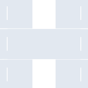
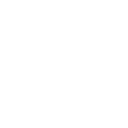

# htop

[← Back to main README](../../README.md)

<table><tr>
  <td></td>
  <td></td>
  <td></td>
</tr></table>

## 16 px

### black
```
https://georgegach.github.io/compatible-icons/simple-icons/compat/htop/16/black.png
```

### slate
```
https://georgegach.github.io/compatible-icons/simple-icons/compat/htop/16/slate.png
```

### white
```
https://georgegach.github.io/compatible-icons/simple-icons/compat/htop/16/white.png
```

## 64 px

### black
```
https://georgegach.github.io/compatible-icons/simple-icons/compat/htop/64/black.png
```

### slate
```
https://georgegach.github.io/compatible-icons/simple-icons/compat/htop/64/slate.png
```

### white
```
https://georgegach.github.io/compatible-icons/simple-icons/compat/htop/64/white.png
```

## 128 px

### black
```
https://georgegach.github.io/compatible-icons/simple-icons/compat/htop/128/black.png
```

### slate
```
https://georgegach.github.io/compatible-icons/simple-icons/compat/htop/128/slate.png
```

### white
```
https://georgegach.github.io/compatible-icons/simple-icons/compat/htop/128/white.png
```

## 512 px

### black
```
https://georgegach.github.io/compatible-icons/simple-icons/compat/htop/512/black.png
```

### slate
```
https://georgegach.github.io/compatible-icons/simple-icons/compat/htop/512/slate.png
```

### white
```
https://georgegach.github.io/compatible-icons/simple-icons/compat/htop/512/white.png
```

## 1024 px

### black
```
https://georgegach.github.io/compatible-icons/simple-icons/compat/htop/1024/black.png
```

### slate
```
https://georgegach.github.io/compatible-icons/simple-icons/compat/htop/1024/slate.png
```

### white
```
https://georgegach.github.io/compatible-icons/simple-icons/compat/htop/1024/white.png
```

## 16 px in base64

### black
```
data:image/png;base64,iVBORw0KGgoAAAANSUhEUgAAABAAAAAQCAYAAAAf8/9hAAAABmJLR0QA/wD/AP+gvaeTAAAA7ElEQVQ4jaXTS2vCQBQF4C/TSLUgWGo2/f9/TCnd1MdCrEZN2kVuUKw2ND0QmJnzGHK4AxVqrLHDAXM/MccxNOvwHHOcLg5yZCG6xj40p+BLPKcgqxuGLlTQBgx7BAzbgAqTOEh4uBP4GFwKfoIqwxtGQWTxHfCOzzA/4RWD2H9p+thlmmZrLDEO0RIFNmEY4wPTCN/gBSmFedGjgwXq1CnrQPvfRQ9vgezfJXKesBW2mlJnN26caaZwG9oa+/bW1UVQFetrlM7vZh+eLF2Qf0XJeZQHvwjvYdAGJM2AjDSvMcX6Gu2o58FPkb4BxGpJ9JBYkZ4AAAAASUVORK5CYII=
```

### slate
```
data:image/png;base64,iVBORw0KGgoAAAANSUhEUgAAABAAAAAQCAYAAAAf8/9hAAAABmJLR0QA/wD/AP+gvaeTAAABYklEQVQ4jZ2SwU5TARBFzxketcWAECEoBveu/P8vcS0Y0yhiDYa2hDfXRYkhsDD1bifnzuRkvJgvxiSiv8QpsmMyP39z+J5HuZwvLiJvifchK5JXVY4D8V79Cd3CkCi65EkCq7Rd5h6yxFqnOarNuMenwL/TI4SCAE63L9gwhRmBQ3TaSWl2SJ4VCi+0dzopdLphMnoxX3wBZiGFSqKpO6q/0t4CUNmj64zKbgA21htYDsJph1Z+GPZD7WL/Tvwg3CAk7ivf0x6UuQvcJLwuOajE1lxtbcBcJfSDxP9PURg82RYMnlA4EL4VzBpmkZF0m5pY/Yl4S8DKHu2ZlWVv6FltPCyHhGNkoi7SmVQ5gSzOT48+Pt54OV98TvKOsLZcJxwlvCxRwjXJqrQTR3T1/GTWSY2lTbIiXItuXtmst7Zn1n9fWWt3a/6BKaW6+zg4Cw5IkcyeATC1UsEhOOvuY6X+AFTdz/uAJWB9AAAAAElFTkSuQmCC
```

### white
```
data:image/png;base64,iVBORw0KGgoAAAANSUhEUgAAABAAAAAQCAYAAAAf8/9hAAAABmJLR0QA/wD/AP+gvaeTAAAA+0lEQVQ4jaWTTWuDQBiEH7dKk0IgpfGS///HEkovTfQQWjW6Tg+OpEhTqR1Y2HU+Fl9mkRQl9ZJKSZWkq6QjE0g6SmqtKe1pU6ADSqAHUiABqmkAUFvTmW+A52Ay/mCYQwQYA1YLAlZjQAS2/hCAhzuBj+aC+S0QE0mvwNpE4nUF3oBPm5+APZD5LIZ5VImk1oczsLHoDOTAxYYN8A7sHH4BXoAQbD4tmMEJ6MOsbAbjf+cLvDmQ/HuISKpdy0LSh+t6mF4n6SCps6awpx5vLbhVNXo/RWOuN18ASfhG/hUN3Kqc/SK8h2wMCAwFWTO8xuD9FGPVU/M7IHwBd9yao5ulimoAAAAASUVORK5CYII=
```

