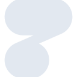
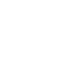

# httpie

[← Back to main README](../../README.md)

<table><tr>
  <td></td>
  <td></td>
  <td></td>
</tr></table>

## 16 px

### black
```
https://georgegach.github.io/compatible-icons/simple-icons/compat/httpie/16/black.png
```

### slate
```
https://georgegach.github.io/compatible-icons/simple-icons/compat/httpie/16/slate.png
```

### white
```
https://georgegach.github.io/compatible-icons/simple-icons/compat/httpie/16/white.png
```

## 64 px

### black
```
https://georgegach.github.io/compatible-icons/simple-icons/compat/httpie/64/black.png
```

### slate
```
https://georgegach.github.io/compatible-icons/simple-icons/compat/httpie/64/slate.png
```

### white
```
https://georgegach.github.io/compatible-icons/simple-icons/compat/httpie/64/white.png
```

## 128 px

### black
```
https://georgegach.github.io/compatible-icons/simple-icons/compat/httpie/128/black.png
```

### slate
```
https://georgegach.github.io/compatible-icons/simple-icons/compat/httpie/128/slate.png
```

### white
```
https://georgegach.github.io/compatible-icons/simple-icons/compat/httpie/128/white.png
```

## 512 px

### black
```
https://georgegach.github.io/compatible-icons/simple-icons/compat/httpie/512/black.png
```

### slate
```
https://georgegach.github.io/compatible-icons/simple-icons/compat/httpie/512/slate.png
```

### white
```
https://georgegach.github.io/compatible-icons/simple-icons/compat/httpie/512/white.png
```

## 1024 px

### black
```
https://georgegach.github.io/compatible-icons/simple-icons/compat/httpie/1024/black.png
```

### slate
```
https://georgegach.github.io/compatible-icons/simple-icons/compat/httpie/1024/slate.png
```

### white
```
https://georgegach.github.io/compatible-icons/simple-icons/compat/httpie/1024/white.png
```

## 16 px in base64

### black
```
data:image/png;base64,iVBORw0KGgoAAAANSUhEUgAAABAAAAAQCAYAAAAf8/9hAAAABmJLR0QA/wD/AP+gvaeTAAAA60lEQVQ4jZ3SP0oDQRzF8U82RRQFESztchcv4gUEL2CrCJaitShW9jZewDqNNhL/VCl0oy6sUYudYFh3ZqMPXjHDfN/83jD8aB9DvOIr4nE4s6umbTwnwLpzbM0GDP4ATz2ALHipPtIcWkY3wyfe/xFQYJKFxbHqgeZVjpPZjQ4OcI836e5POAzML61hA5u4xihAJe5whn5qtD5Ow+Ey1LrFDlZSYEf1Do+1cUe4xGIKFm7INXcucdEWcBOBpx5itQnM0EWv5YIe1mMBE+1/oAhTNgbAEV4i8AeuQkhSe6quY1XvAg84x0IM+gZhnWd/nEfFEQAAAABJRU5ErkJggg==
```

### slate
```
data:image/png;base64,iVBORw0KGgoAAAANSUhEUgAAABAAAAAQCAYAAAAf8/9hAAAABmJLR0QA/wD/AP+gvaeTAAABhklEQVQ4jZWSS2tTURSFv7VTDWps2ovQKF5L8B+IM0fOhY5ExIkgKDp14MTHHxAfwzguHYr/wFln/gIp2AepDzAxbWkqyVkOboSI90rco8PZZ317r8URk9ra7T8H30BkoJOUlTgguefQ2vLSwqPiCvi023sY0lNgvlT4V3nfxJPlVvNVFJS4M7sYQA3MXYCwHSGfml08QZAatmshKSVz+N+AiKGkcWHBfiPYn306eymxOjmDbW1/G7wgpetABjpRJTZ8lnmXt5oPJFnTzW53cGZUS5dk8mTfF2ojMsRIpmuzTvD4wtLCxm/N3DRgVEtNrNsmXYnQOSeOjDcCVn8e98uLWfajxE5hYetLrwO1a8Jnp/b9jvmg8d5KnuelQQfAztf+M6Gbf4gLfKbQVR87vVaVSRQb6BaoUR6a52Rf3tzsL5YCbNew61UTildRj3o6X9qSNDbxzz/g5OHocPFjpYUQHWBQqhYj0Pt2W8NKQN5qvrboIHYQBwA2R6Cund6Oh/P3qrb7BRYjmwpwTBk1AAAAAElFTkSuQmCC
```

### white
```
data:image/png;base64,iVBORw0KGgoAAAANSUhEUgAAABAAAAAQCAYAAAAf8/9hAAAABmJLR0QA/wD/AP+gvaeTAAABA0lEQVQ4jZ3SPW5TQRTF8TPPRYiIhCKlpPNespFsAIkNpA1CSolwHYGo6GnYQGo3oUGGULkAO/Akx/woPCDL8XuWOc3oau7/3I+ZpAovMcGdbs1rzkXWhef43gNuaoZn6wbjPeC/GidJgybJ4+yvIwyaUsrvJL/+w6AtpSybGoySzPeAZ0mu/kUouMQX/Nwx+ze8QnlgixOc4gzXmFZogc94i2FnXxjiTU1eWL37J5zjSR9YMMLtRrtTfMBh70ZqhVnHzAu832Vws2NxExxvYxsMkhz0VljdP91qUEpZZvcfaJPcbDWo5+skPzrg+yQfSyltbwm8qLPO69wtvuIdHnVxfwAHk7NNjodhVAAAAABJRU5ErkJggg==
```

