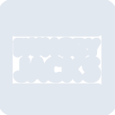

# hungryjacks

[← Back to main README](../../README.md)





## 16 px

### black
```
https://georgegach.github.io/compatible-icons/simple-icons/hungryjacks/16/black.png
```

### slate
```
https://georgegach.github.io/compatible-icons/simple-icons/hungryjacks/16/slate.png
```

### white
```
https://georgegach.github.io/compatible-icons/simple-icons/hungryjacks/16/white.png
```

## 64 px

### black
```
https://georgegach.github.io/compatible-icons/simple-icons/hungryjacks/64/black.png
```

### slate
```
https://georgegach.github.io/compatible-icons/simple-icons/hungryjacks/64/slate.png
```

### white
```
https://georgegach.github.io/compatible-icons/simple-icons/hungryjacks/64/white.png
```

## 128 px

### black
```
https://georgegach.github.io/compatible-icons/simple-icons/hungryjacks/128/black.png
```

### slate
```
https://georgegach.github.io/compatible-icons/simple-icons/hungryjacks/128/slate.png
```

### white
```
https://georgegach.github.io/compatible-icons/simple-icons/hungryjacks/128/white.png
```

## 512 px

### black
```
https://georgegach.github.io/compatible-icons/simple-icons/hungryjacks/512/black.png
```

### slate
```
https://georgegach.github.io/compatible-icons/simple-icons/hungryjacks/512/slate.png
```

### white
```
https://georgegach.github.io/compatible-icons/simple-icons/hungryjacks/512/white.png
```

## 1024 px

### black
```
https://georgegach.github.io/compatible-icons/simple-icons/hungryjacks/1024/black.png
```

### slate
```
https://georgegach.github.io/compatible-icons/simple-icons/hungryjacks/1024/slate.png
```

### white
```
https://georgegach.github.io/compatible-icons/simple-icons/hungryjacks/1024/white.png
```

## 16 px in base64

### black
```
data:image/png;base64,iVBORw0KGgoAAAANSUhEUgAAABAAAAAQCAYAAAAf8/9hAAAABmJLR0QA/wD/AP+gvaeTAAABWklEQVQ4jZXS30pUURQG8N+M/ysatSgqIQTpAbpIX8RH6N2qK5/BqyAIusubIChSR50Z/9TozHG6ON/GgxrYhsVaZ51vr72+b60WtvAGc/7vnONjCz0sNn4cosJ8bIIhfuMeOg1sTwAT7OEMu7hs5Itd4Gd8t+RbCfbRxuM7tH6J48SLpcAJ/mB0J/a1XkOsTCfxq1H1KaYwCOcjPMkDRYszvIDSQdeVODPxhfds4io0R/ie+FU74NNUhh21oN1c6sdfxM7xoXApBfrYDLDY51C5n0tjLCT39noBWMv3Kpaxjk94nyIV3gVzUC4VDb7heV6Zvubn4lsRthN/grUyhQpfsBTwDp7hJb7igXpXjrGBbbwuXUzS0sjN7fuXDfBDYxOrFOjjoXr+t52eehMfNTU4SuvU4xyo1Z6NDpPQGqrHuBzsAnpT4dRJB5WrRSpdjfNqO//GsT62/wJGOoGtg/aKVQAAAABJRU5ErkJggg==
```

### slate
```
data:image/png;base64,iVBORw0KGgoAAAANSUhEUgAAABAAAAAQCAYAAAAf8/9hAAAABmJLR0QA/wD/AP+gvaeTAAAB10lEQVQ4jZWTS25TQRREz2k7ODYR+YASIEKAxAoYEDbCEtgbMGILMEBISEjMYIJEJEQIH9sJJI7j18XgxQYGgKhRq9V1b92uW+7ujR9jvUO1x/+g5ITw3N290RBYm98n+YKl0SxTXY6JZALlCDMgrC6KyLA7Jwf2hRV0ptkkiMH2ZS9kYPIploE1Y+QSYb0AKPtCAQbCFnPeLxCWwKuFdCh2kRFAF6BCHzyW+v5foycA9JRJYK0LYOWDctCKqFuBDinjmEGRr4FN4JgwITlSvoPbkFYBsF7JDRBxqdWcy+I05BoQKo1Sgqfgu9BKKWcDfhOOSEh8A3xM+AS1IYyoNBamyDSFE6yPFm62zRhF7imN1gZpCrwkdoLnlZOEWUK/QCcp938rQAHh1tnpJjUbkR1KXpj6MMl5QyM8SCiSzwt3dvdGAd6CVyEzQleZBbuQWaAnzFonHQOrIWPxEHKr/URtSF4R1tVZqG/UK0mui68TVyT7ykHC3UKeBm7jTwVfhNWwcOXvkAOSQ3B7TlgLnCZ8Vi4Agz8s0VCowEXwAkAXHZKsAx3NSmAoToBzYNd292aBCWYKbCQcq/02TKlPkJ02ziL0zxpOIdP8FNAR+8BxG5SMgs9+AN5c8PqTAaGoAAAAAElFTkSuQmCC
```

### white
```
data:image/png;base64,iVBORw0KGgoAAAANSUhEUgAAABAAAAAQCAYAAAAf8/9hAAAABmJLR0QA/wD/AP+gvaeTAAABVElEQVQ4jZ3T30pVQRQG8N8286RFmllRBhFID9BF+iI9Qu+m3dgzdBFBEHSXN0FX0TE9R4/lv3bTxf4GN4fAasGw1sys+WZ935ppSimv8AwD/2aneNuUUkZY6m3socW1jIIT/MACFnu5o6aUUjIZ4gYmuItm6sZz7OIODrACFWCImbp4if3CYeKlCjDBcW75GxuE1sPZLHzpod7DlZS5gP1QOnahxXes9insuhDnanzBGeYSt6F5js+Jn8wk+SjIsIOvAW0xjj/LOMXLyqUCjPE8iXW8D5XrOfQT81l7MQ0Aa5k/xjLW8Q5bAWmxmZxv9VDV4BMe5JbZKT+IbyLsYvwEa7ULLT7gVpJ3cB+P8FH3wIa6Tm3gNZ72K9gLcgW8zA5TwWoFaHXtGeOmrv9/spHuJd7ua7Cf0unaeaBTey4VldA60bVxObnz8pm2dYr/z3d+8xtSMoYf8TIpPQAAAABJRU5ErkJggg==
```

