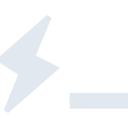

# hyper

[← Back to main README](../../README.md)

<table><tr>
  <td></td>
  <td></td>
  <td></td>
</tr></table>

## 16 px

### black
```
https://georgegach.github.io/compatible-icons/simple-icons/compat/hyper/16/black.png
```

### slate
```
https://georgegach.github.io/compatible-icons/simple-icons/compat/hyper/16/slate.png
```

### white
```
https://georgegach.github.io/compatible-icons/simple-icons/compat/hyper/16/white.png
```

## 64 px

### black
```
https://georgegach.github.io/compatible-icons/simple-icons/compat/hyper/64/black.png
```

### slate
```
https://georgegach.github.io/compatible-icons/simple-icons/compat/hyper/64/slate.png
```

### white
```
https://georgegach.github.io/compatible-icons/simple-icons/compat/hyper/64/white.png
```

## 128 px

### black
```
https://georgegach.github.io/compatible-icons/simple-icons/compat/hyper/128/black.png
```

### slate
```
https://georgegach.github.io/compatible-icons/simple-icons/compat/hyper/128/slate.png
```

### white
```
https://georgegach.github.io/compatible-icons/simple-icons/compat/hyper/128/white.png
```

## 512 px

### black
```
https://georgegach.github.io/compatible-icons/simple-icons/compat/hyper/512/black.png
```

### slate
```
https://georgegach.github.io/compatible-icons/simple-icons/compat/hyper/512/slate.png
```

### white
```
https://georgegach.github.io/compatible-icons/simple-icons/compat/hyper/512/white.png
```

## 1024 px

### black
```
https://georgegach.github.io/compatible-icons/simple-icons/compat/hyper/1024/black.png
```

### slate
```
https://georgegach.github.io/compatible-icons/simple-icons/compat/hyper/1024/slate.png
```

### white
```
https://georgegach.github.io/compatible-icons/simple-icons/compat/hyper/1024/white.png
```

## 16 px in base64

### black
```
data:image/png;base64,iVBORw0KGgoAAAANSUhEUgAAABAAAAAQCAYAAAAf8/9hAAAABmJLR0QA/wD/AP+gvaeTAAAAx0lEQVQ4jcXTsUrDUBSH8V8xWQUHKRQ6uBdcBJ+gUoTSofQNfAq3voGP4Gu4+A4i1sklLZaWDu2iUNA4JNEIISQB8cCZ7v2+y/0fDn9UIVpN4SM8YNAEPsEMGwR14XNE+MRNXXiEV8RYoFMHvsYqhWPc1319m4NjzHGL46qCMzzhPSf5SMW9qpJQEmAmWOKqKgynWPsJsV8VzGY9lfz5BUM85+50MS6THGKHR7QLzi+x9zvo7w4wSeELvBUIItwp2Y2DtP+nvgBnuDBZBAkF/gAAAABJRU5ErkJggg==
```

### slate
```
data:image/png;base64,iVBORw0KGgoAAAANSUhEUgAAABAAAAAQCAYAAAAf8/9hAAAABmJLR0QA/wD/AP+gvaeTAAABUUlEQVQ4jbWTv0tCYRSGn/NdLzRU1qBpdqWaImpuDqSmaIjGhv6IlqChtT8hGtubGiIa2t2KgiJIU7kq1tVBIvU7DZn9ErxLZ3x53+ecw/cd+I/KqrqqKmG85reQywXj8Uo9W6g2VsMAfnR59IMZA6dA3JuIJkSkHXqCJ7++ZFQvQeYEOQ4T7gHy/su6ij1BxANbUuftIEwYwBT8xq6IHKKSBFDlLh2LlcICJO8HARD9Uihg5cLF7CSTI9XBK1gyiNyAvAKgTCFstaRzn/efFwZOAB/vHi/XHwCvK/uC7nmJsaNBgAhAohLMW2SoiyxqW7fTqbHzQeEewKrZB40BD7bjrE2nRm4/DcVizXtzzIb5++c+APe12qi2dFnQ67a4mdnJ4fJ3gzWRRUc4QNXtC3BbzqYgVxHbXElPjjd/G1Q6eVE5A9P/NlTVUVUnzL7/Uu9iqnwocxl0EAAAAABJRU5ErkJggg==
```

### white
```
data:image/png;base64,iVBORw0KGgoAAAANSUhEUgAAABAAAAAQCAYAAAAf8/9hAAAABmJLR0QA/wD/AP+gvaeTAAAA0klEQVQ4jbXTMUpDQRSF4TMmaYUUQRAs7AUbIStQQRALcQeuws4duAS3YeMK7IJa2URRFAttFAT9LEzwCU95T8jfzvzncO8wySxAD6XJ3bkauZ/kLMnmf5qXcYFHdNvKQ4zxgaO28g5ufXGDxTbyAe59c9q2/clPrnGMQdOANZzjtRLyPgleaRrSmyxwyh3224yxiofKEtebutO3PkwySHKVZLuUclkJX0qy+1f7PJ4xwkLN+Rbe/EI3yV6SUZKNUspLTcc4yUmS+r+BDjqNBp4Fn9mI6aHFYQtgAAAAAElFTkSuQmCC
```

