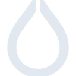

# hyprland

[← Back to main README](../../README.md)





## 16 px

### black
```
https://georgegach.github.io/compatible-icons/simple-icons/hyprland/16/black.png
```

### slate
```
https://georgegach.github.io/compatible-icons/simple-icons/hyprland/16/slate.png
```

### white
```
https://georgegach.github.io/compatible-icons/simple-icons/hyprland/16/white.png
```

## 64 px

### black
```
https://georgegach.github.io/compatible-icons/simple-icons/hyprland/64/black.png
```

### slate
```
https://georgegach.github.io/compatible-icons/simple-icons/hyprland/64/slate.png
```

### white
```
https://georgegach.github.io/compatible-icons/simple-icons/hyprland/64/white.png
```

## 128 px

### black
```
https://georgegach.github.io/compatible-icons/simple-icons/hyprland/128/black.png
```

### slate
```
https://georgegach.github.io/compatible-icons/simple-icons/hyprland/128/slate.png
```

### white
```
https://georgegach.github.io/compatible-icons/simple-icons/hyprland/128/white.png
```

## 512 px

### black
```
https://georgegach.github.io/compatible-icons/simple-icons/hyprland/512/black.png
```

### slate
```
https://georgegach.github.io/compatible-icons/simple-icons/hyprland/512/slate.png
```

### white
```
https://georgegach.github.io/compatible-icons/simple-icons/hyprland/512/white.png
```

## 1024 px

### black
```
https://georgegach.github.io/compatible-icons/simple-icons/hyprland/1024/black.png
```

### slate
```
https://georgegach.github.io/compatible-icons/simple-icons/hyprland/1024/slate.png
```

### white
```
https://georgegach.github.io/compatible-icons/simple-icons/hyprland/1024/white.png
```

## 16 px in base64

### black
```
data:image/png;base64,iVBORw0KGgoAAAANSUhEUgAAABAAAAAQCAYAAAAf8/9hAAAABmJLR0QA/wD/AP+gvaeTAAABGElEQVQ4jY3Suy8EYRQF8J+3ZnU2EREiCoVGIRIS/g2PRKel1PgjVHoFLSISDSUFnUZB2CXxigKdjUcxd5PJmhlO8mW+nHvOmZvv3ib5WMMAWnCNpQLtL4zjGfs4iPtYlrA5g+vCJko4jVPCVtQK0YQjfOIcbXHOgzsMTS5W8Y47DKb4oeDesJJn7g/RC2Yy6gtRu0VfVsAevrBT0OFuaLYbCyVUUEV3QUBPdFAVD1qfwhTKuJGMLA/3YS5jOh0wik7JyP7CGTowkg74jm/WXuShljYcS8Y3+Q/jOF5xkiZbcYUnTPxhfsRlVreLkVwJYZa5EprZOtm4luuYw4dkqS5CM4xetGMDywVdmg/jg+ShanG/SP+5jh9CjEAfDZoIZwAAAABJRU5ErkJggg==
```

### slate
```
data:image/png;base64,iVBORw0KGgoAAAANSUhEUgAAABAAAAAQCAYAAAAf8/9hAAAABmJLR0QA/wD/AP+gvaeTAAAB30lEQVQ4jY2Sv2tTcRTFz/k+kxYkfRHJizHGxE1EBLWhoGAXd3HUzkIH0UUclA5ujiLirqAV/wdBqOgQcRShUiU/jM/n06SdbJp7HEzSmB/o3b58z/l877nfS0yp2tf2PQElAp7JPhVz+65N0rkp5gUASwISJiVIXqo22+X/AqzH8ZzJnhiUgqzieaoISAF6uh7Hc6N6Dh8ksR62XxiwSOj9t2z6FAAEYesdxGMkXh7K+udJamIHtXDztqAygabIC/NkZ57s0LmLIJpGlKvR1s2JETa+/CyCWpaw7Xm8UcymN/p3hcD/KPIWTB0nu9poxIUxQIJ4AOEg6dbyGf/ZaNZi1n9MulcA8uZ59/8CRFGUAnkCQj0hd2Vs1L0yb8+yTA0Ap/sDdQDwayd5TmAg6HMul4qmAUqZvU0RVROCZCexOAAY3UlAs3SuMs2827J7S2LGA44PzaD751s0ebEmxqF1BgAnvaa0BeDsv61aENQW3JsBIH8gvWZEBKHUCDfPTLP2VvwIye+Hg9QugOSOA++KNtNVd7UnHDML9tyIWc9xhaQBI6tcDVsPIVwGsC2hTvKDA9iFjjowLyhJx0eFwL/e93DkIdTCH0sGt0IxTWK/IECMSbWc4518xl8d1v8GLlXNzchsAJUAAAAASUVORK5CYII=
```

### white
```
data:image/png;base64,iVBORw0KGgoAAAANSUhEUgAAABAAAAAQCAYAAAAf8/9hAAAABmJLR0QA/wD/AP+gvaeTAAABL0lEQVQ4jY2Suy4EQBSGv3FvVkciIkQUCo1CNiHhNSyJTkup8RAqvYIWUVNS0GkUBEviFgXb2fApnJXNZmc5yckk/y1n5kwiU+oGMAK0A9cppZVmuraMuQgsAp3RJXXqXwFqL7ANFIDT6AKwE1y+1KQeqZ/qudoZfR7YoZpaBayrFfVeHa3DxwJ7V9dy5uEQvarzTfil4O7UoWYBB+qXutdiwv3Q7DYSBfVWLat9LQIGYoJy7UFrW5gF+oGblNJLLiCl9ACUQztXHzAJ9PCzsr/qDOgGJuoDjLPpx8pUtd5wDFSAmX8Yi8AbcPKLqB3qlfqsTuecalF9Ui/VtkZyWX2LbRQz5tvQlGp4ahBtAgvAB3APXIRmHBgEuoCtlNJq9oLqonqhPqrV6MfASo36b/jyDuWKPrGXAAAAAElFTkSuQmCC
```

