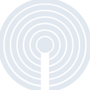
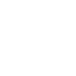

# ibeacon

[← Back to main README](../../README.md)

<table><tr>
  <td></td>
  <td></td>
  <td></td>
</tr></table>

## 16 px

### black
```
https://georgegach.github.io/compatible-icons/simple-icons/compat/ibeacon/16/black.png
```

### slate
```
https://georgegach.github.io/compatible-icons/simple-icons/compat/ibeacon/16/slate.png
```

### white
```
https://georgegach.github.io/compatible-icons/simple-icons/compat/ibeacon/16/white.png
```

## 64 px

### black
```
https://georgegach.github.io/compatible-icons/simple-icons/compat/ibeacon/64/black.png
```

### slate
```
https://georgegach.github.io/compatible-icons/simple-icons/compat/ibeacon/64/slate.png
```

### white
```
https://georgegach.github.io/compatible-icons/simple-icons/compat/ibeacon/64/white.png
```

## 128 px

### black
```
https://georgegach.github.io/compatible-icons/simple-icons/compat/ibeacon/128/black.png
```

### slate
```
https://georgegach.github.io/compatible-icons/simple-icons/compat/ibeacon/128/slate.png
```

### white
```
https://georgegach.github.io/compatible-icons/simple-icons/compat/ibeacon/128/white.png
```

## 512 px

### black
```
https://georgegach.github.io/compatible-icons/simple-icons/compat/ibeacon/512/black.png
```

### slate
```
https://georgegach.github.io/compatible-icons/simple-icons/compat/ibeacon/512/slate.png
```

### white
```
https://georgegach.github.io/compatible-icons/simple-icons/compat/ibeacon/512/white.png
```

## 1024 px

### black
```
https://georgegach.github.io/compatible-icons/simple-icons/compat/ibeacon/1024/black.png
```

### slate
```
https://georgegach.github.io/compatible-icons/simple-icons/compat/ibeacon/1024/slate.png
```

### white
```
https://georgegach.github.io/compatible-icons/simple-icons/compat/ibeacon/1024/white.png
```

## 16 px in base64

### black
```
data:image/png;base64,iVBORw0KGgoAAAANSUhEUgAAABAAAAAQCAYAAAAf8/9hAAAABmJLR0QA/wD/AP+gvaeTAAABlUlEQVQ4jV3T326MURQF8N/3dUrCME1DVactIhF/UhE3RbyBeAK3vINIPANvQlL6CrggiIRpovFvqFZrOhIyQzMuvlUZPclJ9t7r7L3XXjuH/88+3EUbS3iG57HbwerDCeWQfQktzGMD49iN0djrwVq4sLPAZdzDe0yhg+84nLuRWBPvcB8XoUADrwPU43/FCPbnTQdbOIRu7jGcGsGd0JwN5RaO4y36+BE2J9KoibE0PFNgJR272IVpLGfubkZs4FsKf0rhOibLAFOYDO2XSW4kucgoB4KVGWUa6zX0sIYJDPBzaM6TKfImWD3FxpPTKwMM0qmHvfF3niJYP/YAg1oEnFCtqovf8cdwO8m3sBmtRiP2QXyuqfb8IdS3QrudDk9SoINfwZYi/CZmSzyIkEdUu30UUVeHxltJ7HHeHVWtdqGGm3iBV1H3vGqNfzKrMFvGubBZxRyulXFu4HRmLJLQxJ4I10ysxJe8vZ5N/DtXQ3URTwPO564ltpg3V7aThn/jAs5Gjxl8VK2sH3smhebwcDvpL813eFyb10F4AAAAAElFTkSuQmCC
```

### slate
```
data:image/png;base64,iVBORw0KGgoAAAANSUhEUgAAABAAAAAQCAYAAAAf8/9hAAAABmJLR0QA/wD/AP+gvaeTAAACXUlEQVQ4jV2TwWqUBxzEf/P/dg24yUYWd5NNYqMoGJVY8WIrvoanXtvSRyilPfUd+hI9tGB8BvWmEtAIBhNj3c3GdfMRE3fb7z89xEDtnOYyM8zAiP9gMBjMHFa1X6W4K/sD0oHtAE6DGyJ+n4rxz51O5+BEEyfkTb+8fVTVNgLdwjkEWumcsl3HtDDvwLc+Zn1jp7f/1WcGW7vlnXT+IWILvIAZGd7LdAVdiaFhZLwoeJX4z51++TWAXg6Hs/WJnol4leR0oFlD36aQ1DSWpBF2JZhLXIooIS+M63lF2/3Rb6RXJZZBNmyAr2E9UcS004APkL8ErQsug8NmC3is7d6oh+mDS6RT4CXMJqIFKj9VnUXew3ERvIM9cWhaZj5s7wELSPNIBdZTFC3DrBCAgCbWWeynhpA0F9YS6F1NaGwxkN0BGXQILgOVxivHDnqe2ApNB246aRkPhMcBWNiARI4JNwzmfxDIuIE9AUvCINck6rY6iCGoJP23RMf4jBy/cJzwk2CfpI+ijjyFaUv8VTN0wduYQ8sV0grWG2QbHgEYj2yOJFasfOGkF4r9hC8Cs2ZpT2JZ6AL4AWIBaxfb2AZ6khbAD2WWQ5w3fi98rzZR8eMpqidWrNs5F+hmZm6C/pGk4wVcCTZBN4xHELvg1bqLb+LS/MxuFPEdzqug/qeBKoUWRZ4W2RBatKjAgeMt5NV0ftvtzgwCYKndXCuK4gehVVvrQANoo/iI4ghok9mwtY58I+3vz3db9z9742K7eW9CXBfaQ3FO8usqclJFTiS/RnEONKi7WD0RA/wLwVZOgKHNw08AAAAASUVORK5CYII=
```

### white
```
data:image/png;base64,iVBORw0KGgoAAAANSUhEUgAAABAAAAAQCAYAAAAf8/9hAAAABmJLR0QA/wD/AP+gvaeTAAABsElEQVQ4jWXTy25PURgF8N8+WhJKpdGqXpQYuKWIiUu8hpEp4hFEGHkHL2FAUp4BM+SfUINGXavVqqYuLc02OKvxFzvZyT57nbX2t761d9E1aq07cRsX8Q2raLAdO3AXN0spq5ucpot8HtM4gyUMYBt6s14MNl1rPfuPQK31Au5hFiNYxhfsy1zK3ihe436t9RyUWms/XgToQz8+YQt2oYS8gb1YyTyIo6XWegeTmECNjeN4FkHpxUl0cDiVz+JpqbXO5cQVbMUYZuJ7JQL9+IxDeIf1iA83AUYwnLKfh9wfcomVPcGaWBnDYg/WsIChWPje5fNIRF4G64vYQDhrTYCak9a0eVf/jxJsPeuK2qPNeShRreBXvnfjVsg38DW96tXej0F86NHm/Calb6Ts9znhSQSW8SPYK8xFcH+DB2nkhDbbR2nqfJe9uew9zn8HtBdtqgfXtZl30t3T2hh/x6tUNoNTqWZee3cuNaWUeVzBsXgsIYz6+4hGs9fgY/69XEpZaKCU8gDXotoJaRA/430we51UcbWU8pCu11hKmcKJ9GMcbxPZetbj2uwnN8nwB63pjbDAt8zzAAAAAElFTkSuQmCC
```

